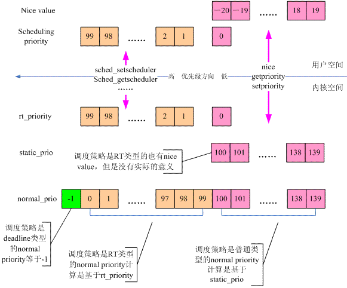
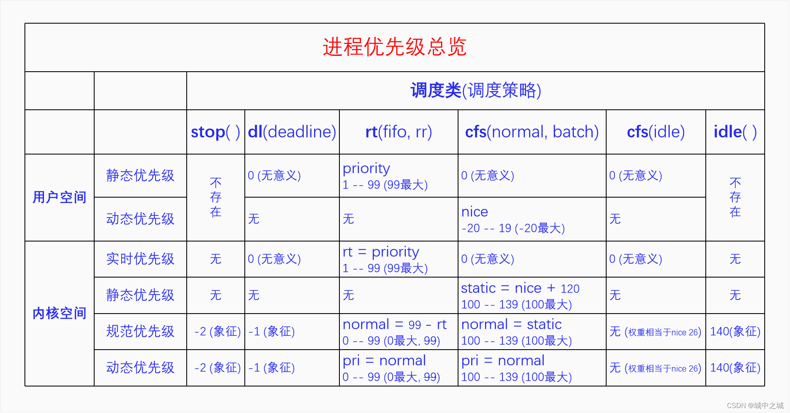

# 0x00. 导读

[深入 Linux 的进程优先级](https://linux.cn/article-7325-1.html)  

# 0x01. 简介



进程的优先级该如何确定？有两种方式：由用户程序指定、由内核的调度程序动态调整。


# 0x02. 用户空间角度

从用户空间来看，进程优先级就是 nice value 和 scheduling priority.

在用户空间的时候，实时进程和普通进程 (分时进程) 共享同一个优先级数轴，叫静态优先级(scheduling priority?)，范围是 0-99，值越大优先级越高，实时进程占用 1-99，普通进程占用 0。普通进程自己又新开了一个数轴，叫动态优先级，也叫 nice 值，范围是 -20 - 19 ，值越低优先级越高。

## 2.1 nice 值

`nice 值`，取值范围为 -20~19，默认为 0 。这个值越小，表示进程”优先级”越高，而值越大“优先级”越低。当 nice 值设定好了之后，除非我们用 renice 去改它，否则它是不变的。

对于普通进程而言，进程优先级就是 nice value.

## 2.2 scheduling priority

随着实时需求的提出，进程又被赋予了另外一种属性 scheduling priority ，这些进程就是实时进程。  
实时进程的 scheduling priority 的范围是 1（优先级最低）～99（优先级最高） 。当然，普通进程也有 scheduling priority ，被设定为 0。

# 0x03. 内核空间角度

到了内核空间的时候，实时进程有一个实时优先级，直接复制用户空间的静态优先级，普通进程有一个静态优先级，它是用户空间的 nice 值转换过来的，转换规则是 nice+120。然后内核又定义了规范优先级，把它们都统一到同一个数轴上来。普通进程的规范优先级是直接复制其静态优先级，实时进程的规范优先级等于 99 减去它的实时优先级。在规范优先级的数轴上，所有进程都可以直接比较优先级了，值越小优先级越大。实时进程的规范优先级范围是 0-99，但是由于它是从用户空间的优先级计算而来的，所以 99 这个值就用不到。

最后是动态优先级，对进程所有的处理都以动态优先级为准，动态优先级默认等于其规范优先级。以前的时候调度算法会去调整进程的动态优先级，现在不会再调了。现在只有使用了优先级继承锁的时候才会去调整进程的动态优先级。

task struct数据结构中有4个成员，用来描述进程的优先级。
```c
struct task_struct {
    int prio;
    int static_prio;
    int normal_prio;
    unsignea int rt_priority;
};
```
- `static_prio`

    1. 静态优先级，用于普通进程。 120 + nice ，范围是 100 ~ 139 ，缺省值是 120 ，值越小，优先级越高

- `rt_priority`

    1. 实时优先级，也就是从用户空间的视角来看的 scheduling priority 。范围是 1 ~ 99, 数字越大优先级越高， 0 表示该进程是普通进程。

- `normalprio`

    1. 归一化优先级，根据静态优先级、 scheduling priority 和调度策略来计算得到。何为归一，如果我们使用了不同的方式来刻画同一个概念，那么势必会带来管理上的麻烦，所谓归一化，就是设计一种转换方式，将这些不同的方法统一到同一种方法上去，从而简化问题的模型。
    2. 范围是 -1 ~ 139 ，并且数字越小优先级越大。
    3. -1 是 deadline 进程的优先级。对于普通进程来说，normal_prio 等同于 static_prio ；对于实时进程，会根据 rt_priority 重新计算 normal_prio = 99 - rt_priority, 最高 0 ，最低 99.

    ```c
    static inline int normal_prio(struct task_struct *p)
    {
        int prio;

        if (task_has_dl_policy(p))
            prio = MAX_DL_PRIO-1;
        else if (task_has_rt_policy(p))
            prio = MAX_RT_PRIO-1 - p->rt_priority;
        else
            prio = __normal_prio(p);
        return prio;
    }
    ```

- `prio`

    保存着进程的动态优先级，也是调度类使用的优先级。




对于禁令调度类、限时调度类和闲时调度类，它们用不到进程优先级，但是系统在规范优先级数轴上为它们提供了象征值，其动态优先级是对规范优先级的复制，也只有象征意义。有一个特殊的情况是分时调度类里面的 SCHED_IDLE 调度策略的进程，它的优先级无法在规范优先级数轴上体现出来，它的优先级是在 CFS 算法专门处理的，直接设置的调度权重，相当于是 nice 26。

# 0x04. ps and top

除了这些复杂的优先级体系之外，ps 和 top 命令下的优先级体系也不相同。

```bash
$ sudo ps -eo pid,cls,nice,pri,rtprio,cmd     
  PID CLS  NI PRI RTPRIO CMD
    1  TS   0  19      - /usr/lib/systemd/systemd --switched-root --system --deserialize 22
    2  TS   0  19      - [kthreadd]
   18  FF   - 139     99 [migration/2]
   19  TS   0  19      - [ksoftirqd/2]
   21  TS -20  39      - [kworker/2:0H]
   23  FF   - 139     99 [migration/3]

```
```
cls 代表的是调度策略，含义如下：

TS SCHED_OTHER/SCHED_NORMAL
FF SCHED_FIFO
RR SCHED_RR
B SCHED_BATCH
IDL SCHED_IDLE
DLN SCHED_DEADLINE

NI 代表的是 nice 值，范围：-20 – 19，-20 最大，只有 SCHED_NORMAL 和 SCHED_BATCH 有意义。

RTPRIO 代表的实时进程的用户空间优先级，范围：1 – 99，99 最大，只有 SCHED_FIFO 和 SCHED_RR 有意义。

PRI，普通进程 pri = 19 - nice, 实时进程 pri = 40 + rtprio，值越大优先级越大，普通进程 0 – 39， 实时进程 41 – 139。
```

```
top 命令中
NI 列是 nice 值，只对普通进程有效，对其它进程来说没有意义。

PR，普通进程 pr = 20 + nice，实时进程 pr = -1 - rt，rt 是实时进程的用户空间优先级，PR 值越小优先级越大，普通进程 0 – 39，实时进程 -2 – -100，-100 会显示为 rt，普通进程大于等于 0，实时进程小于 0。
```