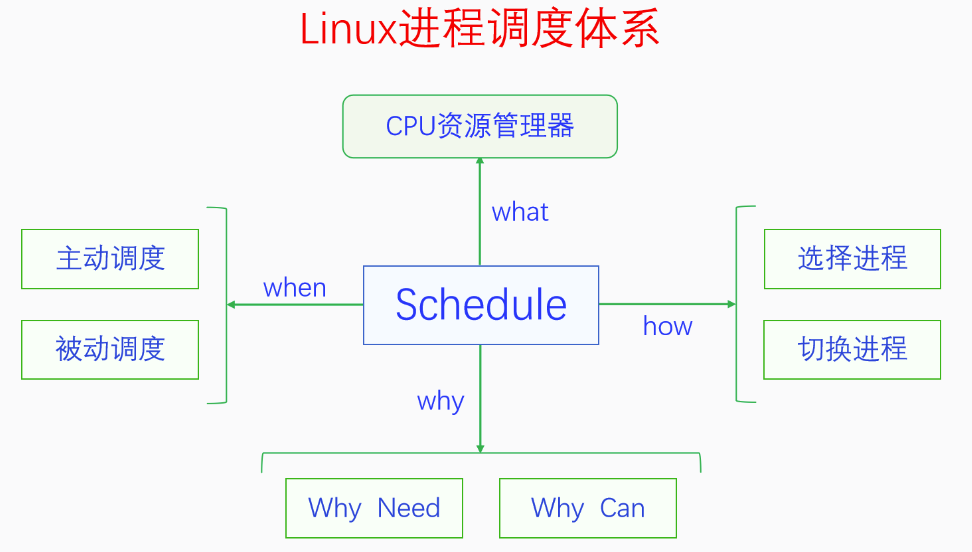

# 0x00. 导读

[深入理解 Linux 进程调度](https://blog.csdn.net/orangeboyye/article/details/126109076)

# 0x01. 简介

# 0x02. 详解

## 2.1 什么是调度

调度是 CPU 资源管理器。

对线程的调度可以有两种方式：一种是直接调度线程，不考虑它们所属的进程，这种方式叫做直接调度或者一级调度；另一种是先调度进程，再在进程内部调度线程，这种方式叫做间接调度或者二级调度。  
POSIX 规定，操作系统可以选择这两种方式中的任何一种都行。Linux 选择的是一级调度，为什么会这么选择呢？主要是为了提高进程的并发性，充分利用多 CPU 多核的优势。

## 2.2 为什么要调度

如果没有调度的话，就不能实现多任务，一次就只能运行一个程序，我们使用电脑的体验就会大大降低。有了调度就有了多任务，我们就能同时在电脑上做很多事情，使用体验就会非常好。

### 2.2.1 拓展

最早的多任务是**协作式多任务**，然后是**抢占式多任务**。
- 协作式多任务叫做主动调度：进程任务一旦占用 CPU 只有当任务完成或者因为某些原因主动释放 CPU 。  
- 抢占式多任务叫做被动调度：进程任务占用CPU期间可以被其他进程夺走，具体由操作系统调度器决定下一个占用CPU的进程，Linux 采用抢占式调度）。

进程被抢占时不一定运行在什么地方，有可能运行在用户空间，也有可能运行在内核空间 (进程通过系统调用进入内核空间)，所以抢占又分为用户抢占和内核抢占。

其中内核抢占由 config 选项控制，可以开启也可以关闭，因为内核抢占还会影响系统的响应性和性能。开启内核抢占会提高系统的响应性但是会降低一点性能，关闭内核抢占会降低系统的响应性但是会提高一点性能。因此把内核抢占做成配置项，可以让大家灵活配置。服务器系统一般不需要与用户交互，所以会关闭内核抢占来提高性能，桌面系统会开启内核抢占来提高系统的响应性，来增加用户体验。
- CONFIG_PREEMPT_NONE：不支持抢占，中断退出后，需要等到低优先级任务主动让出CPU才发生抢占切换；
- CONFIG_PREEMPT_VOLUNTARY：自愿抢占，代码中增加抢占点，在中断退出后遇到抢占点时进行抢占切换；
- CONFIG_PREEMPT：抢占，当中断退出后，如果遇到了更高优先级的任务，立即进行任务抢占；

## 2.3 为什么能调度

为什么能调度分为两部分：
- 为什么能触发调度
- 为什么能执行调度

### 2.3.1 为什么能触发调度

对于主动调度，调度是进程主动触发的，这个是肯定能的。

对于被动调度，在图灵机模型中是做不到的，因为图灵机是一条线性一直往前走的，进程在执行时，进程要是不主动，是不可能跳到其它进程来执行的。被动调度能做到的原因关键就在于**中断机制**，因为中断是强行在正常的执行流中插入了一段代码，它能改变后续代码的走向。有了中断机制，我们就可以创建一个定时器中断，以固定的时间间隔比如每 10ms 来触发中断，检测进程是否运行时间过长，如果过长就触发调度。这样任何进程都不可能霸占 CPU ，所以进程都能公平地共享 CPU 时间。

有了中断机制之后，在中断的处理中可以触发调度，在中断返回的点可以执行调度，这样就可以避免进程霸占CPU了。

**为何能触发进程调度，主动调度是进程自己触发的，被动调度是在中断中触发的**。

### 2.3.2 为什么能执行调度

执行调度包括两部分：选择进程和切换进程。

选择进程是纯软件的，用算法实现。切换进程是怎么切换呢？进程切换主要是切换执行栈和用户空间，这两个都需要用到 CPU 特定的指令。

## 2.4 何时调度

对于主动调度，触发调度和执行调度是同步的、一体的，触发即执行。主动调度发生的时机有 IO 等待、加锁失败等各种阻塞操作以及用户空间主动调用 sched_yield。

对于被动调度，触发调度和执行调度是异步的、分离的，触发调度并不会立马执行调度，而是做个需要调度的标记（也就是设置抢占触发点），然后在之后的某个合适的地方会检测这个标记，如果被设置就进行调度。

设置抢占触发点可以理解为，我要告诉别人，我想调度，至于调不调，那另说。抢占触发点有：
- 睡眠进程被唤醒
- 定时器中断超时
- 创建新进程
- 进程迁移
- 优先级调整

真正执行调度的点，也就是抢占执行点，这又得看是在用户态还是内核态了：

用户态有：
- 中断处理完返回用户空间
- 系统调用完返回用户空间
- 异常处理完返回用户空间

内核态有：
- 中断执行完毕后进行抢占调度；
- 主动调用preemp_enable或schedule等接口的地方进行抢占调度；

## 2.5 如何调度

执行调度分为两步：一是选择下一个要执行的进程，二是切换进程。  

选择下一个要执行的进程，这就是调度算法了。首先调度算法只能从Runnable的进程中进行选择，不能选择Blocked进程，因为选择了也没有意义。其次算法还要区分进程类型，比如普通进程与实时进程，肯定要优先选择实时进程，在同一类型的进程中还要有具体的算法来决定到底选择哪个进程。

进程选择好了之后就要切换进程了。切换进程分两步：第一步是切换用户空间，第二步是切换执行栈(线程栈)。

切换进程地址空间就是给寄存器 CR3 赋予新的值。