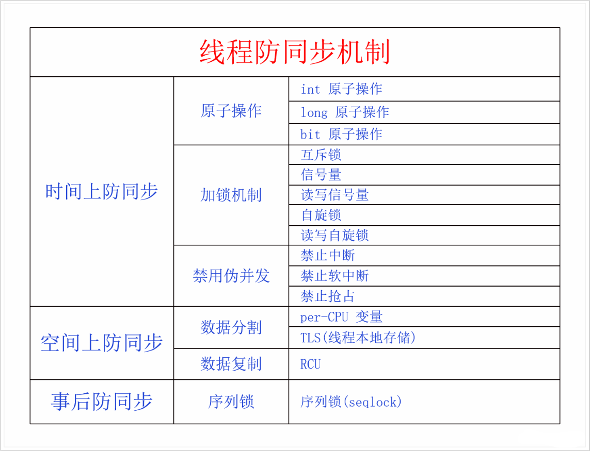

# 0x00. 导读

是否陷入内核，是否可重入

禁止调度？不能休眠？

# 0x01. 简介

# 0x02. 线程同步

名词定义：

- 真并发：在多处理器的情况下，多个进程(线程)能够在多个 CPU 核心上同时执行。
- 伪并发：即使只有一个处理器，用户程序也会被调度程序抢占和重新调度，我们可以认为所有就绪的进程都在同时执行，这就是抢占式内核的特性
- 临界区： 访问相同数据的代码段，如果可能会在多个线程中并发执行，就叫做临界区，临界区可以是一个代码段被多个线程并发执行，也可以是多个不同的代码段被多个线程并发执行。
- 同步： 首先线程同步的同步和同步异步的同步，不是一个意思。线程同步的同步，本文按照字面意思进行解释，同步就是统一步调、同时执行的意思。
- 线程同步现象： 线程并发过程中如果存在临界区并发执行的情况，就叫做线程同步现象。

针对线程同步可能出现的竞态问题，我们有三大类方法，分别是从时间上防同步、从空间上防同步、事后防同步。从时间上和空间上防同步都比较好理解，事后防同步的意思是说我先不防同步，先把临界区走一遍再说，然后回头看刚才有没有发生同步现象，如果有的话，就再重新走一遍临界区，直到没有发生同步现象为止。

## 2.1 时间上防同步

不让你们同时进入临界区，这样就不会同时操作相同的数据了。

### 2.1.1 原子操作

对于个别特别简单特别短的临界区，CPU 会提供一些原子指令，在一条指令中把多个操作完成，两个原子指令必然一个在前一个在后地执行，不可能同时执行。原子指令能防伪并发和真并发，适用于 UP 和 SMP。

### 2.1.2 加锁

在临界区的入口处加锁，同一时间只能有一个线程进入，获得锁的线程进入，在临界区的出口处再释放锁。

未获得锁的线程在外面等待，等待的方式有两种，忙等待的叫做自旋锁，休眠等待的叫做阻塞锁。  
根据临界区内的数据读写操作不同，锁又可以分为单一锁和读写锁，单一锁不区分读者写者，所有用户都互斥；读写锁区分读者和写者，读者之间可以并行，写者与读者、写者与写者之间是互斥的。

自旋锁有单一锁和读写锁，阻塞锁也有单一锁和读写锁。自旋锁只能防真并发，适用于 SMP；休眠锁能防伪并发和真并发，适用于 UP 和 SMP。

### 2.1.3 临时禁用伪并发

对于某些由于伪并发而产生的同步问题，可以通过在临界区的入口处禁用此类伪并发、在临界区的出口处再恢复此类伪并发来解决。这种方式显然只能防伪并发，适用于 UP 和 SMP 上的单 CPU。而自旋锁只能防真并发，所以在 SMP 上经常会同时使用这两种方法，同时防伪并发和真并发。

临时禁用伪并发有三种情况：

a. 禁用中断  
如果线程和中断、软中断和中断之间会访问公共数据，那么在前者的临界区内可以临时禁用后者，也就是禁用中断，达到防止伪并发的目的。在后者的临界区内不用采取措施，因为前者不能抢占后者，但是后者能抢占前者。前者一般会同时使用禁中断和自旋锁，禁中断防止伪并发，自旋锁防止真并发。

b. 禁用软中断  
如果线程和软中断会访问公共数据，那么在前者的临界区内禁用后者，也就是禁用软中断，可以达到防止伪并发的目的。后者不用采取任何措施，因为前者不会抢占后者。前者也可以和自旋锁并用，同时防止伪并发和真并发。

c. 禁用抢占  
如果线程和线程之间会访问公共数据，那么可以在临界区内禁用抢占，达到防止伪并发的目的。禁用抢占也可以和自旋锁并用，同时防止伪并发和真并发。

## 2.2 空间上防同步

1. 数据分割

    把大家都要访问的公共数据分割成 N 份，各访问各的。这也有两种情况：

        a. 在 SMP 上如果多个 CPU 要经常访问一个全局数据，那么可以把这个数据拆分成 NR_CPU 份，每个 CPU 只访问自己对应的那份，这样就不存在并发问题了，这个方法叫做 per-CPU 变量，只能防真并发，适用于 SMP，需要和禁用抢占配合使用。

        b. TLS，每个线程都用自己的局部数据，这样就不存在并发问题了，能防真并发和伪并发，适用于 UP 和 SMP。

2. 数据复制

    RCU，只适用于用指针访问的动态数据。读者复制指针，然后就可以随意读取数据了，所有的读者可以共同读一份数据。写者复制数据，然后就可以随意修改复制后的数据了，因为这份数据是私有的。不过修改完数据之后要修改指针指向最新的数据，修改指针的这个操作需要是原子的。对于读者来说，它是复制完指针之后用自己的私有指针来访问数据的，所以它访问的要么是之前的数据，要么是修改之后的数据，而不会是不一致的数据。RCU 不仅能实现读者之间的同时访问，还能实现读者与一个写者的同时访问，可谓是并发性非常高。RCU 对于读者端的开销非常低、性能非常高。RCU 能防伪并发和真并发，适用于 UP 和 SMP。

## 2.3 事后防同步

不去积极预防并发，而是假设不存在并发，直接访问数据。访问完了之后再检查刚才是否有并发发生，如果有就再重来一遍，一直重试，直到没有并发发生为止。这就是内核里面的序列锁 `seqlock`，能防伪并发和真并发，适用于 UP 和 SMP。

