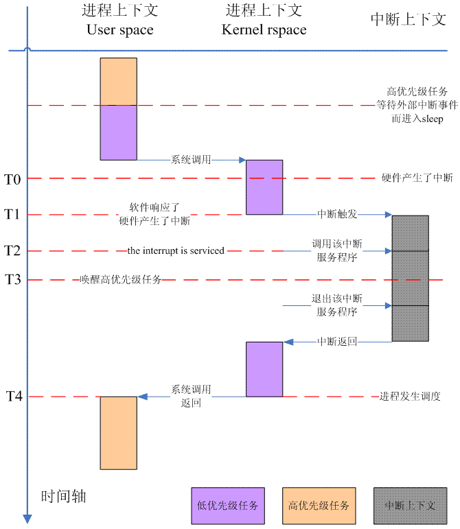
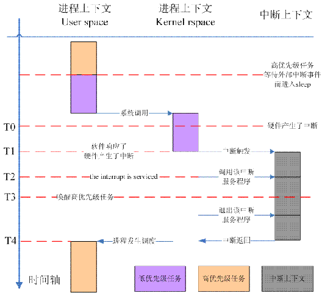

# 0x00. 导读

# 0x01. 简介

指在内核代码的执行过程中发生的抢占。

通常在执行内核代码时必须等待内核代码执行完成之后才能进行下一次调度（也就是上面的用户抢占的两种情况），也就是说调度器无法在任务还处于内核中的时候对它进行抢占。  
**Linux 实现了内核抢占使得内核代码的执行也可以被抢占，条件是当前任务没有持有锁**。这是通过在每一个进程的 thread_info 中加入 preempt_count 计数器来实现的，如果这个计数器为 0 表示可以抢占，否则就不行。以下四中情况下可能会发生内核抢占：

- 中断处理器结束并返回内核空间之前（也就是说内核代码正在执行的时候被中断，后面的图中例子）

- 内核再次变成可以抢占的时候（内核是否可以抢占需要依赖 preempt_count 如果它从非零变成零也就是再次变为可抢占）

- 内核代码显式调用 schedule() 函数（如果内核代码显式调用该函数表明内核代码确定目前可以抢占，否则就是代码的 BUG 了）

- 任务在内核中阻塞（这也会导致 schedule() 被调用）

# 0x02. 内核抢占

在 2.5 版本之前，内核在内核空间中的操作不会被暂停，比如进程使用 系统调用 陷入内核空间后会执行完整个系统调用操作，即使耗时很长。即使中断打断了该系统调用，**中断返回后该系统调用也继续运行，不触发调度。**

linux kernel 2.4(不支持内核抢占)：



橙色和紫色是两个不同的进程，紫色触发了 read()系统调用，进入内核空间，此时发生中断，中断处理完毕后返回内核空间继续执行，因为处于内核空间，在 2.4 中无法触发调度。

Linux 2.6 内核引入了完全抢占式内核（Fully Preemptible Kernel）的支持，它实现了内核抢占的特性，即使是在执行系统调用，也可被抢占调度。

linux kernel 2.6(支持内核抢占)：



注意 `T4` 时刻中断返回的区别。

在 2.6 中，即使是在内核空间，只要 `preempt_count` 为 0 表明可以抢占，就可以直接触发调度切换到其他的高优先级进程。

## 2.1 内核抢占的实现

在 task_struct 的 thread_info 结构中，有一个抢占计数器 preempt_count:

```c
struct thread_info {
    ...
    int preempt_count; /* 0  可抢占，>0  不可抢占， <0  BUG */
    ...
}
```

`preempt_count` 确定了内核当前是否处于一个可以被抢占的位置。如果 `preempt_count` 为 0 ，则内核可以被抢占，否则不行。比如处于临界区时内核是不希望自己被抢占的，可以通过 `preempt_disable` 暂时停用内核抢占。

`preempt_count` 是一个 int 而不是 bool 类型的值，表示对内核抢占的开关可以嵌套，多次增加 `preempt_count` 关闭内核抢占后，必须递减同样次数的 `preempt_count` ，才能再次启用内核抢占。

`preempt_count` 操作相关的函数：

- preempt_disable: 通过调用 inc_preempt_count 增加计数来停用抢占。此外，会指示编译器避免某些内存优化，以免导致某些与抢占机制相关的问题。
- preempt_check_resched: 会检测是否有必要进行调度，如有必要则进行。
- preempt_enable: 启用内核抢占，然后立即用 preempt_check_resched 检测是否有必要重调度。
- preempt_enable_no_resched: 启用内核抢占，但不进行重调度。实际操作是调用 dec_preempt_count()为 `preempt_count` 加 1。

抢占的实际操作就是调用 `__schedule()` 函数触发一次调度。

在开启抢占式调度( CONFIG_PREEMPT )的情况下，`preempt_schedule_context()` 会在合适的时机执行，此时会检测当前进程是否需要被调度( TIF_NEED_RESCHED 标志)，然后执行 `preempt_schedule()` ：

```c
// include/linux/preempt.h
#define preempt_check_resched() \
do { \
	if (unlikely(test_thread_flag(TIF_NEED_RESCHED))) \
		preempt_schedule(); \
} while (0)
```

在 preempt_schedule() 中，判断当前是否允许内核抢占( preempt_count 是否为 0 )或是否停用了中断（ irqs_disabled() ），如果允许，则调用主调度器函数 __schedule() 触发调度：

```c
asmlinkage void __sched notrace preempt_schedule(void)
{
	struct thread_info *ti = current_thread_info();

	/*
	 * If there is a non-zero preempt_count or interrupts are disabled,
	 * we do not want to preempt the current task. Just return..
	 */
	if (likely(ti->preempt_count || irqs_disabled()))
		return;

	do {
        /*
         * 触发调度前首先将preempt_count加上极大值PREEMPT_ACTIVE
         * 保证关闭内核抢占，防止嵌套。同时该标志用于schedule()中
         * 对是否是由抢占触发的情况做判断。
         */
		add_preempt_count_notrace(PREEMPT_ACTIVE);
		__schedule();
        // 调度结束回来时要把临时加的PREEMPT_ACTIVE减掉
		sub_preempt_count_notrace(PREEMPT_ACTIVE);

		/*
		 * Check again in case we missed a preemption opportunity
		 * between schedule and now.
		 */
		barrier();
    // 每次循环判断一次TIF_NEED_RESCHED标记，如果依然需要调度，则再次执行不返回
	} while (need_resched());
}
```

## 2.2 内核抢占的触发时机

内核抢占被重新激活时，也就是 preempt_enable() 被调用时，会调用 preempt_check_resched() 进行调度(如果条件满足)

```c
#define preempt_enable() \
do { \
    preempt_enable_no_resched(); \
    barrier(); \
    preempt_check_resched(); \
} while (0)
```

在处理了一个硬件中断请求之后。如果处理器在处理中断请求后返回核心态（返回用户态不属于内核抢占讨论的范畴），特定于体系结构的汇编例程会检查抢占计数器值是否为 0(是否允许抢占)，以及是否设置了重调度标志，然后调用 __schedule(). 