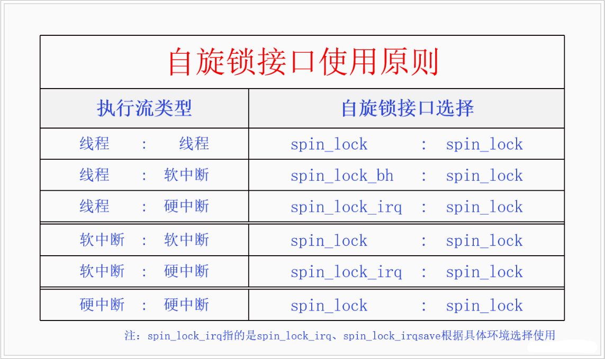

# 0x00. 导读


# 0x01. 简介

自旋锁的概念很简单，如果加锁失败了，在等锁时使用忙等待。  
自旋锁的逻辑是，用自旋锁保护的临界区要足够小，当自旋锁加锁失败时，说明有其它的临界区正在执行中。由于自旋锁的临界区足够小且不会休眠，所以我们可以自旋忙等待其它临界区的退出，没必要去休眠，因为休眠要做一大堆操作。而忙等待的话，对方很快就会退出临界区，我们就可以很快地获得自旋锁了。

# 0x02. 前提补充

先说结论： spinlock 会关闭本 CPU 中断，会禁止本 CPU 上的调度，临界区内不能休眠。

## 2.1 单处理器上临界区问题

对于单处理器来说，由于任何一个时刻只会有一个执行单元，因此不存在多个执行单元同时访问临界区的情况。但是依然存在下面的情形需要保护：

- Case 1 任务上下文抢占

    低优先级任务A进入临界区，但此时发生了调度(比如发生了中断, 然后从中断中返回),高优先级任务B开始运行访问临界区。  

    解决方案：进入临界区前**禁止抢占**就好了。这样即使发生了中断，中断返回也只能回到任务A.

- Case 2 中断上下文抢占

    任务A进入临界区，此时发生了中断，中断处理函数中也去访问修改临界区。当中断处理结束时，返回任务A的上下文，但此时临界区已经变了！

    解决方案：进入临界区前**禁止中断**(顺便说一句，这样也顺便禁止了抢占)

## 2.2 中断、调度、睡眠

睡眠依赖调度器唤醒，调度器通过时钟中断判断何时唤醒任务。

所以，关了中断，调度器再也无法收到时钟中断了，所以就无法唤醒任务了。调度器无法工作，也就等于关了调度（**关中断就是关调度**）。所以操作系统中，关中断时不能睡眠，睡眠就会睡死了。

spinlock 肯定会关调度，别人别和我抢这个临界区，同时也不让其它核抢。 同时，spinlock 分为两种，一种是顺带关中断的，另一种不是。对于第一种，是我们经常遇见的，没中断就没调度。对于第二种，这种情况下理论上是可以产生调度的，但又因为关了抢占，别的任务又不能跑，这个核实际上是浪费了。

## 2.3 多处理器上临界区问题

- case 3 其他CPU访问

    任务A运行在CPU_a上，进入临界区前关闭了中断(本地)，而此时运行在CPU_b上的任务B还是可以进入临界区！没有人能限制它

    解决方案：任务A进入临界区前持有一个互斥结构，阻止其他CPU上的任务进入临界区，直到任务A退出临界区，释放互斥结构。

    这个互斥结构就是自旋锁的来历。所以本质上，自旋锁就是为了针对SMP体系下的同时访问临界区而发明的！


# 0x03. 说回 spinlock

由于 spin_lock 会关闭抢占，所以天然解决伪并发的问题。

## 3.1 定义

```c
typedef struct spinlock {
	union {
		struct raw_spinlock rlock;
        // code omitted
	};
} spinlock_t;

typedef struct raw_spinlock {
	arch_spinlock_t raw_lock;
    // code omitted
} raw_spinlock_t;

// for x86-64 and smp
typedef struct qspinlock {
	atomic_t	val;
} arch_spinlock_t;

// for x86-64 and up
typedef struct { } arch_spinlock_t;
```

原来自旋锁就是一个原子变量(修改这个变量会 LOCK 总线，因此可以避免多个 CPU 同时对其进行修改)。

## 3.2 API

内核使用 `spin_lock_init` 来进行自旋锁的初始化。

加锁：  
`spin_lock`: 关闭抢占（可以解决前面说的Case 1和Case 3）  
`spin_lock_irq`: 关闭抢占，关闭中断（解决了Case 2，其实禁止中断也就没有了抢占）  
`spin_lock_irqsave`: 它与 spin_lock_irq 的区别就在于加锁时将中断使能状态保存在 flags. 这样就保证了在进出临界区前后，中断不变。（如果进入临界区前中断本来是关闭，spin_lock_irq 通过一进一出，中断竟然变成打开的了！这显然不合适！）  
`spin_lock_bh`: 关闭软中断

`spin_unlock`、`spin_unlock_irq` 或者 `spin_unlock_irqsave` 、`spin_unlock_bh` 完成对应的解锁。

对于 UP ，锁等于关闭抢占，解锁等于打开抢占。

## 3.4 历史

自旋锁一开始的实现是很简单的，后来随着众核时代的到来，自旋锁的公平性成了很大的问题，于是内核实现了 **票号自旋锁 (ticket spinlock)** 来保证加锁的公平性。后来又发现票号自旋锁有很大的性能问题，于是又开始着力解决自旋锁的性能问题。先是开发出了 **MCS** 自旋锁，确实解决了性能问题，但是它改变了自旋锁的接口，所以没办法替代自旋锁。然后又有人对 MCS 自旋锁进行改造从而开发出了 **队列自旋锁 (queue spinlock)** 。队列自旋锁既解决了自旋锁的性能问题，又保持了自旋锁的原有接口，非常完美。  

现在内核使用的自旋锁是队列自旋锁。


# 0x04. 自旋锁与禁用伪并发

内核里有四种不同类型的执行流，线程、软中断、硬中断、NMI 中断，前者不能抢占后者，但是后者能抢占前者。

自旋锁能防止两个 CPU 同时进入临界区，但是并不能防止本 CPU 的临界区被高级的执行流所抢占。所以当两个关联临界区在不同类型的执行流的时候，只使用自旋锁是不够的，低级执行流还得临时禁止高级执行流的抢占才行。由于 NMI 中断是不可禁止的，而且 NMI 中断发生的概率非常低，一般我们的代码也不会与 NMI 中断发生关联，所以 NMI 中断就不考虑了。现在只剩下线程、软中断、硬中断三种情况了。组合下来有 6 种情况，我们一一说明。

- 线程对线程，自旋锁内部已经禁用了线程抢占，所以两个线程之间的临界区直接使用自旋锁就可以了。
- 线程对软中断，线程会被软中断抢占，所以线程中要自旋锁加禁用软中断，而软中断不会被线程抢占，所以软中断中直接使用自旋锁就可以了。
- 线程对硬中断，线程会被硬中断抢占，所以线程中要自旋锁加禁用硬中断，而硬中断不会被线程抢占，所以硬中断中直接使用自旋锁就可以了。
- 软中断对软中断，软中断中发生硬中断，硬中断返回时发现正在软中断中，不会再去执行软中断，只会排队软中断，所以软中断对软中断只使用自旋锁就可以了。
- 软中断对硬中断，由于硬中断会抢占软中断，所以软中断中要禁用硬中断，硬中断中直接使用自旋锁就可以了。
- 硬中断对硬中断，现在内核里已经禁止中断嵌套了，所以只使用自旋锁就可以了。



从图中我们可以看到规律，由于前者不能抢占后者，后者可以抢占前者，所以前者禁用后者就可以了，后者则直接使用自旋锁就可以了。由于同类型的执行流不会抢占对方，所以直接使用自旋锁就可以了。

# 0x0 . 参考

[获取自旋锁和禁止中断的时候为什么不能睡眠?](https://www.zhihu.com/question/28821201/answer/42214222)  
[深入理解同步机制---内核自旋锁](https://switch-router.gitee.io/blog/spinlock/)  
[Linux 中断、抢占、锁之间的关系](https://blog.guorongfei.com/2014/09/06/linux-interrupt-preemptive-lock/)   
[深入理解Linux自旋锁](https://blog.csdn.net/orangeboyye/article/details/125488951)