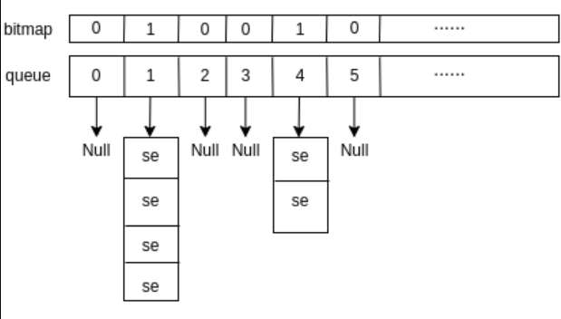

# 0x00. 导读

介绍 O（1）调度器。

# 0x01. 简介

O(n) 调度器 的实现思路非常简单，在它的年代也够用了，但随着多核架构的发展，其扩展性方面的问题越来越明显。其中最大的问题是系统中所有的 CPU 共享一个全局的运行队列，这个设计会导致如下问题：

1. 并发访问的问题，系统需要通过加锁来同步对队列的访问
2. 每次调度需要遍历整个队列，时间复杂度太高
3. 实时任务与普通任务共用一个队列，影响实时任务的响应速度
4. 任务在调度时，很容易在不同的 CPU 之间来回跳转，无法很好地利用 CPU 缓存
5. 在每个调度周期后期，容易造成有的 CPU 在空跑，例如此时还有剩余时间的就绪任务的总量小于 CPU 数量的话，就一定有 CPU 此时处于 idle 状态
6. 给任务分配调度时间时需要遍历系统的所有任务，效率过于低下，并且在该过程中其余的 CPU 实际上无事可做

总之，O(n) 调度器 简单粗暴的实现很难适应 SMP 架构下的扩容问题，而随着系统任务数量的增加，其性能存在严重的缺陷，我们需要一种更精细化的策略来完成任务调度。

O（1）调度器是 Linux 2.6.0 至 2.6.22 (2003-2007) 版本使用，直到后来被 CFS 取代。

# 0x02. 调度逻辑

在 O(n) 调度器 中，“运行队列”实际上只是个逻辑概念，内核只是用一个列表将就绪任务串起来了而已，并没有单独定义一个数据结构。 O(1) 调度器 的实现中专门定义了结构体 `struct runqueue` 来对各种信息进行封装，并且为了解决全局运行队列额问题， O(1) 调度器 为每个 CPU 单独维护了一个运行队列 (runqueue) ，这种变量叫着 per cpu variable. 

这样 CPU 在调度时，会首先拿到与自己绑定的运行队列在进行各种操作，不会影响其他 CPU 的工作。  

为了降低时间复杂度，调度器在 runqueue 中又为每个优先级单独维护了一个任务列表，这部分信息封装在数据结构 `struct prio_array` 中：
```c
/* file: kernel/sched.c */
struct prio_array {
    unsigned int nr_active;
    unsigned long bitmap[BITMAP_SIZE];
    struct list_head queue[MAX_PRIO];
};
// queue 中的每个元素都是一个任务列表，位图 bitmap 用来标识列表是否为空。
```


图中展示的任务列表中，只有优先级为 1 与 4 的列表非空。有了 prio_array 的支持，调度器在寻找下一个任务时的时间复杂度就变为了 O(1): 先找到 bitmap 中的第一个非 0 的位置，然后将其作为索引从 queue 中取出任务列表，再取出第一个任务即可。

当然，由于每个 CPU 现在都有自己的 runqueue , 因此调度器还需要对各个 CPU 做负载均衡。

# 0x03. 时间分配

每个调度周期结束后需要单独为每个任务分配时间，效率底下。为了解决这个问题，O(1) 调度器 为每个 runqueue 准备了两个任务列表，对应的字段为 `prio_array_t *active, *expired`; 其中 active 用来存放就绪任务，而 expired 用来存放时间片已经耗尽的任务。  
在调度时，调度器使用 active 来寻找下一个任务，而当任务的运行时间被耗尽后，系统会立刻为其计算下一轮的运行时间并将其放入 expired 列表，这样当 active 为空时，调度器就不用暂停所有工作来分配时间，而是直接切换 active 与 expired 两个列表即可。该逻辑发生在调度函数 schedule() 中。

如果任务被扔到 expired 列表，那么它在这一轮周期内就没有机会再运行了，但对于交互式任务而言可能导致响应延迟，造成不好的用户体验，因此我们希望尽可能地不要将交互式任务从 active 中剔除，系统通过宏 `TASK_INTERACTIVE` 来判断任务是否是交互式任务，主要判断依据是任务的平均睡眠时间。但也要避免交互式任务一直呆在 active 里面导致 expired 中的任务被饿死，所以系统会使用宏 `EXPIRED_STARVING` 来判断 expired 列表中的任务是否要饿死了，如果是的话，那么依然会将任务扔进 expired 中，乖乖地等待下一轮调度。

# 0x04. 算法改进：SD 和 RSDL

设计调度器是个很复杂的工作，特别是要设计出一款通用调度器，其面临的挑战更大，因为不同的应用场景有不同的需求，交互式任务希望响应速度更快，批处理任务希望吞吐量更大，多核架构下，又需要在高效利用所有 CPU 的前提下，尽量保证高速缓存与 TLB 的命中率。尽管 O(1) 调度器针对 O(n) 的问题做了很多优化，在大多数情况下也工作得很好，但依然有用户抱怨在特定场景下存在各种问题。

识别与奖励交互式任务本质上是在追求时间分配的公平性，而仅仅通过进程行为来判断其是否是交互式任务实际上是没有理论依据的，尽管 O(1) 在算法上做了很多改进，包括考量进程在 CPU 上的运行时间、在 runqueue 中的等待时间、睡眠时间以及进程睡眠时的状态等，但这些努力也只是能够提升“猜中”的概率而已，总有用户举出在特殊场景下交互式任务响应太慢的例子，反而导致代码变得非常复杂。同时不管是 O(n) 还是 O(1) , 其对交互式任务的奖励方式都会造成任务的调度延迟是不确定的，**我们无法通过有效的手段得到某个任务的延迟响应时间**。

后来，大家尝试着抛弃“评估任务的交互性”这种思路来寻找解决办法，SD 和基于它的改进版 RSDL(Rotating Staircase Deadline Scheduler) 便是这样的一种方案。该方案由 Con Kolivas 提出，我们在这里简单讨论一下其设计思路。
同 O(1) 一样，在每个调度周期内， RSDL 会根据任务的优先级为其分配固定的 CPU 时间，并且为每一个优先级维护一个任务列表。**但在任务运行过程中，任务不会始终呆在自己优先级所对应的任务列表中，而是随着时间的消耗顺着优先级的任务阶梯逐级下降，直到所有任务的运行时间耗尽，调度器再开启下一轮调度。**