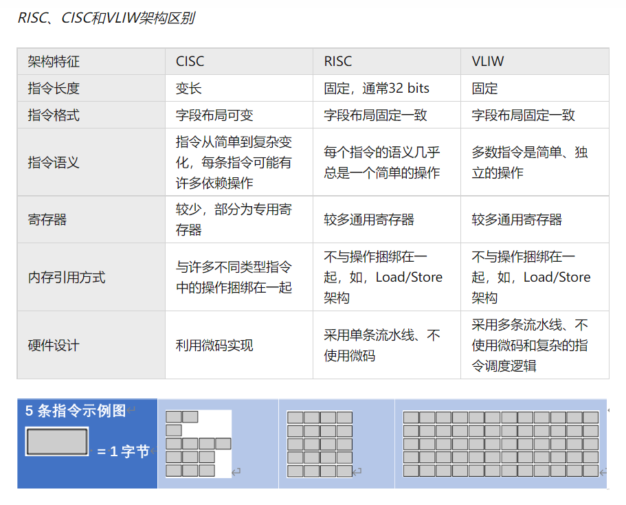

# 0x00. 导读

# 0x01. 简介

# 0x02. 

## 2.1 指令

当我们给 CPU 的一些指定端口传入 特殊 的高低电平时，CPU 内部的逻辑电路就会按照 “事先设计的规则” 进行运转，并在一些端口输出最终 “计算的结果” 。这些特殊的高低电平就是所谓的 **指令**。

指令其实有两个鲜明的特征：事先约定、CPU实现。  
也就是说这些指令是在创造 CPU 之前就已经约定好的，而后实现的 CPU 必须按照指令来实现相应的功能。

## 2.2 指令集架构

 

这张图描述了整个计算机系统从上到下的抽象层。首先最顶层的是应用程序（Application），那么应用程序在计算机里是由什么构成的呢？是由它的下一层级，算法（Algorithm）构成的。算法也依赖于所实现它的编程语言（Programming Language），然而编程语言也需要操作系统（Operating System）的支持才能正确工作。那什么东西支持操作系统呢？再往下一层就是 指令集架构（Instruction Set Architecture, 以下简称 ISA ）。

**指令集架构包含了基本数据类型，指令集，寄存器，寻址模式，存储体系，中断，异常处理以及外部I/O。指令集架构包含一系列的 opcode 即操作码（机器语言），以及由特定处理器执行的基本命令。**

## 2.3. Microarchitecture

指令集架构（ISA）和微架构（Microarchitecture）很多时候会被人们混淆。**其实微架构就是对 ISA 的一种实现**。使用不同微架构的电脑可以共享一种指令集。例如，Intel 的 Pentium 和 AMD 的 AMD Athlon，两者几乎采用相同版本的 x86 指令集体系，但是两者在内部设计上有本质的区别。

# 0x03. 指令集架构

常见的指令集架构有三种：

- 复杂指令集运算（Complex Instruction Set Computing，CISC）

- 精简指令集运算（Reduced Instruction Set Computing，RISC）

    RISC 最初起源于加州伯克利分校的一个4人团队，RISC-V 是研究团队在2010年推出的第五代 RISC 体系，读作 risk-five ，由于它的免费、开源和高效，RISC-V 很快便引来越来越多的科技巨头的加入。

- 超长指令字指令集运算（Very Long Instruction Word, VLIW）

    通过将多条指令放入一个指令字，有效的提高了CPU各个计算功能部件的利用效率，提高了程序的性能

不常见的就不管了，只说 CISC 和 RISC 。我自己的理解：根据 ISA 这个规范制作成两个子集 CISC 和 RISC。而后的 x86 ARM 等是这两个子集的具体实现。

例如： X86 属于 CISC, ARM 是 RISC 的典型代表，另一个 RISC 的典型就是 MIPS.  
目前最活跃的 MIPS 是中国的龙芯，其 loongisa 架构其实是 MIPS 的扩展。在设计理念上 MIPS 指令集强调软硬件协同提高性能，同时简化硬件设计。power cpu 属于 RISC, 老苹果用的就是这货。 alpha 侧重超算，目前貌似最活跃是中国申威，神威太湖之光的cpu就是这货。

## 3.1 指令集

指令构成的集合称为指令集，它规定了 CPU 可执行的所有操作，也是一种规范。用厨房的比喻就是菜谱，它定义了你这个厨房能做什么菜，这个菜做出来是什么样什么味道，使得顾客在这家连锁店的任何一间都能叫到相同的菜，吃到相同的味道。
