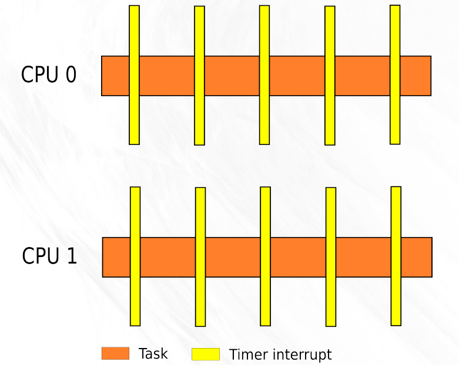
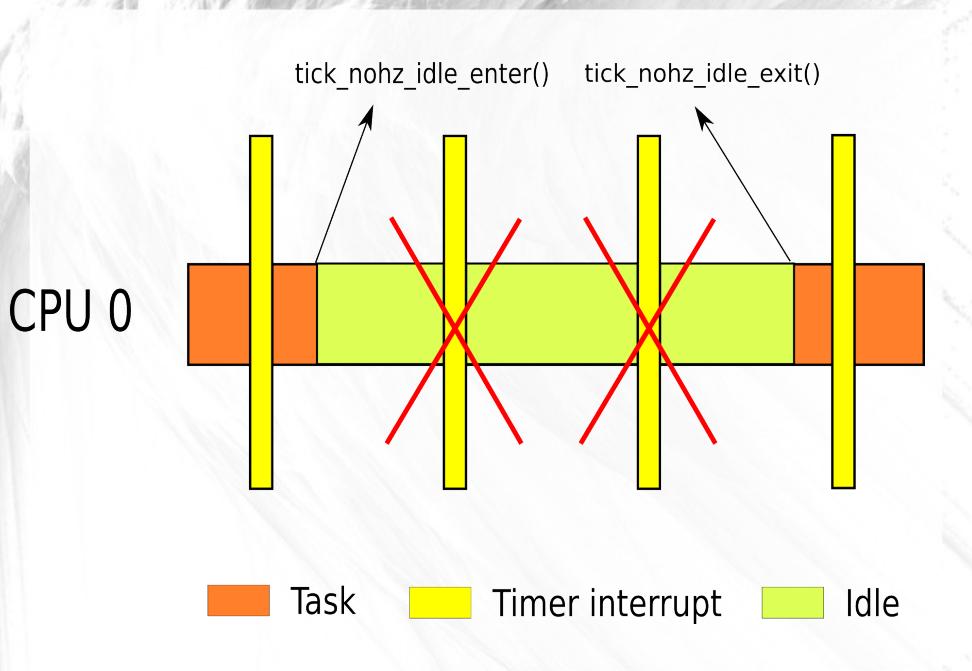

# 0x00. 导读

tick 就是周期性的时钟中断，作为系统的心跳，很多事情都需要靠它驱动。

`grep CONFIG_HZ /boot/config-$(uname -r)` 命令查看 tick 频率。

# 0x01. 简介

从系统开始启动后经过的 ticks 被记作 `jiffies`，每发生一次时钟中断，jiffies 的数值就加上 1 。

本文目标就是减少调度时钟中断的数量，从而提高效率并减少操作系统抖动。

# 0x02. 模式

## 2.1 period 模式

CONFIG_HZ_PERIODIC, 不管啥时候， tick 都不会被省略。

## 2.2 dyntick-idle/no_hz/tickless 模式

当 CPU 进入 idle 低功耗模式时，是不希望被 tick 打断的。为此，自2007年的2.6.21版本，可通过 `CONFIG_NO_HZ_IDLE` 配置选项，于 idle 模式时关闭 tick（不需要 HZ ）。这是默认配置。

其带来的收益是功耗的减少，付出的代价则是进入和退出 dyntick-idle 模式的指令开销较大。是目前内核默认采用的 tick 模式。

## 2.3 adaptive-ticks 模式

如果一个 CPU 上只有一个任务，同样也是不需要 tick 的。这种需求在2013年的3.10版本被支持，称为 "adaptive-ticks" 模式，对应的配置选项为 `CONFIG_NO_HZ_FULL`，"full" 可理解为 1 个 task 在一段时间内完全地占有一个 CPU 。

对于需要开启这项功能的 CPU ，应在内核启动参数中设置，比如 "nohz_full=1,6-8" ，就表明 CPU 1, 6, 7, 8 是 adaptive-ticks 的，系统运行后不可再动态更改（想更改只能 reboot ）。

"dyntick-idle" 模式需额外付出的 effort 对 "adaptive-ticks" 模式也是存在的，而后者还有一些其他方面的问题。当 CPU 上唯一的线程从用户态进入内核态执行后，并不会发生 task 切换，依然满足 adaptive-ticks 的条件，这就对线程 "utime" 和 "stime" 的统计造成了困难。

### 2.3.1 RCU callback

adaptive-ticks CPUs must have their RCU callbacks offloaded.(卸载 RCU 回调)

通常，CPU 会尽可能长时间地保持 adaptive-ticks 模式。并且，即使转换到内核模式也不会自动更改模式。
相反，CPU 将仅在需要时退出 adaptive-ticks 模式，例如，if that CPU enqueues an RCU callback.

CONFIG_RCU_NOCB_CPU, rcu_nocbs=
