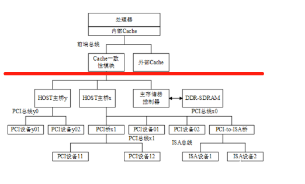
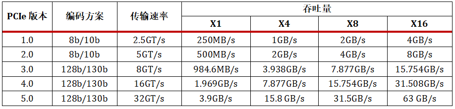
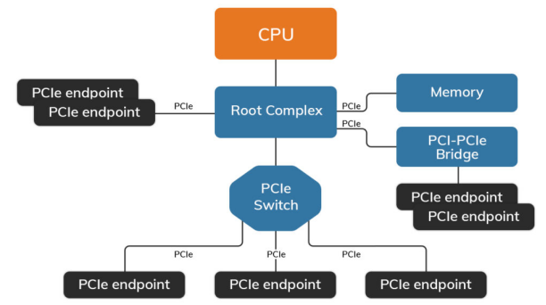

# 0x00. 导读

[PCIe扫盲系列](https://blog.chinaaet.com/justlxy/p/5100053251)

# 0x01. 简介

PCI 即 Peripheral Component Interconnect, 外设组件互连标准，是由 PCISIG (PCI Special Interest Group) 推出的一种 连接电脑主板和外部设备的总线标准。目前该总线已经逐渐被 PCI Express 总线所取代。

其主要作用是用于连接计算机内部的各种硬件设备，包括网络适配器、声卡、显卡、硬盘控制器等等。PCIe总线与传统的并行总线标准如PCI和PCI-X相比，PCIe提供了更低的延迟和更高的数据传输速率。每个连接到主板上的设备都通过独立的点对点连接与之相连，这避免了设备之间因为共享同一总线而竞争带宽的情况。

PCI总线具有独立的地址空间，即PCI总线地址空间，该空间与存储器地址空间通过HOST主桥隔离。cpu处理器需要通过HOST主桥进行地址转换才能访问PCI设备，而PCI设备也需要通过HOST主桥进行地址转换才能访问主存储器(内存)。



HOST主桥是联系和连接处理器和PCI设备的桥梁。在一个处理器中，每一个HOST主桥都管理了一颗PCI总线树，在同一颗PCI总线树上的所有PCI设备属于同一个PCI总线域。如上图所示，HOST主桥x下的PCI设备属于PCI总线x域，而HOST主桥y下的PCI设备属于PCI总线y域。在这棵总线树上的所有PCI设备的配置空间都由HOST主桥通过配置读写总线周期访问。


# 0x02. 基础

PCIe的传输速度上限由两个值决定：

- PCIe的lane，一个lane代表一个数据通道。最少的是单个lane，就是PCIe x1。目前市面上常见的lane数量能达到16，也就是常说的x16
- 通道属于第几代标准的PCIe？最新一代是5.0，于2019年发布，单个lane的传输速度能达到约4 Gbps，16个lane全开的极限速度能达到惊人的64 GBps。



PCIe的架构主要由五个部分组成：Root Complex(根复合体)，PCIe Bus，Endpoint(终端设备)，Port and Bridge(桥接器)，Switch。其整体架构呈现一个树状结构



## 2.1 总线

## 2.1 PCI PCIe

# 0x03.

PCI 配置空间和内存空间是分离的，那么如何访问这段空间呢？我们首先要对所有的 PCI 设备进行编码以避免冲突，通常我们是以三段编码来区分PCI设备:
- Bus Number
- Device Number
- Function Number

简称为 BDF, 有了 BDF 我们可以唯一确定某一 PCI 设备，一般写作 BB:DD.F 的格式。

```bash
$ lspci -t -v
 # [Domain:Bus]
 \-[0000:00]-+-00.0  Advanced Micro Devices, Inc. [AMD] Starship/Matisse Root Complex
         # Device.Function
             +-14.0  Advanced Micro Devices, Inc. [AMD] FCH SMBus Controller
```