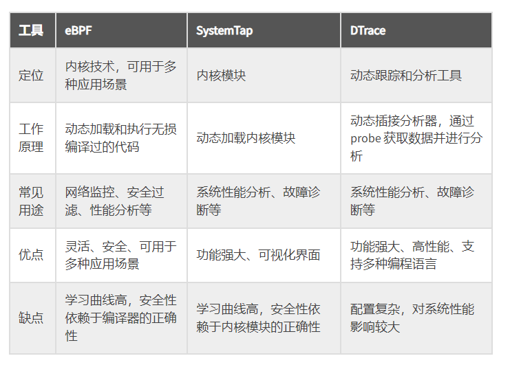
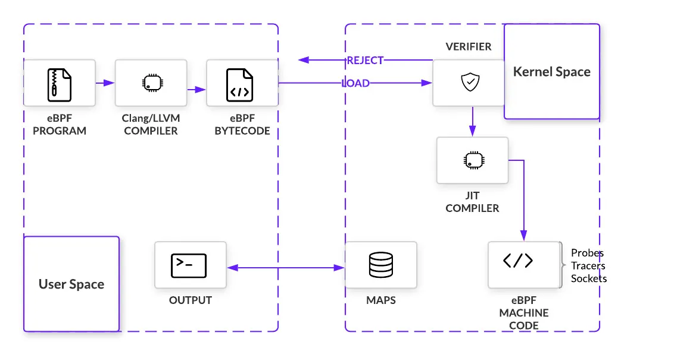

# 0x00. 导读

# 0x01. 简介

# 1.1 BPF 历史

BPF 的全称是 Berkeley Packet Filter ，中文翻译为伯克利包过滤器，是类 Unix 系统上数据链路层的一种原始接口，提供原始链路层封包的收发。

dtrace 是一个 Solaris 和 BSD 操作系统上的动态跟踪工具，eBPF 受到 dtrace 的启发，原意是设计一个更好的 Linux 跟踪工具。跟 dtrace 不同的是，Linux 无法获取运行中系统的鸟瞰视图，它被系统调用、库调用以及函数所限制。一小撮工程师在 Berkeley Packet Filter（BPF）基础之上，构建一个内核虚拟机级别的包过滤机制，提供了类似 dtrace 的功能。2014 年 extended BPF(eBPF) 随 Linux 3.18 首次限量发布，充分利用 eBPF 至少需要 `Linux 4.4` 以上版本。为了后向兼容，传统的 BPF 仍被保留了下来，并被重命名为 cBPF(classical BPF)。

eBPF 比起 cBPF 来说， cBPF 只能用于网络过滤，而 eBPF 则可以用于更多的应用场景，包括网络监控、安全过滤和性能分析等。另外，eBPF 允许常规用户空间应用程序将要在 Linux 内核中执行的逻辑打包为字节码，当某些事件（称为挂钩）发生时，内核会调用 eBPF 程序。此类挂钩的示例包括系统调用、网络事件等。用于编写和调试 eBPF 程序的最流行的工具链称为 BPF 编译器集合 (BCC)，它基于 LLVM 和 CLang。

有了 eBPF，无需修改内核，也不用加载内核模块，程序员也能在内核中执行自定义的字节码。

# 1.2 bcc 历史

bcc 是一个为了方便创建高效内核跟踪和操作程序的工具包，包括一些开箱即用的工具和示例。 它基于 eBPF 开发（需要 Linux 3.15 及更高版本）。 bcc 使用的大部分内容都需要 Linux 4.1 及更高版本。

bcc 使得 bpf 程序更容易被书写（旧的流程是：编写BPF代码-编译成字节码-注入内核-获取结果-展示），bcc 使用 Python 和 Lua，虽然核心依旧是一部分 C 语言代码（BPF C 代码）。

BCC 包含了许多实用工具，如：

- bcc-tools：一个包含许多常用的 BCC 工具的软件包。
- bpftrace：一个高级语言，用于编写和执行 BPF 程序。
- tcptop：一个实时监控和分析 TCP 流量的工具。
- execsnoop：一个用于监控进程执行情况的工具。
- filetop：一个实时监控和分析文件系统流量的工具。
- trace：一个用于跟踪和分析函数调用的工具。
- funccount：一个用于统计函数调用次数的工具。

- pidstat：一个用于监控进程性能的工具。
- profile：一个用于分析系统 CPU 使用情况的工具。

# 1.3 



# 1.4 eBPF 工作原理

eBPF 的工作原理主要分为三个步骤：加载、编译和执行。



# 0x02. 命令

```bash
ls /usr/share/bcc/tools 

argdist       capable     filetop         offwaketime  stackcount  vfscount
bashreadline  cpudist     funccount       old          stacksnoop  vfsstat
biolatency    dcsnoop     funclatency     oomkill      statsnoop   wakeuptime
biosnoop      dcstat      gethostlatency  opensnoop    syncsnoop   xfsdist
biotop        doc         hardirqs        pidpersec    tcpaccept   xfsslower
bitesize      execsnoop   killsnoop       profile      tcpconnect  zfsdist
btrfsdist     ext4dist    mdflush         runqlat      tcpconnlat  zfsslower
btrfsslower   ext4slower  memleak         softirqs     tcpretrans
cachestat     filelife    mysqld_qslower  solisten     tplist
cachetop      fileslower  offcputime      sslsniff     trace
```

[bcc tools example](https://github.com/iovisor/bcc/tree/master/tools)

- opensnoop：prints one line of output for each open() syscall
- execsnoop: 列出新进程的运行信息
- exitsnoop: 列出进程运行时长和退出原因
- runqlat: 统计 CPU 运行队列的延迟信息
- runqlen: 统计 CPU 运行队列的长度
- runqslower: 当运行队列中等待时长超过阈值时打印
- cpudist: 统计在 CPU 上运行的时间
- profile: 采样 CPU 运行的调用栈信息
- offcputime: 统计线程脱离 CPU 时的跟踪信息和等待时常
- syscount: 按类型和进程统计系统调用次数
- argdist: 可以用来进行系统调用分析
- trace: 可以用来进行系统调用分析
- funccount: 统计函数调用次数
- softirqs: 统计软中断时间
- hardirqs: 统计硬中断时间
- llcstat: 按进程统计 LLC 命中率
- cachestat: provides read and write hits for the entire system cache.
- cachetop: provides cache hits for each process.
- oomkill: 展示 OOM Killer 事件的详细信息
- memleak: 展示可能有内存泄露的代码路径
- shmsnoop: 跟踪共享内存相关的调用信息
- swapin: 按进程展示页换入信息
- fileslower: 展示较慢的文件读/写操作
- filetop: 按 IOPS 和字节书排序展示文件
- writeback: 展示写回事件和对应的延迟信息
- dcstat: 目录缓存命中率统计信息
- dcsnoop: 跟踪目录缓存的查找操作
- mountsnoop: 跟踪系统中的挂载和卸载操作
- xfsslower: 统计过慢的 XFS 操作
- xfsdist: 以直方图统计常见的 XFS 操作延迟
- ext4slower: 跟踪 ext4 文件系统并对常见操作进行计时，然后仅打印超出阈值的操作。
- ext4dist: 以直方图统计常见的 EXT4 操作延迟
- nfsslower: 统计过慢的 NFS 操作
- nfsdist: 以直方图统计常见的 NFS 操作延迟
- biolatency: 跟踪磁盘 I/O 延迟（从设备发出到完成的时间），当工具结束时（Ctrl-C 或给定间隔），它会打印延迟的直方图摘要。
- biosnoop: 为每个磁盘 I/O 打印一行输出，其中包含延迟（从设备发出到完成的时间）等详细信息。
- biotop: top 工具的磁盘版：按进程统计块 I/O
- bitesize: 按进程统计磁盘 I/O 请求尺寸直方图
- biostacks: 跟踪磁盘 I/O 相关的初始化软件栈信息
- tcpconnect: 为每个主动的 TCP 连接（例如，通过 connect()）打印一行输出，其中包括源地址和目标地址等详细信息。
- tcpaccept: 为每个被动 TCP 连接（例如，通过accept()）打印一行输出，其中包括源地址和目标地址等详细信息。
- tcpretrans:  为每个 TCP 重传数据包打印一行输出，其中包括源地址和目标地址以及 TCP 连接的内核状态等详细信息。