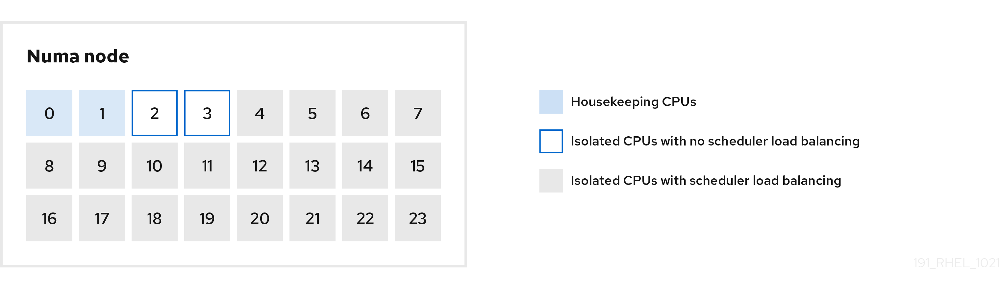

# 0x00. 导读

# 0x01. 简介

# 0x02. 

为了使用 cpu-partitioning 优化，需要以下修改：
-  `/etc/tuned/cpu-partitioning-variables.conf` 配置文件
- 将 tuned 设置为 cpu-partitioning (`tuned-adm profile cpu-partitioning`) 
- 重启。

**cpu-partitioning -> network-latency -> latency-performance**

这样你就能获得：
- The cpus dedicated to your application will be isolated (not via the isolcpus boot flag) 专用于你的应用程序的 cpu 将被隔离（不是通过 isolcpus 启动标志）
- IRQs, RCU callbacks, kernel dirty page threads – will all be moved off the isolated cpus IRQ、RCU 回调、内核脏页线程 – 都将从隔离的 cpu 中移出
- nohz_full set on the isolated cpus 在隔离的 cpu 上设置 nohz_full
- CPU frequency scaling set to maximum allowed CPU 频率缩放设置为允许的最大频率
- MCE interrupts disabled( MCE, Machine Check Exception, 是 CPU 发现硬件错误时触发的异常 (exception)，中断号是 18，异常的类型是 abort )
- Kernel workqueue requests moved off isolated cpus 内核工作队列请求从隔离的 cpu 上移出
- Kernel numa_balance and transparent hugepages disabled 禁用内核 numa_balance 和透明大页
- Various KVM options set to reduce latency and to remove unwanted VM Exits and interrupts 设置各种 KVM 选项以减少延迟并消除不需要的 VM 退出和中断
- Numerous kernel sysctl tunables set to low latency values 许多内核 sysctl 参数设置为低延迟值
- All programs started by systemd will be invoked with a cpu mask that prevents them from running on the isolated cpus. 所有由 systemd 启动的程序都将使用 cpu 掩码来调用，以防止它们在隔离的 cpu 上运行
- Coming soon: If your application also has some threads which can be pinned to specific cpus where no cpu load balancing is needed, the cpu-partitioning profile will provide a way in the /etc/tuned/cpu-partitioning-variables.conf file to isolate those cpus without any scheduler load balancer latency hits
即将推出：如果你的应用程序还有一些线程可以固定到不需要 cpu 负载平衡的特定 cpu，则 cpu 分区配置文件将在 /etc/tuned/cpu-partitioning-variables.conf 文件中提供一种方法隔离这些 cpu，没有任何调度程序负载均衡器延迟影响

## 2.1 例子

 
- 带有负载均衡的隔离 CPU  
    在 cpu-partitioning 图中，从 4 到 23 编号的块是默认的隔离 CPU。在这些 CPU 上启用了内核调度程序的进程负载均衡。它专为需要内核调度程序负载平衡的多个线程的低延迟进程而设计。

    您可以使用 isolated_cores=cpu-list 选项在 /etc/tuned/cpu-partitioning-variables.conf 文件中配置 cpu-partitioning 配置集，它列出了 CPU 来隔离将使用内核调度程序负载平衡。

    隔离的 CPU 列表用逗号分开，也可以使用一个短划线（如 3-5 ）指定范围。这个选项是必须的。这个列表中缺少的任何 CPU 会自动被视为内务 CPU。

- 没有负载均衡的隔离 CPU  
    在 cpu-partitioning 图中，编号为 2 和 3 的块是不提供任何其他内核调度程序进程负载均衡的隔离 CPU。

    您可以使用 no_balance_cores=cpu-list 选项在 /etc/tuned/cpu-partitioning-variables.conf 文件中配置 cpu-partitioning 配置集，它列出了不使用内核调度程序负载平衡的 CPU。

    指定 no_balance_cores 选项是可选的，但此列表中的任何 CPU 都必须是 isolated_cores 列表中所列 CPU 的子集。

    使用这些 CPU 的应用程序线程需要单独固定到每个 CPU。

- 日常 CPU  
    在 cpu-partitioning-variables.conf 文件中没有隔离的 CPU 会自动被视为内务 CPU。在内务 CPU 上，允许执行所有服务、守护进程、用户进程、可移动内核线程、中断处理程序和内核计时器。