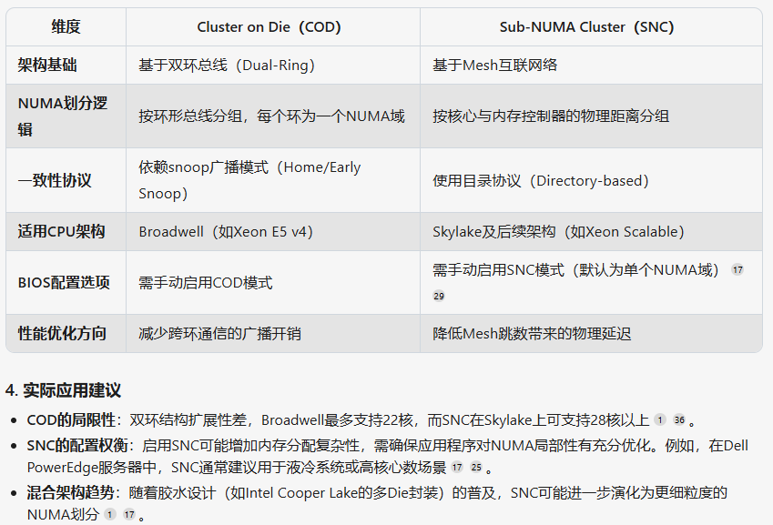
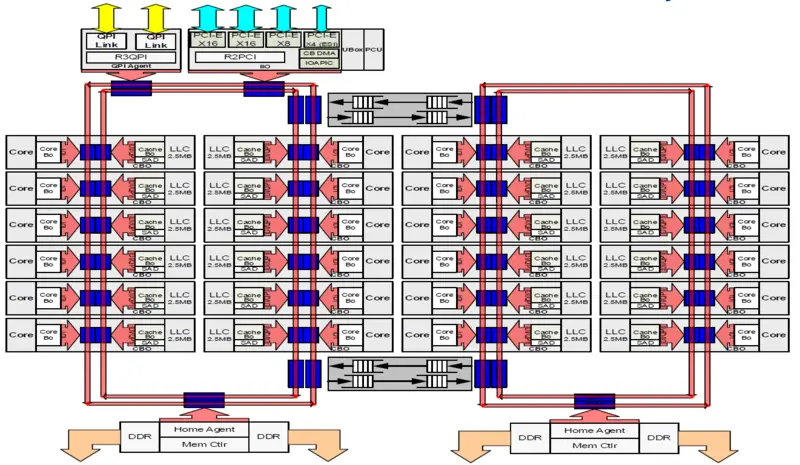
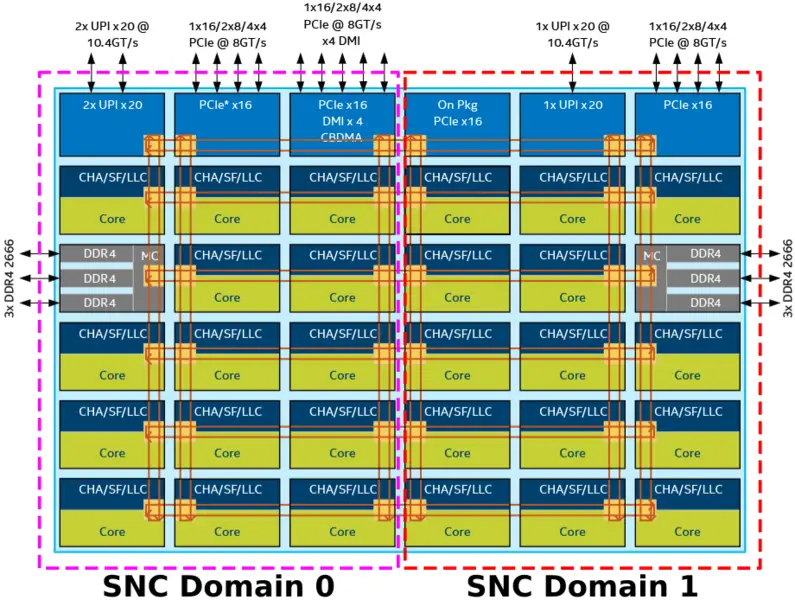

# 0x00. 导读

# 0x01. 简介

Cluster on Die（COD）和 Sub-NUMA Cluster（SNC）是两种针对多核服务器 CPU 设计的 NUMA 优化技术，旨在解决高核心数带来的内存访问延迟和一致性挑战。

# 0x02. COD

COD 主要用于解决双环总线（Dual-Ring）架构下的跨环访问延迟问题。当CPU核心数较多时，双环结构会导致不同环上的核心访问内存控制器（MC）的路径不同，从而产生性能差异。

COD 通过将单个物理 CPU 划分为两个逻辑 NUMA 节点，每个节点包含一半的核心和末级缓存（LLC），并绑定到独立的内存控制器。操作系统会将这两个逻辑节点识别为独立的NUMA域，以优化内存局部性。

# 0x03. SNC

SNC 是 Intel 在 **Skylake及后续架构（如Xeon Scalable）** 中提出的技术，针对 Mesh 互联架构设计。由于 Mesh 结构下核心与内存控制器的物理距离不同，SNC 通过将核心分组绑定到就近的内存控制器，进一步细分 NUMA 域。

例如，在 Skylake-X 架构中，单个 CPU 可能被划分为 2 或 4 个 SNC域（取决于核心数），每个域内的核心访问本地内存控制器的跳数更少，从而降低延迟。

