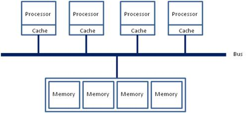
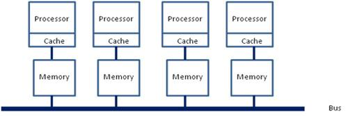
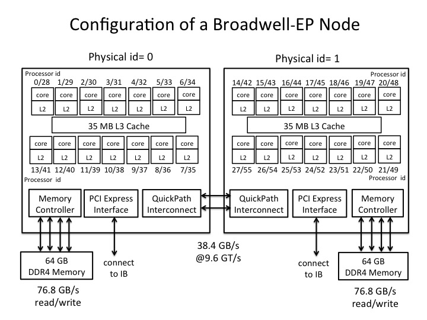

# 0x00. 导读

# 0x01. 简介

SMP, Symmetric Multi-Processing, 对称多处理器结构
- 只有一个操作系统实例，运行在多个CPU上，每个CPU的结构都是一样的，内存、资源共享。这种系统有一个最大的特点就是共享所有资源。

AMP, Asymmetric Multi-Processing, 非对称多处理器结构
- 多个CPU，各个CPU在架构上不一样，每个CPU内核运行一个独立的操作系统或同一操作系统的独立实例，每个CPU拥有自己的独立资源。这种结构最大的特点在于不共享资源。

我们平时使用的机器基本都是 SMP system，我目前还没有见过 AMP system。

如何查看我们的 Linux 是 SMP 还是 AMP, `uname -a` 命令的结果中含有 SMP.
```
$ uname -a
Linux cs_223 3.10.0-1160.119.1.el7.x86_64 #1 SMP Tue Jun 4 14:43:51 UTC 2024 x86_64 x86_64 x86_64 GNU/Linux
```

**SMP 架构又分为 NUMA 和 UMA.**

# 0x02. NUMA

对于 Linux 内核来说最早出现在 2.6.7 版本。

在若干年前，对于 x86 架构的计算机，那时的内存控制器还没有整合进 CPU，所有内存的访问都需要通过北桥芯片来完成。此时的内存访问如下图所示，被称为 **UMA(uniform memory access, 一致性内存访问 )**。这样的访问对于软件层面来说非常容易实现：总线模型保证了所有的内存访问是一致的，不必考虑由不同内存地址之前的差异。



之后的 x86 平台经历了一场从 拼频率 到 拼核心数 的转变，越来越多的核心被尽可能地塞进了同一块芯片上，各个核心对于内存带宽的争抢访问成为了**瓶颈**；此时软件、OS方面对于 SMP 多核心 CPU 的支持也愈发成熟；再加上各种商业上的考量，x86 平台也顺水推舟的搞了 **NUMA(Non-uniform memory access, 非一致性内存访问)** 。

在这种架构之下，每个 Socket 都会有一个独立的内存控制器 IMC（integrated memory controllers, 集成内存控制器），分属于不同的 Socket 之内的 IMC 之间通过 QPI link 通讯。

> 一个 Socket 上有多个 die, 一个 die 上有多个 core



然后就是进一步的架构演进，由于每个 socket 上都会有多个 core 进行内存访问，这就会在每个 core 的内部出现一个类似最早 SMP 架构相似的内存访问总线，这个总线被称为 IMC bus。

```
+-----------------------Node0/smp架构---------------+    +-----------------------Node1/smp架构----------------+
| +++++++++++++++  +++++++++++++++  +++++++++++++++ |    | +++++++++++++++  +++++++++++++++  +++++++++++++++ |
| |     CPU0     |  |     CPU2     |  |     CPU3    |    | |     CPU6    |  |     CPU7     |  |     CPU8   | |
| +++++++++++++++  +++++++++++++++  +++++++++++++++ |    | +++++++++++++++  +++++++++++++++  +++++++++++++++ |
|        |                |                |        |    |        |                |                |        |
|        |                |                |        |    |        |                |                |        |
|   -------------------IMC BUS--------------------  |    |   -------------------IMC BUS--------------------  |
|                |                 |                |    |                |                 |                |
|                |                 |                |    |                |                 |                |
|          +++++++++++++++   +++++++++++++++        |    |          +++++++++++++++   +++++++++++++++        |
|           |    memory   |   |    memory |      |    |            |    memory   |   |    memory      | |
|       +++++++++++++++   +++++++++++++++ |           +        +++++++++++++++++ +++++++++++++++        |
+___________________________________________________+    +___________________________________________________+
                           |                                                         |
                           |                                                         |
                           |                                                         |
  ----------------------------------------------------QPI---------------------------------------------------
```

于是，很明显的，在这种架构之下，两个 socket 各自管理 1/2 的内存插槽，如果要访问不属于本 socket 的内存则必须通过 QPI link。也就是说内存的访问出现了本地/远程（local/remote）的概念，内存的延时是会有显著的区别的。

以 Xeon 2699 v4 系列 [CPU( Broadwell架构 )](https://en.wikipedia.org/wiki/Broadwell_(microarchitecture)) 的标准来看，两个 Socket 之之间通过各自的一条 9.6GT/s 的 QPI link 互访。而每个Socket事实上有2个内存控制器。双通道的缘故，每个控制器又有两个内存通道（channel），每个通道最多支持3根内存条（DIMM）。理论上最大单 socket 支持 76.8GB/s(假设是用 DDR4 2400, 2400*8/1000=19.2GB/s, 19.2\*2\*2=76.8)的内存带宽，而两个 QPI link ，每个 QPI link 有 9.6GT/s 的速率（~57.6GB/s, 9.6GT/s × 16bit / 8bit/Byte = 19.2 GB/s, 2Link×19.2GB/s=38.4GB/s。作者可能用的是 9.6GT/s × 24bit / 8bit/Byte = 28.8GB/s/Link，QPI实际有效数据带宽需扣除协议开销（如纠错码））**事实上QPI link已经出现瓶颈了**。


[图来源](https://www.nas.nasa.gov/hecc/support/kb/broadwell-processors_529.html)

核心数还是源源不断的增加，内存的访问变得更加复杂。两个 IMC 也有了 local/remote 的区别，在保证兼容性的前提和性能导向的纠结中，系统允许用户进行更为灵活的内存访问架构划分。于是就有了“NUMA之上的NUMA”这种妖异的设定（SNC）。
