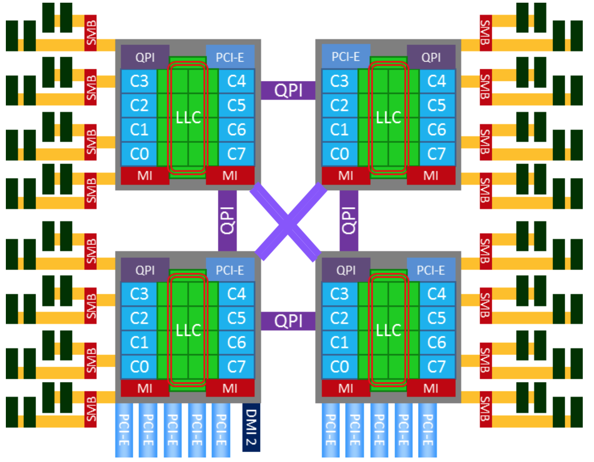

# 0x00. 导读

# 0x01. 简介

# 0x02. 基础概念

SMP VS. AMP
- SMP(Symmetric Multiprocessing)， 即对称多处理器架构，是目前最常见的多处理器计算机架构。
- AMP(Asymmetric Multiprocessing)， 即非对称多处理器架构，则是与SMP相对的概念。

那么两者之间的主要区别是什么呢？ 总结下来有这么几点，

- SMP的多个处理器都是同构的，使用相同架构的CPU；而AMP的多个处理器则可能是异构的。
- SMP的多个处理器共享同一内存地址空间；而AMP的每个处理器则拥有自己独立的地址空间。
- SMP的多个处理器操通常共享一个操作系统的实例；而AMP的每个处理器可以有或者没有运行操作系统， 运行操作系统的CPU也是在运行多个独立的实例。
- SMP的多处理器之间可以通过共享内存来协同通信；而AMP则需要提供一种处理器间的通信机制。

NUMA(Non-Uniform Memory Access) 非均匀内存访问架构 是指多处理器系统中，内存的访问时间是依赖于处理器和内存之间的相对位置的。 这种设计里存在和处理器相对近的内存，通常被称作本地内存；还有和处理器相对远的内存， 通常被称为非本地内存。

UMA(Uniform Memory Access) 均匀内存访问架构 则是与NUMA相反，所以处理器对共享内存的访问距离和时间是相同的。

由此可知，不论是 NUMA 还是 UMA 都是 SMP 架构的一种设计和实现上的选择。

阅读文档时，也常常能看到 ccNUMA(Cache Coherent NUMA)，即缓存一致性NUMA架构。 这种架构主要是在NUMA架构之上保证了多处理器之间的缓存一致性。降低了系统程序的编写难度。

x86多处理器发展历史上，早期的多核和多处理器系统都是 UMA 架构的。这种架构下，多个 CPU 通过同一个北桥(North Bridge)芯片与内存链接。北桥芯片里集成了内存控制器(Memory Controller)。下图是一个典型的早期 x86 UMA 系统，四路处理器通过 FSB (前端系统总线, Front Side Bus) 和主板上的内存控制器芯片 (MCH, Memory Controller Hub) 相连，DRAM 是以 UMA 方式组织的，延迟并无访问差异。

PCH(Platform Controller Hub)，Intel 于 2008 年起推出的 Chipset，用于取代以往的 I/O Controller Hub (ICH).

在 UMA 架构下，CPU 和内存控制器之间的前端总线 (FSB) 在系统 CPU 数量不断增加的前提下， 成为了系统性能的瓶颈。因此，AMD 在引入 64 位 x86 架构时，实现了 NUMA 架构。之后， Intel 也推出了 x64 的 Nehalem 架构，x86 终于全面进入到 NUMA 时代。x86 NUMA 目前的实现属于 ccNUMA。

从 Nehalem 架构开始，x86 开始转向 NUMA 架构，内存控制器芯片被集成到处理器内部，多个处理器通过 QPI 链路相连，从此 DRAM 有了远近之分。 而 Sandy bridge 架构则更近一步，将片外的 IOH 芯片也集成到了处理器内部，至此，内存控制器和 PCIe Root Complex 全部在处理器内部了。 下图就是一个典型的 x86 的 NUMA 架构：

Uncore 里集成了过去 x86 UMA 架构时代北桥芯片的基本功能。在 Nehalem 时代，内存控制器被集成到 CPU 里，叫做 iMC(Integrated Memory Controller)。 而 PCIe Root Complex 还做为独立部件在 IO Hub 芯片里。到了 SandyBridge 时代，PCIe Root Complex 也被集成到了 CPU 里。 现今的Uncore部分，除了 iMC，PCIe Root Complex，还有 QPI(QuickPath Interconnect) 控制器， L3缓存，CBox(负责缓存一致性)，及其它外设控制器。

在Intel x86上，NUMA Node之间的互联是通过 QPI(QuickPath Interconnect) Link的。 CPU的Uncore部分有QPI的控制器来控制CPU到QPI的数据访问。