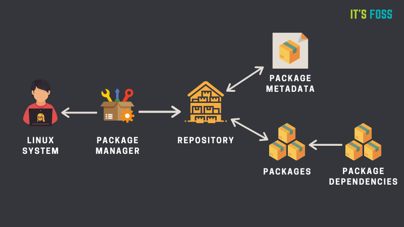

# 0x00. 导读

# 0x01. 简介

简单来说，包管理器 package manager 是一种工具，它允许用户在操作系统上安装、删除、升级、配置和管理软件包。软件包管理器可以是像 软件商店 这样的图形化应用，也可以是像 apt-get 或 pacman 这样的命令行工具。

一个包 package 通常指的是一个应用程序，它可以是一个 GUI 应用程序、命令行工具或（其他软件程序需要的）软件库。包本质上是一个存档文件，包含二进制可执行文件、配置文件，有时还包含依赖关系的信息。

在旧时代，软件曾经是从它的源代码安装的。你会参考一个文件（通常命名为 README），看看它需要什么软件组件、二进制文件的位置。它通常包括一个配置脚本或 Makefile。你必须自己编译该软件或自己处理所有的依赖关系（有些软件需要安装其他软件）。

为了摆脱这种复杂性，Linux 发行版创建了自己的打包格式，为终端用户提供随时可用的二进制文件（预编译软件），以便安装软件，同时提供一些元数据（版本号、描述）和依赖关系。

这就像烤蛋糕与买蛋糕一样。

大约在上世纪 90 年代中期，Debian 创建了 DEB 打包格式（.deb），Red Hat Linux 创建了 RPM（Red Hat Package Manager 的缩写）打包系统（.rpm）。编译源代码的方式仍然存在，但现在是可选的。

要与打包系统交互或使用打包系统，你需要一个包管理器。

# 0x02. 包管理器



## 2.1 软件仓库

几乎所有的 Linux 发行版都有 软件仓库 ，它基本上是软件包的集合。并且可以有不止一个软件库。软件库包含不同种类的软件包。

软件仓库也有元数据文件，其中包含了软件包的信息，如软件包的名称、版本号、软件包的描述和软件仓库名称等。这就是你在 Ubuntu/Debian 中使用 apt show 命令所看到的。

你的系统上的包管理器首先会与元数据进行交互。包管理器在你的系统上创建了一个元数据的本地缓存。当你运行包管理器的更新选项（例如 apt update）时，它会通过引用仓库中的元数据来更新本地元数据缓存。

当你运行软件包管理器的安装命令（例如 apt install package_name）时，软件包管理器会引用这个缓存。如果它在缓存中找到了包的信息，它就会使用互联网连接到相应的仓库，并在你的系统上安装之前先下载包。

一个包可能有依赖关系。意思是说，它可能需要安装其他软件包。软件包管理器通常会处理这些依赖关系，并将其与你正在安装的软件包一起自动安装。

## 2.2 包管理器

包管理器因打包格式（例如 RPM DEB，注意，有时候 RPM 是指打包格式，有时候是指包管理器，因为它们名字一样，都是 RPM）而异，但同一打包系统却可能有多个包管理器。

例如，RPM 有 Yum 和 DNF 包管理器。对于 DEB，你有 apt-get、dpkg 等基于命令行的包管理器。

## 2.3 yum 配置

yum 命令：下载与安装软件包，配置文件 `/etc/yum.conf`  
yum 仓库/源：存放软件包的地方,配置目录 `/etc/yum.repos.d/*.repo`

```bash
$ yum repolist
Loaded plugins: fastestmirror
Loading mirror speeds from cached hostfile
 * base: mirrors.aliyun.com
 * extras: mirrors.aliyun.com
 * updates: mirrors.aliyun.com
 repo id (源标识)          repo name （源名称）                        status（状态）
base/7/x86_64     CentOS-7 - Base - mirrors.aliyun.com               10,072
epel/x86_64       Extra Packages for Enterprise Linux 7 - x86_64     13,747
extras/7/x86_64   CentOS-7 - Extras - mirrors.aliyun.com                515
updates/7/x86_64  CentOS-7 - Updates - mirrors.aliyun.com            4,425      
repolist: 28,759
```

目前只有 base，extras，updates，epel 4个源，base，extras，updates 是系统默认的 yum 源，epel 是额外的源。

设置系统的 yum 源为阿里云
```bash
# 0. https://mirrors.aliyun.com/ 进入网站
 
#1.备份已有的yum源
$ mv /etc/yum.repos.d/CentOS-Base.repo /etc/yum.repos.d/CentOS-Base.repo.bak
#2.配置系统默认的源，改为阿里云的
#使用wget或curl 下载阿里云的yum源的配置文件到/etc/yum.repos.d目录下
#wget -O /etc/yum.repos.d/CentOS-Base.repo https://mirrors.aliyun.com/repo/Centos-7.repo
#- O 下载并改名，存放到指定目录中
$ curl -o /etc/yum.repos.d/CentOS-Base.repo https://mirrors.aliyun.com/repo/Centos-7.repo
 
#3.修改了base,extras,updates是系统默认的yum源，改为了阿里云。
```

增加 epel 源
```bash
#1.备份
#第一次备份会提示文件不存在
$ mv /etc/yum.repos.d/epel.repo /etc/yum.repos.d/epel.repo.backup
$ mv /etc/yum.repos.d/epel-testing.repo /etc/yum.repos.d/epel-testing.repo.backup
 
#2.增加系统的epel（企业级Linux的额外的软件包，yum仓库）
[root@lnh ~]# wget -O /etc/yum.repos.d/epel.repo https://mirrors.aliyun.com/repo/epel-7.repo
 
#3.检查
[root@lnh ~]# yum -y install sl
```