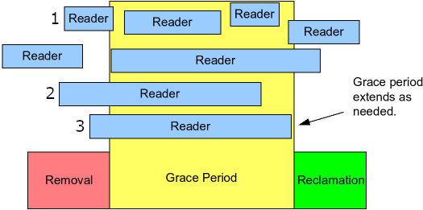

# 0x00. 导读

[1111](https://www.cnblogs.com/LoyenWang/p/12770878.html)

# 0x01. 简介

RCU(Read-Copy Update) 是数据同步的一种方式，历史中分为 经典RCU 和 tree RCU 。

RCU 的原理可以简述如下： RCU 记录了所有对共享数据的使用者。当内核线程需要 write 某个数据时，先创建一个副本，在副本中修改。当所有读线程都离开临界区后，新的数据才被更新。

场景：  
RCU 适用于需要频繁的读取数据，而相应修改数据并不多的情景，例如在文件系统中，经常需要查找定位目录，而对目录的修改相对来说并不多，这就是RCU发挥作用的最佳场景。

# 0x02. 详解

目前内核支持3种RCU。

- 不可抢占RCU（RCU-sched）。不允许进程在读端临界区被其他进程抢占。

- 加速版不可抢占RCU（RCU-bh，bh是“bottom half”的缩写，下半部），是针对不可抢占RCU的改进，在软中断很多的情况下可以缩短宽限期。

- 可抢占RCU（RCU-preempt），也称为实时 RCU，在内核版本2.6.26中引入。可抢占 RCU 允许进程在读端临界区被其他进程抢占。

## 2.1 概念

宽限期 (Grace Period, GP) ，宽限期是一个 period，可长可短。它的意义是， 在一个删除动作发生后，它必须等待所有在宽限期开始前已经开始的读线程结束，才可以进行真正的销毁操作。 

宽限期从删除动作发生后开始，此时 time 为 t1 ；  
当所有的读线程都结束后宽限期结束，此时 time 为 t2 。  
GP=t2-t1 。因此宽限期可长可短，取决于读线程读多久。  

Quiescent Status，用于描述处理器的执行状态。当某个CPU正在访问RCU保护的临界区时，认为是活动的状态，而当它离开了临界区后，则认为它是静止的状态。方便触发回收工作。

## 2.2 接口

在 Linux kernel 中还专门提供了一个头文件 `include/linux/rculist.h` ，提供了利用 RCU 机制对链表进行增删查改操作的接口。

内核中关于RCU的常见接口如下：

- 使用函数 rcu_read_lock() 标记进入读端临界区，使用函数 rcu_read_unlock() 标记退出读端临界区。读端临界区可以嵌套。
- 在读端临界区里面应该使用宏 rcu_dereference(p) 访问指针。
- 写的时候有 4 个函数可以使用：
    - 使用函数 synchronize_rcu() 等待宽限期结束，即所有读者退出读端临界区，然后写者执行下一步操作。这个函数可能睡眠。

    - 使用函数 synchronize_rcu_expedited() 等待宽限期结束。和函数 synchronize_rcu() 的区别是：该函数会向其他处理器发送处理器间中断 (Inter-Processor Interrupt，IPI) 请求，强制宽限期快速结束。我们把强制快速结束的宽限期称为加速宽限期 (expedited grace period) ，把没有强制快速结束的宽限期称为正常宽限期 (normal grace period) 。

    - 使用函数 call_rcu() 注册延后执行的回调函数，把回调函数添加到 RCU 回调函数链表中，立即返回，不会阻塞。

    - 使用函数 rcu_barrier() 等待使用 call_rcu 注册的所有回调函数执行完。这个函数可能睡眠。

不管是同步还是异步接口，最终都是调到 `__call_rcu` 接口，通过 __call_rcu 注册的这些回调函数在哪里调用呢？答案是在 `RCU_SOFTIRQ` 软中断中。

线程: rcu_sched rcu_preempt rcu_bh, [The new visibility of RCU processing](https://lwn.net/Articles/518953/)

# 0x03. 内核线程

1. **rcuob（RCU Offload Batch）**：这个线程负责执行 RCU 的延迟回收。在某些情况下，当需要释放某些数据结构时，为了避免阻塞当前线程，Linux 内核会将回收操作延迟到 rcuob 线程中执行，以提高系统的性能和响应性。

2. **rcuos（RCU Operating System）**：这个线程是 RCU 的一个子系统，负责管理 RCU 的全局状态、调度 RCU 的回收操作以及处理 RCU 相关的系统事件。rcuos 线程的主要作用是协调整个系统中的 RCU 操作，确保其正常运行。

总的来说，rcuob 和 rcuos 线程分别负责延迟回收和管理 RCU 的全局状态，以提高系统的性能和并发访问能力。

1. **`rcu_bh`（RCU Bottom-Half）**：
   - 这个线程负责处理一些低优先级的中断处理程序（bottom-half），这些处理程序通常与 RCU 相关的工作有关。
   - RCU 提供了一种延迟回收机制，因此，当需要释放某些资源时，释放操作可能被延迟到 `rcu_bh` 线程中执行，以避免阻塞高优先级的中断处理程序。
   - 典型的情况是，当某个内核模块或者子系统需要释放一些与 RCU 相关的资源时，它们可以安排回调函数在 `rcu_bh` 上运行以执行释放操作。

2. **`rcu_sched`（RCU Scheduler）**：
   - 这个线程负责管理基于 RCU 的延迟调度功能。
   - 在 Linux 内核中，RCU 还用于实现一种延迟调度机制，这种机制允许内核延迟对一些任务的调度，以提高系统的性能和吞吐量。
   - `rcu_sched` 线程负责调度和执行这些延迟调度任务，以确保它们在适当的时候得到执行。

综上所述，`rcu_bh` 和 `rcu_sched` 线程都是为了支持 RCU 在 Linux 内核中的延迟回收和调度功能而存在的，它们分别负责处理底半部（bottom-half）的相关工作和管理基于 RCU 的延迟调度任务。