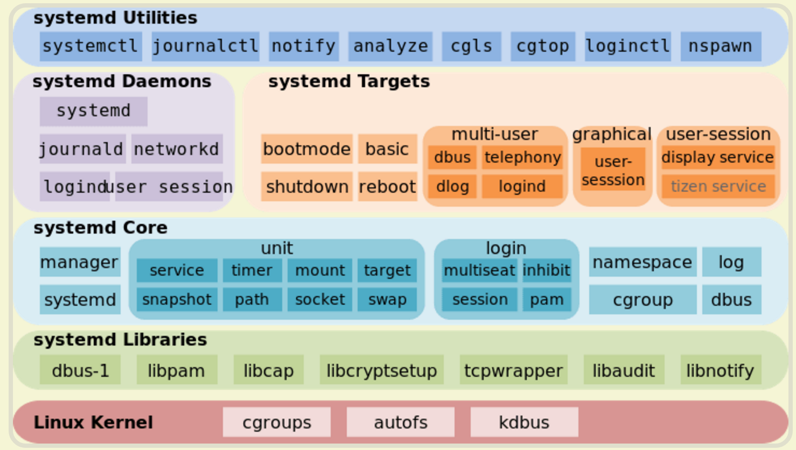

# 0x00. 导读

# 0x01. 简介

# 0x02. 

历史上，Linux 的启动一直采用 init 进程，如 sysvinit 和 UpStart，下面的命令用来启动服务。
```bash
$ sudo /etc/init.d/apache2 start
$ service apache2 start
```

使用了 Systemd，就不需要再用 init 了。**Systemd 取代了 initd**，成为系统的第一个进程（PID 等于 1），其他进程都是它的子进程。

Systemd  的优点是功能强大，使用方便，缺点是体系庞大，非常复杂。事实上，现在还有很多人反对使用  Systemd，理由就是它过于复杂，与操作系统的其他部分强耦合，违反”keep simple, keep stupid“的 Unix 哲学。

下图为Systemd架构图


# 0x03. Unit

Systemd 可以管理所有系统资源，不同的资源统称为 Unit(单元)

Unit 一共分成 12 种

- Service unit：系统服务
- Target unit：多个 Unit 构成的一个组
- Device Unit：硬件设备
- Mount Unit：文件系统的挂载点
- Automount Unit：自动挂载点
- Path Unit：文件或路径
- Scope Unit：不是由 Systemd 启动的外部进程
- Slice Unit：进程组
- Snapshot Unit：Systemd 快照，可以切回某个快照
- Socket Unit：进程间通信的 socket
- Swap Unit：swap 文件
- Timer Unit：定时器

```bash
# 列出正在运行的 Unit
$ systemctl list-units
```

## 3.1 控制 Unit 

```bash
# 显示系统状态
$ systemctl status

# 显示单个 Unit 的状态
$ sysystemctl status bluetooth.service

# 显示远程主机的某个 Unit 的状态
$ systemctl -H root@rhel7.example.com status httpd.service
```

```bash
# 立即启动一个服务
$ sudo systemctl start apache.service

# 立即停止一个服务
$ sudo systemctl stop apache.service

# 重启一个服务
$ sudo systemctl restart apache.service

```

## 3.2 配置文件

每一个  Unit  都有一个配置文件，告诉 Systemd 怎么启动这个  Unit 。

Systemd  默认从目录 `/etc/systemd/system/` 读取配置文件。但是，里面存放的大部分文件都是符号链接，指向目录 `/usr/lib/systemd/system/` ，真正的配置文件存放在那个目录。

systemctl enable 命令用于在上面两个目录之间，建立符号链接关系。systemctl disable 命令用于在两个目录之间，撤销符号链接关系。

配置文件的后缀名，就是该  Unit  的种类，比如 sshd.socket。如果省略，Systemd 默认后缀名为 .service，所以 sshd 会被理解成 sshd.service.

```bash
# 列出所有配置文件
$ systemctl list-unit-files
# enabled：已建立启动链接
# disabled：没建立启动链接
# static：该配置文件没有[Install]部分（无法执行），只能作为其他配置文件的依赖
# masked：该配置文件被禁止建立启动链接

# 列出指定类型的配置文件
$ systemctl list-unit-files --type=service
```

## 3.3 Target

简单说，Target  就是一个 Unit 组，包含许多相关的 Unit 。启动某个 Target 的时候，Systemd 就会启动里面所有的 Unit。