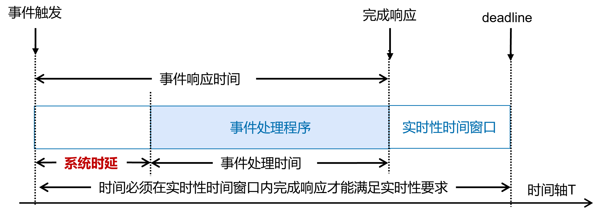

# 0x00. 导读

# 0x01. 简介

# 0x02. 实时

实时系统是必须在设置的截止时间内对环境中的事件做出反应的系统，否则会产生严重的后果。

## 2.1 实时分类

根据错过截止时间产生的后果，实时任务可以分为三类：

1. 硬实时(Hard real time system)

    如果在截止时间之后产生结果，可能对受控系统造成灾难性后果，则该任务是硬实时任务。

    硬任务的例子可以在安全关键系统中找到，并且通常与传感、驱动和控制活动有关，例如：

    - 汽车安全气囊的检测与控制；
    - 反导弹系统要求硬实时。反导弹系统由一系列硬实时任务组成。反导系统必须首先探测所有来袭导弹，正确定位反导炮，然后在导弹来袭之前将其摧毁。所有这些任务本质上都是硬实时的，如果反导弹系统有任何一个任务失败都将无法成功拦截来袭导弹。

2. 强实时(Firm real time system)

    如果在截止日期之后产生结果对系统无用，但不会造成任何损害，则该任务是强实时任务。

    在网络应用程序和多媒体系统中找到，在这些系统中，跳过一个数据包或一个视频帧比长时间延迟处理更重要。 因此，它们包括以下内容：

    - 视频播放；
    - 音/视频编解码中，没有在设置的码率时序范围内执行完，产生结果都是无用的丢弃即可，继续下一轮读取；
    - 在线图像处理；

3. 软实时(Soft real time system)

    如果实时任务在截止日期之后产生结果仍然对系统有用，尽管会导致性能下降，则该任务是软实时任务。

    软任务通常与系统-用户交互有关，有点延迟什么的并不影响，只是体验稍差点。 因此，它们包括：

    - 用户界面的命令解释器；
    - 处理来自键盘的输入数据；
    - 在屏幕上显示消息；
    - 网页浏览等；

事件预期发生与实际发生的时间之间的时间称为延迟(**latency**).

RTOS，英文全称Real Time Operating System，即实时操作系统。  
TSOS，英文全称Time-sharing Operating System，即分时操作系统。linux是分时系统。