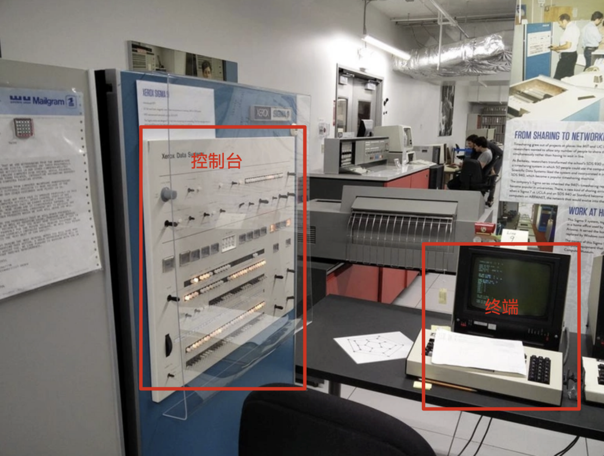
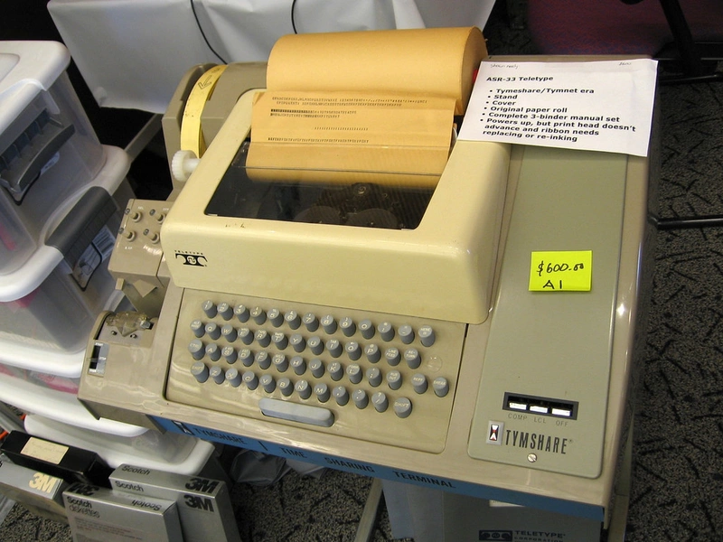
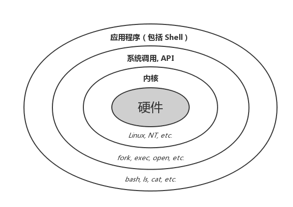

# 0x00. 导读

[The TTY demystified](https://www.linusakesson.net/programming/tty/)  
[翻译：解密 TTY ](https://www.cnblogs.com/liqiuhao/p/9031803.html)  
[TTY 到底是什么？](https://www.kawabangga.com/posts/4515)  
[Linux TTY/PTS概述](https://segmentfault.com/a/1190000009082089)  

[理解Linux 终端、终端模拟器和伪终端](https://mazhen.tech/p/%E7%90%86%E8%A7%A3linux-%E7%BB%88%E7%AB%AF%E7%BB%88%E7%AB%AF%E6%A8%A1%E6%8B%9F%E5%99%A8%E5%92%8C%E4%BC%AA%E7%BB%88%E7%AB%AF/)

# 0x01. 简介

科普一些历史概念。有个很好的比喻：console 相当于电视机机体上的按钮，一般只有一个。 terminal 相当于遥控器，可以有很多个。

# 0x02. 远古时期

## 2.1 CLI

命令行界面（英语：Command-line Interface，缩写：CLI）是在图形用户界面得到普及之前使用最为广泛的用户界面，它通常不支持鼠标，用户通过键盘输入指令，计算机接收到指令后，予以执行。

## 2.1 控制台 (console)

早期的计算机很大，是一堆硬件组成的巨无霸，人们想要操作它，就需要 控制台 ，用来管理、配置、监控等。它和计算机是一体的，算是计算机的一个组成部分，供系统管理员使用，有着较大的权限。下图来源于西雅图活电脑博物馆。一台计算机一般只有一个控制台，但是可以连接多个终端。



## 2.2 终端 (Terminal)

当多用户使用主机时候，不可能一起挤在一个房间里去抢输入输出设备吧。所以就有了远程连接的 终端。

随着计算机的发展，控制台和终端的概念已经逐渐模糊，Console 与 Terminal 基本可以看作是同义词，因为我们既可以是管理员又可以是普通用户，就看我们要对计算机做什么。

## 2.3 电传打字机 (teletypewriter, TTY)

早期的终端叫做电传打字机，电传打字机非常便宜，而早期的计算机设备都非常昂贵。电传打字机长下面这样



## 2.4 终端模拟器 (Terminal Emulator)

随着计算机的进化，我们已经见不到专门的终端硬件了，取而代之的则是键盘与显示器。但是没有了终端，我们要怎么与那些传统的、不兼容图形接口的命令行程序（比如说 GNU  工具集里的大部分命令）交互呢？这些程序并不能直接读取我们的键盘输入，也没办法把计算结果显示在我们的显示器上（这时候图形接口还在娘胎里）这时候我们就需要一个程序来模拟传统终端的行为，即 **终端模拟器** 。

人们为了省事，直接称呼终端模拟器为「终端」。（名字还是一样，只是含义变了）

- Linux 下常用的终端模拟器有：Konsole、Xiki。
- MacOS 下常用的终端模拟器有：Terminal.app（系统自带）、iTerm2。
- Windows 下常用的终端模拟器有：Windows Terminal（集成了 Powershell、Cmd）、XShell。

# 0x03. shell

Shell 通常指的是命令行界面的解析器，一个为操作系统提供访问内核的程序。



知名的命令行 Shell 有多种，可通过 `cat /etc/shells` 命令来显示本机上的 Shell。

## 3.1 终端与 shell

终端干的活是从用户（通过键盘和鼠标）这里接收输入，然后扔给 Shell，然后把 Shell 返回的结果展示给用户（通过显示器）。Shell 干的活儿是从终端那里拿到用户输入的命令，解析后交给操作系统内核去执行，然后把执行结果返回给终端。

# 0x04. TTY 深入

现在说的 tty 指的是 text terminal ，而不是 teletype.

## 4.1 PTY

那么在今天，TTY 到底是什么呢？本质上，它不再是一个硬件，而只是一个软件（内核子系统）。从系统的用户层面来说，他是一个文件。（作为一个文件，你可以直接往里面写。内容写进 TTY 之后将会被输出设备读出去。）

通过 tty 命令可以查看当前的 shell 使用的哪一个 TTY。还可以试试 w 命令

```bash
$ tty             
/dev/pts/6
```
输出以 `/dev/pts/` 开头的，而不是以 `/dev/tty` 开头，为什么？

这其实是假装的 TTY，叫做 **Pseudo terminal**。

TTY 是作为内核的一个模块（子系统，Drive）。TTY 在内核空间而不是用户空间，我们现代的 Terminal 程序，ssh 程序等，如何能和 TTY 交互呢？

答案就是 PTY。

当像 iTerm2 这样的程序需要 TTY 的时候，它会要求 Kernel 创建一个 PTY pair 给它。

注意这里是 pair，也就是 PTY 总是成对出现的。一个是 master，一个是 slave。slave 那边交给程序，程序并不知道这是一个 PTY slave 还是一个真正的 TTY，它只管读写。PTY master 会被返回给要求创建这个 PTY pair 的程序（一般是 ssh，终端模拟器图形软件，tmux 这种），程序拿到它（其实是一个 fd），就可以读写 master PTY 了。内核会负责将 master PTY 的内容 copy 到 slave PTY，将 slave PTY 的内容 copy 到 master PTY。

上面我们看到的 `/dev/pts/*` 等， pts 的意思是 `pseudo-terminal slave`. 意思是这些交互式 shell 的 login device 是 pseudo-terminal slave.

所以说，我们在 GUI 下看到的程序，比如 tmux 中打开的 shell，比如 ssh 打开的 shell，全部都是 PTY。所以，GUI 下面的这些终端，类似 konsole, Xterm，都叫做 “终端模拟器”，它们不是真正的终端，是模拟出来的。