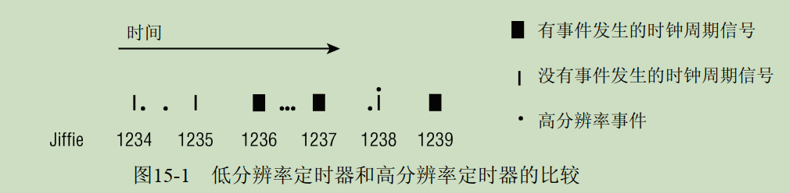
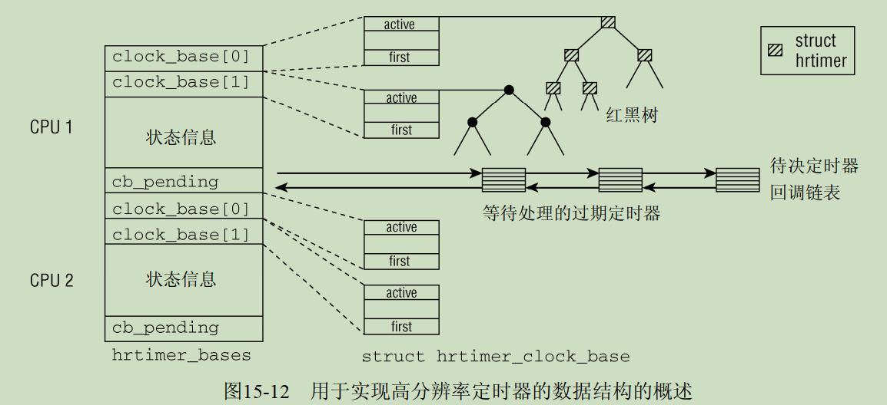

# 0x00. 导读

《深入 Linux 内核架构》 第 15 章，基于 2.6.24

本文脉络：  
1. 经典定时器、高分辨率定时器

# 0x01. 简介

在最初的发布版中，定时器子系统只包括现在所谓的 **低分辨率定时器**。本质上，低分辨率定时器是围绕时钟周期展开的，该周期是每隔一定时间定期发生的。可以预定在某个周期激活指定事件。

扩展这个相对简单的框架的压力，主要来自于如下两方面：

- 电力有限的设备（如笔记本电脑、嵌入式设备等）在无事可做时，需要使用尽可能少的电能。如果运行一个周期性的时钟，那么在几乎无事可做时，也仍然必须提供时钟的周期信号。但如果该周期信号没有用户，它本质上就不需要运行。然而，为实现该时钟周期信号，系统需要不时地从较低功耗状态进入到较高功耗状态。

- 面向多媒体的应用程序需要非常精确的计时功能，例如，为避免视频中的跳帧，或音频回放中的跳跃。这迫使我们提高现有的分辨率。

为找到所有接触时间管理的开发者（和用户）都同意的良好的解决方案，要花费很多年，提出很多内核补丁。内核目前支持两类差别很大的定时器。

- 经典定时器（ classical timer）：在内核的最初版本，就已经提供了此类定时器。经典定时器也称作低分辨率(low-resolution)定时器，或定时器轮（ timer wheel）定时器。

- 在内核版本2.6开发期间，添加了一个额外的定时器子系统，可以利用这样的高精度定时器资源。新的子系统提供的定时器，通常称为 **高分辨率定时器 (high-resolution timer)**。

高分辨率定时器的一部分代码总是被编译到内核中，但只有设置了编译选项 `HIG_RES_TIMERS`，才能提供比低分辨率定时器更高的精度。高分辨率定时器引入的框架，被低分辨率定时器重用（实际上，低分辨率定时器是基于高分辨率定时器的机制而实现的）。

**经典定时器是由固定的栅栏所框定的，而高分辨率时钟事件在本质上可以发生在任意时刻，参见下图。除非启用了动态时钟特性，否则很可能时钟周期信号发出，但实际上并没有事件到期（因为它是固定频率发出的）。与此相反，高分辨率时钟信号只在某些事件可能发生时，才会发出。**



[Documentation/hrtimers.txt](https://www.kernel.org/doc/Documentation/timers/hrtimers.txt) 解释了为什么开发者不选择看起来更简单的路径去改进现存的定时器子系统，而开发一个全新的。

注意两个概念：

1. 超时：表示将在一定时间之后发生的事件，但可以且通常都会在发生之前取消。例如网络子系统等待下一个分组数据到达，会设置一个最大等待时间，但是分组数据通常会按时到达，那么定时器在实际过期之前被删除的可能性很大。对于此类定时器而言，分辨率（精度）不是很关键，就比如刚刚的例子，并不会在意到底是 10s 超时还是 10.000001s 超时。

2. 定时器：用于实现时序。例如，声卡驱动器可能想要按很短的周期间隔向声卡发送一些数据。此类定时器通常都会到期，而且与超时类定时器相比，需要高得多的分辨率。

真正的硬件在最底层。每个系统都有几个设备（通常由时钟芯片实现）提供了定时功能，可以用作时钟。实际可用的硬件取决于具体的体系结构。例如， IA-32 和 AMD64 系统有一个 PIT (programmable interrupt timer，可编程中断计时器，由8253芯片实现) ，这是一个经典的时钟源，分辨率和稳定性一般。而 CPU 局部的 APIC (advanced programmable interrupt controller，高级可编程中断控制器) ，它的分辨率和稳定性要好得多。 APIC 适合充当高分辨率时间源，而 PIT 只适用于低分辨率定时器。


硬件自然需要由体系结构相关代码来编程控制，时钟源( clock source )的抽象为所有硬件时钟芯片提供了一个通用接口。本质上，该接口允许读取时钟芯片提供的运行计数器的当前值。  

周期性的事件不怎么符合上述运行计数器的模型，因而需要另一个抽象。 时钟事件（ clock event）是周期性事件的基础。但时钟事件可以发挥更强大的作用。一些定时设备可以提供发生在任意的非规则时刻的事件。与周期性事件设备相对，它们称作单触发设备（ one-shot device）。

高分辨率定时器机制基于**时钟事件**，而低分辨率定时器机制利用了**周期性事件**，而周期性事件可以直接基于低分辨率时钟，或在高分辨率时间子系统之上构建。低分辨率定时器承担了如下两个重要的任务。

1. 处理全局 jiffies 计数器。该值周期性地增长，它表示了一种特别简单的时间基准。
2. 进行各进程统计。这也包括了对经典的低分辨率定时器的处理，这种定时器可以关联到任意
进程。

# 0x02. 低分辨率定时器

首先需要周期性的时钟源，在 IA-32 与 AMD64 系统上， PIT 或 HPET(High Precision Event Timer ，高精度事件定时器) 可用于该目的。几乎所有比较现代的此类系统都具备 HPET ，如果 HPET 可用，则将优先采用。中断将定期发生，刚好是每秒 HZ 次。 HZ 由一个体系结构相关的预处理器符号定义，在 `<asm-arch/param.h>` 头文件中。其值可以在编译时通过配置选项 CONFIG_HZ 来设置。 HZ = 250 用作大多数机器类型的默认值，特别是在普遍存在的 IA-32 与 AMD64 体系结构上。

> 在启用动态时钟时，也定义（并使用）了 HZ ，因为它是许多计时任务的基本量。在一个繁忙的系统上，总有一些非平凡的工作（不同于 idle 进程）需要完成，动态和周期时钟在表面上没什么区别。只有在近乎于无事可做，而且可以跳过一些时钟中断时，我们才能看到二者的差别。

# 0x03. 通用时间子系统

低分辨率定时器使用 jiffies 作为时间的基本单位，但高分辨率定时器使用人类的时间单位，即纳秒。

**通用时间框架提供了高分辨率定时器的基础。**

- 时钟源（由 struct clocksource 定义）：时间管理的支柱。本质上每个时钟源都提供了一个单调增加的计数器，通用的内核代码只能进行只读访问。不同时钟源的精度取决于底层硬件的能力。

- 时钟事件设备（由 struct clock_event_device 定义）：向时钟增加了事件功能，在未来的某个时刻发生。请注意，由于历史原因，这种设备通常也称为时钟事件源（ clock event source）。

- 时钟设备（由 struct tick_device 定义）：扩展了时钟事件源的功能，提供一个时钟事件的连续流，各个时钟事件定期触发。但可以使用动态时钟机制，在一定时间间隔内停止周期时钟。

内核区分如下两种时钟类型。

- 全局时钟（ global clock），负责提供周期时钟，主要用于更新jiffies值。在此前的内核版本中，此类型时钟在IA-32系统上是由PIT实现的，在其他体系结构上由类似芯片实现。

- 每个CPU一个局部时钟（ local clock），用来进行进程统计、性能剖析和实现高分辨率定时器。

全局时钟的角色，由一个明确选择的局部时钟承担。请注意，高分辨率定时器只能工作于提供了各 CPU 时钟源的系统上。否则，处理器之间的大量通信将大大降低系统性能，这是高分辨率定时器的作用所不能弥补的。

----

在两种广泛使用的平台 AMD64 和 IA-32 （ MIPS平台也受到影响）上发生的令人遗憾的问题，使得整体的概念复杂化。 SMP 系统上的局部时钟基于 APIC 芯片。遗憾的是，这种时钟能否正确工作，取决于系统所处的电源模式。对于低功耗模式（确切地说， ACPI 模式 C3），将停用局部 APIC 定时器，因而无法作为时钟源使用。在这种电源管理模式下，系统全局时钟仍然处于工作状态，将用于周期性地激活信号，使之看起来仍然来自于原来的时钟源。这种规避方案称为**广播机制**。

由于广播需要CPU之间的通信，与专门的局部时钟源相比，这种解决方案要慢，且不那么精确。内核会自动将定时器由高分辨率模式切换回低分辨率模式。

----


定时器实现受到几个配置选项的影响。在编译时间，有如下两种可能的选择。
- 内核在联编时，可以选择支持或不支持动态时钟。如果启用了动态时钟，将设置预处理器常
数 `CONFIG_NO_HZ`
- 可以启用或禁用高分辨率定时器支持。如果要提供支持，将启用预处理器符号 `CONFIG_HIGH_RES_TIMERS`

`GENERIC_TIME` 表示体系结构支持通用时间框架。 `GENERIC_CLOCKEVENTS` 表示体系结构支持通用时钟事件，二者都是支持动态时钟和高分辨率定时器的必要前提。  
`CONFIG_TICK_ONESHOT` 用于支持时钟事件设备的单触发模式。如果启用了高分辨率定时器或动态时钟，会自动选中该选项。如果体系结构受困于省电模式的问题而需要广播，那么必须定义 `GENERIC_CLOCKEVENTS_BROADCAST`

通用时间框架使用数据类型 ktime_t 来表示时间值。该类型是一个64位值。

时钟事件设备允许注册一个事件，在未来一个指定的时间点上发生。但与完备的定时器实现相比，它只能存储一个事件。在任意特定时刻，只能处于一种模式（即周期模式 (CLOCK_EVT_FEAT_PERIODIC) 或单触发模式 (CLOCK_EVT_FEAT_ONESHOT)），但它可以提供在两种模式之间切换的能力

时钟事件设备的一个特别重要的用途是提供周期时钟，回想15.2节的内容，周期时钟的一个用途是用于运作经典的定时器轮。时钟设备是时钟事件设备的一个扩展
```c
struct tick_device {
    struct clock_event_device *evtdev;
    enum tick_device_mode mode;
};
enum tick_device_mode {
    TICKDEV_MODE_PERIODIC,
    TICKDEV_MODE_ONESHOT,
};
```
tick_device 只是 struct clock_event_device 的一个包装器，增加了一个额外的字段，用于指定设备的运行模式。模式可以是周期模式或单触发模式。只要将时钟设备视为一种提供时钟事件连续流的机制即可。这些形成了调度器、经典定时器轮和内核相关组件的基础。内核仍然会区分全局和局部（各CPU）时钟设备。局部设备汇集在 tick_cpu_device 。在注册一个新的时钟事件设备时，内核会自动创建一个时钟设备。


- 没有动态时钟的低分辨率系统，总是使用周期时钟。该内核不包含任何对单触发操作的支持。
- 启用了动态时钟特性的低分辨率系统，以单触发模式使用时钟设备。
- 高分辨率系统总是使用单触发模式，无论是否启用了动态时钟特性。


# 0x04. 高分辨率定时器

- 高分辨率定时器按时间在一棵红黑树上排序。
- 它们独立于周期时钟。它们不使用基于jiffies的时间规格，而是采用了纳秒时间戳。

将高分辨率定时器机制合并到内核中是一个有趣的过程。在经过通常的开发和测试阶段之后，内核版本2.6.16包含了该特性的基本框架，在该版本中，低分辨率定时器的经典实现的基础部分已经替换为新的实现。该实现基于高分辨率定时器框架，尽管支持的分辨率并不比以前好。随后的内核版本提供了对另一类定时器的支持，这些定时器实际上提供了高分辨率功能。

这种合并策略不仅是出于历史方面的考虑：由于低分辨率定时器的实现基于高分辨率机制，即使不启用高分辨率定时器，内核中也会联编（一部分）对高分辨率定时器的支持。当然，这种情况下系统只能够提供低分辨率定时功能。

高分辨率定时器**框架**中，用于提供高分辨率功能支持的部分组件由预处理器符号 `CONFIG_HIGH_RES_TIMERS` 控制，只有在编译时通过该选项启用高分辨率支持的情况下，相关代码才会编译到内核中。而框架的通用部分总是会编译到内核中。

这意味着，即使只支持低分辨率定时器的内核也会包含高分辨率定时器框架的一部分，有时候这可能导致混淆。

## 4.1 数据结构

高分辨率定时器可以基于两种时钟（称为时钟基础， clock base）。单调时钟 (CLOCK_MONOTONIC) 在系统启动时从 0 开始。另一种时钟（ CLOCK_REALTIME）表示系统的实际时间。后一种时钟的时间可能发生跳跃，例如在系统时间改变时，但单调时钟始终会单调地运行。

对系统中的每个CPU，都提供了一个包含了两种时钟基础的数据结构 `struct hrtimer_clock_base`, 每个时钟基础都有一个红黑树，来排序所有待决的高分辨率定时器。每个CPU都提供两个时钟基础（单调时钟和实际时间）。所有定时器都按过期时间在红黑树上排序，如果定时器已经到期但其处理程序回调函数尚未执行，则从红黑树迁移到一个链表中。



CPU时钟基础结构 struct hrtimer_cpu_base 

# 0x05. 动态时钟

多年以来， Linux内核中的时间概念都是由周期时钟提供的。该方法简单而有效，有一点不足之处：周期时钟要求系统在一定的频率下，周期性地处于活动状态。因此，长时间的休眠是不可能的。  
动态时钟改善了这种情况。只有在有些任务需要实际执行时，才激活周期时钟。否则，会临时禁用周期时钟。对该技术的支持可以在编译时选择。

内核如何判定系统当前是否无事可做？如果运行队列时没有活动进程，内核将选择一个特别的 idle 进程来运行。此时，动态时钟机制将开始发挥作用。每当选中 idle 进程运行时，都将禁用周期时钟，直至下一个定时器即将到期为止。在经过这样一段时间之后，或者有中断发生时，将重新启用周期时钟。与此同时， CPU可以进入不受打扰的睡眠状态。请注意，只有经典定时器需要考虑此用法。高分辨率定时器不绑定到时钟频率，也并非基于周期时钟实现。

struct tick_sched

# 0x06. 广播模式

在一些体系结构上，在某些省电模式启用时，时钟事件设备将进入睡眠。幸好，系统不是只有一个时钟事件设备，因此仍然可以用另一个可工作的设备来替换停止的设备。全局变量 tick_broadcast_device 即为用于广播设备的 tick_device 实例。

在这种情况下， APIC设备是不工作的，但广播事件设备仍然可工作。  tick_handle_periodic_broadcast 用作事件处理程序。