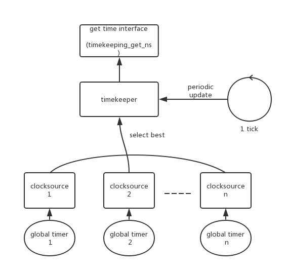

# 0x00. 导读

Linux kernel 发展至今，已经形成了一套强大的、复杂的时间系统，用来支撑上层建筑，其主要提供以下两项功能：

- 提供当前的时间和日期
- 维护定时器，在某个时间点到达时调用回调函数

没有良好的时钟系统，时序的判断就无从谈起，更别说进程的调度、切换，还有更上层的组件。

# 0x01. 简介

两个名词定义：

1. HZ: linux 核心每隔固定周期会发出 timer interrupt (IRQ 0)

    HZ 是用来定义每一秒有几次 timer interrupts。  
    Linux 内核 2.6 及以后版本可以在内核编译时指定HZ的值。 HZ 取值一般为 100、250、300或1000 。对于 linux 而言 HZ 一般为固定值。  
    
    高 HZ 对系统而言是更快的响应速度、更精准的进程调度、更准确的计时精度。随之带来的是系统处理 timer interrupt 中断开销的上升。需要根据实际需求合理选择 HZ 大小。

2. Tick: 翻译为“节拍”，数值上为 HZ 的倒数

    对应 1 次 timer interrupt 的间隔长短， Linux2.6 内核以后，引入了动态时钟，在系统处于 idle 模式时，可以关闭周期性 tick 以节省电量。这一特性需要配置内核选项 CONFIG_NO_HZ 来激活，这一特性也被叫做 `tickless`。

# 0x02. 

时间初始值的获取和更新肯定是通过硬件，毕竟刚刚开机，还不存在软件。有很多种不同精度、价位的硬件都能获得初始值，为了屏蔽各种硬件的细节， Linux 使用 clocksource 提供了对不同软硬件时钟的抽象。

当系统启动时，内核通过读取 RTC(Real Time Clock, 实时时钟) 来初始化墙上时间(wall time)，该时间存放在 xtime 变量中。系统启动初始化阶段，会先使用 jiffies 作为默认 clocksource ，后续过程中如果出现精度更高的 clocksource ，则当做渣男，用更好的 clocksource :

```bash
# 查看 clocksource 的选择变化
$ dmesg | grep -i clocksource
[    0.000000] clocksource: refined-jiffies: mask: 0xffffffff max_cycles: 0xffffffff, max_idle_ns: 7645519600211568 ns
[    0.000000] clocksource: hpet: mask: 0xffffffff max_cycles: 0xffffffff, max_idle_ns: 133484882848 ns
[    0.240866] clocksource: jiffies: mask: 0xffffffff max_cycles: 0xffffffff, max_idle_ns: 7645041785100000 ns
[   16.812778] clocksource: Switched to clocksource hpet
[   16.835405] clocksource: acpi_pm: mask: 0xffffff max_cycles: 0xffffff, max_idle_ns: 2085701024 ns
[   18.688060] tsc: Refined TSC clocksource calibration: 2399.999 MHz
[   18.688127] clocksource: tsc: mask: 0xffffffffffffffff max_cycles: 0x2298364cab5, max_idle_ns: 440795214892 ns
[   19.712400] clocksource: Switched to clocksource tsc
```

clocksource 是一个单调递增的计数，内核负责把这个计数转化为系统当前的时间点。通常这个计数的更新是由硬件完成的， 比如目前主流 x86 服务器的首选时钟源为 tsc (Time Stamp Counter) , x86 的 tsc 的更新频率接近 cpu 的主频，通常是一个固定的频率 (cpu 的 feature: constant_tsc), 通过 `rdtsc` 指令访问。 tsc 是一个高精度的时钟源，除此之外系统还有一些 non-stop 的低精度时钟源 (rtc) ，在断电的时候可以独立持续运行，系统启动时基准时间从低精度时钟获取，然后自动切换到高精度时钟源。

## 2.1 关系

clocksource 和 timekeeper 负责提供当前的时间和日期。  
clock_event 负责维护定时器。



上图描述的是 clocksource 和 timekeeper 的关系：

- 一个 global timer 对应注册一个 clocksource。
- 一个系统中可以有多个 clocksource ，timekeeper 选择精度最高的那个来使用。
- 用户使用 timekeeper 提供的接口来获取系统的时间戳。
- 为了避免无人主动获取时间 clocksource 定时器的溢出，timekeeper 需要定期的去获取 clocksource 的值来更新系统时间，一般是在 tick 处理中更新。

clocksource 定时器的值要定时的读出来，并且把增量加到 timekeeper 中，不然 clocksource 定时器会溢出。

系统在进入 suspend 以后，clocksource 不会再工作，这部分时间会计入 xtime 和 boot time ，但是不会计入 monotonic time 。


`cat /sys/devices/system/clockevents/clockevent0/current_device` 查看 Per-CPU level 的 clockevent 设备。