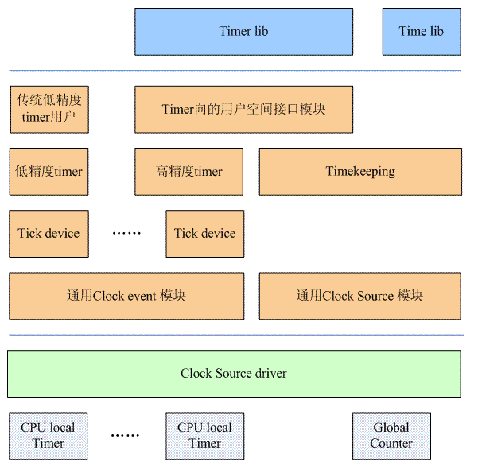

# 0x00. 导读

20240527, 看 [蜗窝科技 Linux时间子系统系列文章之目录](http://www.wowotech.net/timer_subsystem/time_subsystem_index.html) 总结。

# 0x01. 简介

TODO:
1. system counter, 是 clock source device
2. clock source device 是啥
3. Global counter 是啥，例如 HPET 就是
4. 如何判断是在 低/高精度？周期还是 one shot 模式？
5. sched timer

# 0x02. 软件架构

三大块：下 中 上。

## 2.1 下

全局的 system counter( 2.2 中有解释，是 clock source device), 不属于任何一个 CPU. 另外一部分就是产生定时事件的 HW block, 我们称之 timer, timer 硬件被嵌入到各个 cpu core 中，因此，我们更准确的称之为 **CPU local Timer**, 这些 timer 都是基于一个 Global counter 运作的。在驱动层，我们提供一个 clock source chip driver 的模块来驱动硬件，这是模块是和硬件体系结构有关的。如果系统内存在多个 HW timer 和 counter block, 那么系统中可能会存在多个 clock source chip driver。

## 2.2 中

### 2.2.1 通用 clock event 和 clock source 模块

面对形形色色的 timer 和 counter 硬件，linux kernel 抽象出了 通用clock event layer 和 通用clock source 模块，这两个模块和硬件无关。

底层的 clock source chip driver 会调用通用 clock event 和 clock source 模块的接口函数，注册 clock source 和 clock event device。
- **clock source device 对应硬件的 system free running counter**, 提供了一个基础的 timeline 。

    当然了，实际的timeline象一条直线，无限延伸。对于 kernel 而言，其 timeline 是构建在 system free running counter 之上的，因此 clocksource 对应的 timeline 存在溢出问题。如果选用 64bit 的 HW counter ，并且输入频率不那么高，那么溢出时间可能会长达50年甚至更多，那么从应用的角度来看，能维持50年左右的timeline也可以接受。

- 如果说 clock source 是一个 time line, 那么 clock event device是在 timeline 上指定的点产生 clock event 的设备，之所以能产生异步事件，当然是基于中断子系统了， clock source chip driver 会申请中断并调用通用 clock event 模块的 callback 函数来通知这样的异步事件。

### 2.2.2 tick device layer

tick device layer 基于 clock event device进行工作的：一般而言，每个 CPU 形成自己的一个小系统，有自己的调度、有自己的进程统计等，这个小系统都是拥有自己的 tick device，而且是唯一的。

对于 clock event device 而言就不是这样了，硬件有多少个 timer 硬件就注册多少个 clock event device ，各个 cpu 的 tick device 会选择自己适合的那个 clock eventdevice. 

tick device 可以工作在 periodic mode 或者 one shot mode 。因此，在 tick device layer ，有多少个 cpu ，就会有多少个 tick device ，我们称之 **local tick device**。当然，有些事情（例如整个系统的负荷计算）不适合在 local tick 驱动下进行，因此，所有的 local tick device 中会有一个被选择做 **global tick device**，该 device 负责维护整个系统的 jiffies，更新 wall clock，计算全局负荷什么的。

**硬件 timer个数 == clock event device 个数**  
**CPU 个数 == tick device 个数**  
**每个 tick device 会挑选一个喜欢的 clock event device** 

高精度 timer 需要高精度的 clock event，工作在 one shot mode 的 tick device 提供高精度的 clock event 。因此，基于 one shot mode 下的 tick device，系统实现了高精度 timer ，系统的各个模块可以使用高精度 timer 的接口来完成定时服务。虽然有了高精度 timer 的出现, 内核并没有抛弃老的低精度 timer 机制(内核开发人员试图整合高精度 timer 和低精度的 timer ，不过失败了，所以目前内核中，两种 timer 是同时存在的)。当系统处于高精度 timer 的时候（ tick device 处于 one shot mode ），系统会 setup 一个特别的高精度 timer （可以称之 sched timer ），该高精度 timer 会周期性的触发，从而模拟的传统的 periodic tick ，从而推动了传统低精度 timer 的运转。因此，一些传统的内核模块仍然可以调用经典的低精度 timer 模块的接口。

## 2.3 上

略

# 0x03. 

（1）使用低精度timer和周期tick。

（2）使用低精度timer和Dynamic tick

（3）使用高精度timer和周期tick

（4）使用高精度timer和Dynamic tick

注：本文主要描述普通的 dynamic tick 系统（ tickless idle system ），后续会有专门的文章描述 full dynamic tick 系统。

## 3.1 使用低精度 timer + 周期 tick

底层的 clock source chip driver 会调用注册 clock event 的接口函数（`clockevents_config_and_register` 或者 `clockevents_register_device`），一旦增加了一个 clock event device，需要通知上层的 tick device layer，毕竟有可能新注册的这个device更好、更适合某个tick device呢（通过调用 `tick_check_new_device` 函数实现）。

要是这个 clock event device 被某个 tick device 收留了（要么该 tick device 之前没有匹配的 clock event device ，要么新的 clock event device 更适合该 tick device ），那么就启动对该 tick device 的配置（参考 `tick_setup_device` ）。根据当前系统的配置情况（目前我们假设是周期性 tick ），这时候，该 tick device 对应的 clock event device 的 clock event handler 被设置为 `tick_handle_periodic` 。底层硬件会周期性的产生中断，从而会周期性的调用 tick_handle_periodic 从而驱动整个系统的运转。

这时候高精度 timer 模块是运行在低精度的模式，也就是说这些 hrtimer 虽然是按照高精度 timer 的红黑树进行组织，但是系统只是在每一周期性 tick 到来的时候调用 `hrtimer_run_queues` 函数，来检查是否有 expire 的 hrtimer 。毫无疑问，这里的高精度timer也就是没有意义了。

## 3.2 低精度 timer + Dynamic Tick

系统开始的时候并不是直接进入 Dynamic tick mode 的，而是经历一个切换过程。开始的时候，系统运行在周期 tick 的模式下，各个 cpu 对应的 tick device 的（或者说 clock event device 的） event handler 是 `tick_handle_periodic` 。在 timer 的软中断上下文中，会调用 `tick_check_oneshot_change` 进行是否切换到 one shot 模式的检查，如果系统中有支持 one-shot 的 clock event device ，那么就会发生 tick mode 的切换（调用 `tick_nohz_switch_to_nohz` ），这时候， tick device 会切换到 one shot 模式，而 event handler 被设置为 `tick_nohz_handler` 。由于这时候的 clock event device 工作在 one shot 模式，因此当系统正常运行的时候，在 event handler 中每次都要 reprogram clock event ，以便正常产生 tick。当 cpu 运行 idle 进程的时候， clock event device 不再 reprogram 产生下次的 tick 信号，这样，整个系统的周期性的 tick 就停下来。

## 3.3 高精度 timer + Dynamic Tick

同样的，系统开始的时候并不是直接进入Dynamic tick mode的，而是经历一个切换过程。系统开始的时候是运行在周期 tick 的模式下， event handler 是 `tick_handle_periodic` 。在周期 tick 的软中断上下文中（参考 `run_timer_softirq` ），如果满足条件，会调用 `hrtimer_switch_to_hres` 将 hrtimer 从低精度模式切换到高精度模式上。这时候，系统会有下面的动作：

- Tick device 的 clock event device mode 切换到 oneshot mode （参考 `tick_init_highres` 函数）

- Tick device 的 clock event device 的 event handler 会更新为 `hrtimer_interrupt` （参考 `tick_init_highres` 函数）

- **设定 sched timer** （也就是模拟周期 tick 那个高精度 timer ，参考 `tick_setup_sched_timer` 函数）

这样，当下一次 tick 到来的时候，系统会调用 hrtimer_interrupt 来处理这个 tick （该 tick 是通过 sched timer 产生的）。

在 Dynamic tick 的模式下，各个 cpu 的 tick device 工作在 one shot 模式，该 tick device 对应的 clock event device 也工作在 one shot 的模式，这时候，硬件 Timer 的中断不会周期性的产生，但是 linux kernel 中很多的模块是依赖于周期性的 tick 的，因此，在这种情况下，系统使用 hrtime 模拟了一个周期性的 tick 。在切换到 dynamic tick 模式的时候会初始化这个高精度 timer ，该高精度 timer 的回调函数是 `tick_sched_timer` 。这个函数执行的函数类似周期性 tick 中 event handler 执行的内容。不过在最后会 reprogram 该高精度 timer ，以便可以周期性的产生 clock event 。当系统进入 idle 的时候，就会 stop 这个高精度 timer ，这样，当没有用户事件的时候， CPU 可以持续在idle状态，从而减少功耗。

## 3.4 高精度timer + 周期性Tick

这种配置不多见，多半是由于硬件无法支持 one shot 的 clock event device ，这种情况下，整个系统仍然是运行在周期 tick 的模式下。

## 3.5 总结

tick event device = tick device + mode(Periodic or oneshot)

不同类型的 tick device 有不同的 **event handler**:
- 对于 periodic 类型的 tick device, 其 clock event device 的 event handler 是
    - tick_handle_periodic （没有配置高精度 timer）
    - 或者 hrtimer_interrupt （配置了高精度 timer）。
- 对于 one-shot 类型的 tick 设备，其 clock event device 的 event handler 是
    - hrtimer_interrupt （配置了高精度 timer）
    - 或者 tick_nohz_handler （没有配置高精度 timer）。

# 0x04.

tick device 系统的驱动力来自中断子系统，当 HW timer（ tick device 使用的那个）超期会触发中断，因此会调用 event handler(按照高精度定时器来讨论，则是 `hrtimer_interrupt`) 来驱动高精度 timer 的运转。

执行超期 timer 的 call back 函数，扫描保存高精度 timer 的红黑树，找到下一个超期需要设定的时间，调用 `tick_program_event` 来设定下一次的超期事件， tick device 工作在 one shot mode ，需要不断的 set next expire time ，才能驱动整个系统才会不断的向前。

传统的低精度 timer 是周期性 tick 驱动的，但是，目前 tick 处于 one shot mode ，怎么办？只能是模拟了， Tick device layer 需要设定一个周期性触发的高精度 timer ，在这个 timer 的超期函数中（ `tick_sched_timer` ）执行进行原来周期性 tick 的工作，例如触发 TIMER_SOFTIRQ 以便推动系统低精度 timer 的运作，更新 timekeeping 模块中的 real clock。

## 4.1 切换到 tickless

开始的时候 tick device 总是工作在周期性 tick 的 mode ，一切就像过去一样，无论何时，系统总是有那个周期性的 tick 到来。这个周期性的 tick 是由于硬件timer的中断推动，该 HW Timer 的中断会注册 soft irq，因此，HW timer总会周期性的触发soft irq的执行，也就是 run_timer_softirq 函数。

`hrtimer_interrupt` 会触发 `TIMER_SOFTIRQ`, 使得对应的软中断处理函数 `run_timer_softirq` 被激活（注意， TIMER_SOFTIRQ 一开始就有，不是只有 hrtimer_interrupt 才能触发），在该函数中会根据情况将 hrtimer 切换到高精度模式（ hrtimer 也有两种 mode ，一种高精度mode，一种是低精度mode，系统总是从低精度mode开始）。在系统切换到高精度 timer mode 的时候（ `hrtimer_switch_to_hres` ），由于高精度 timer 需要底层的 tick device 运行在 one shot mode，因此，这时会调用 `tick_switch_to_oneshot` 函数将该 CPU 上的 tick device 的 mode 切换置 one shot 。同样的，对应的底层 clock event device 也会被设定为 one shot mode 。一旦进入 one shot mode ，那个周期性到来的 timer 中断就会消失了，从此系统只会根据系统中的 hrtimer 的设定情况来一次性的设定底层 HW timer 的触发，也就可以根据情况实现 tickless 了。

虽然 tick device 以及底层的 HW timer 都工作在 one shot mode，看起来系统的 HW timer 中断都是按需产生，多么美妙。但是，由于各种原因（此处省略3000字），在系统运行过程中，那个周期性的tick还需要保持，因此，在切换到one shot mode的同时，也会调用 `tick_setup_sched_timer` 函数创建一个 sched timer(tick_sched_timer)，该timer的特点就是每次超期后还会调用 `hrtimer_forward` ，不断的将自己挂回 hrtimer 的红黑树，于是乎， tick_sched_do_timer( 也是在 tick_sched_timer 中被调用) 接口按照tick的周期不断的被调用，从而模拟了周期性的tick。

idle 进程执行 cpu_idle_loop 函数，该函数在真正执行 cpu idle 指令之前会调用 `tick_nohz_idle_enter` ，在该函数中， sched timer 会被停掉。

当从 idle 中醒来， `tick_nohz_idle_exit` 函数被调用，重建 sched timer，一切恢复了原状。