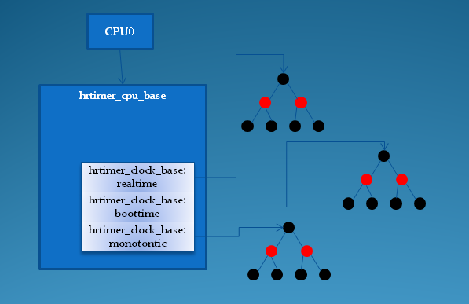

# 0x00. 导读

# 0x01. 简介

内核从2.6.16开始加入了高精度定时器架构。

在实现方式上，内核的高分辨率定时器的实现代码几乎没有借用低分辨率定时器的数据结构和代码，内核文档给出的解释主要有以下几点：

- 低分辨率定时器的代码和jiffies的关系太过紧密，并且默认按32位进行设计，并且它的代码已经经过长时间的优化，目前的使用也是没有任何错误，如果硬要基于它来实现高分辨率定时器，势必会打破原有的时间轮概念，并且会引入一大堆#if–#else判断；

- 虽然大部分时间里，时间轮可以实现O(1)时间复杂度，但是当有进位发生时，不可预测的O(N)定时器级联迁移时间，这对于低分辨率定时器来说问题不大，可是它大大地影响了定时器的精度；

- 低分辨率定时器几乎是为“超时”而设计的，并为此对它进行了大量的优化，对于这些以“超时”未目的而使用定时器，它们大多数期望在超时到来之前获得正确的结果，然后删除定时器，精确时间并不是它们主要的目的，例如网络通信、设备IO等等。

# 0x02. 

hrtimer(high resolution timer)

内核的开发者考察了多种数据结构，最终他们选择了红黑树（rbtree）来组织 hrtimer ，内核用一个 hrtimer 结构来表示一个高精度定时器:

```c
struct hrtimer {
    struct timerqueue_node      node;   // 红黑树节点的封装
    ktime_t             _softexpires;   // 最早超时时间
    enum hrtimer_restart        (*function)(struct hrtimer *);  // 超时的回调函数
    struct hrtimer_clock_base   *base;  // 指向所属的 hrtimer_clock_base
    u8              state;              // 当前的状态，只有 HRTIMER_STATE_INACTIVE 和 HRTIMER_STATE_ENQUEUED 两种
    u8              is_rel;             // 是否是 relative
#ifdef CONFIG_TIMER_STATS
    int             start_pid;
    void                *start_site;
    char                start_comm[16];
#endif
};
```

可以发现有两个超时时间： _softexpires 用来维护最早超时时间，而 expires 用来维护最晚超时时间，因此 hrtimer 可能在 [_softexpires, expires] 之间的任意时刻超时。有了这个范围，定时器系统可以让范围接近或重叠的多个定时器在同一时刻同时到期，避免进程频繁地被 hrtimer 进行唤醒。   

定时器一旦到期，function字段指定的回调函数会被调用，该函数的返回值为一个枚举值，它决定了该hrtimer是否需要被重新激活：
```c
enum hrtimer_restart {
	HRTIMER_NORESTART,  /* Timer is not restarted */
	HRTIMER_RESTART,    /* Timer must be restarted */
};
```

state 字段用于表示 hrtimer 当前的状态，有几下几种位组合：
```
#define HRTIMER_STATE_INACTIVE  0x00  // 定时器未激活
#define HRTIMER_STATE_ENQUEUED  0x01  // 定时器已经被排入红黑树中
#define HRTIMER_STATE_CALLBACK  0x02  // 定时器的回调函数正在被调用
#define HRTIMER_STATE_MIGRATE   0x04  // 定时器正在CPU之间做迁移
```

hrtimer 的到期时间可以基于以下几种时间基准系统：
```
enum  hrtimer_base_type {
	HRTIMER_BASE_MONOTONIC,  // 单调递增的monotonic时间，不包含休眠时间
	HRTIMER_BASE_REALTIME,   // 平常使用的墙上真实时间
	HRTIMER_BASE_BOOTTIME,   // 单调递增的boottime，包含休眠时间
	HRTIMER_MAX_CLOCK_BASES, // 用于后续数组的定义
};
```

和低分辨率定时器一样，出于效率和上锁的考虑，每个cpu单独管理属于自己的hrtimer，为此，专门定义了一个结构hrtimer_cpu_base：
```c
struct hrtimer_cpu_base {
		......
	struct hrtimer_clock_base   clock_base[HRTIMER_MAX_CLOCK_BASES];
};
```

其中， clock_base 数组为每种时间基准系统都定义了一个 hrtimer_clock_base 结构，它的定义如下：
```c
struct hrtimer_clock_base {
	struct hrtimer_cpu_base *cpu_base;  // 指向所属cpu的hrtimer_cpu_base结构
		......
	struct timerqueue_head  active;     // 红黑树，包含了所有使用该时间基准系统的hrtimer
	ktime_t         resolution; // 时间基准系统的分辨率
	ktime_t         (*get_time)(void); // 获取该基准系统的时间函数
	ktime_t         softirq_time;// 当用jiffies
	ktime_t         offset;      // 
};
```

active 字段是一个 timerqueue_head 结构，它实际上是对 rbtree 的进一步封装：
```c
struct timerqueue_node {
	struct rb_node node;  // 红黑树的节点
	ktime_t expires;      // 该节点代表队hrtimer的到期时间，与hrtimer结构中的_softexpires稍有不同
};

struct timerqueue_head {
	struct rb_root head;          // 红黑树的根节点
	struct timerqueue_node *next; // 该红黑树中最早到期的节点，也就是最左下的节点
};
```



总结一下：

1. 每个 cpu 有一个 hrtimer_cpu_base 结构；
2. hrtimer_cpu_base 结构管理着3种不同的时间基准系统的 hrtimer ，分别是：实时时间，启动时间和单调时间；
3. 每种时间基准系统通过它的 active 字段（timerqueue_head结构指针），指向它们各自的红黑树；
4. 红黑树上，按到期时间进行排序，最先到期的hrtimer位于最左下的节点，并被记录在 active.next 字段中；
5. 时间基准的最先到期时间可能不同，所以，它们之中最先到期的时间被记录在 hrtimer_cpu_base 的 expires_next 字段中。

# 0x03. hrtimer 如何运转

hrtimer 系统需要通过 timekeeper 获取当前的时间，计算与到期时间的差值，并根据该差值，设定该 cpu 的 tick_device(clock_event_device) 的下一次的到期时间，时间一到，在 clock_event_device 的事件回调函数中处理到期的 hrtimer 。

一旦开启了 hrtimer ， tick_device 所关联的 clock_event_device 的事件回调函数会被修改为： hrtimer_interrupt ，并且会被设置成工作于 CLOCK_EVT_MODE_ONESHOT 单触发模式。