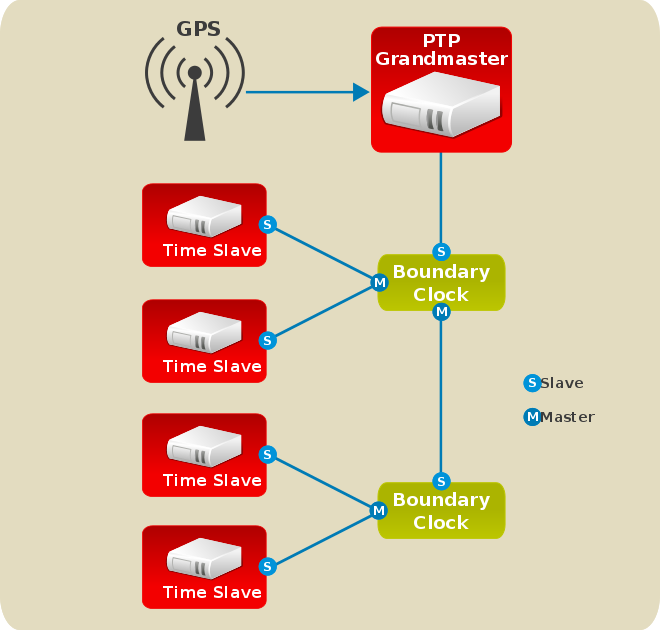

# 0x00. 导读

[PTP技术介绍](./PTP技术介绍.pdf), [from](https://www.h3c.com/cn/d_201008/686476_30003_0.htm)

[richardcochran/linuxptp](https://github.com/richardcochran/linuxptp/tree/master)

# 0x01. 简介

在通信网络中，许多业务的正常运行都要求网络时钟同步，即整个网络各设备之间的时间或频率差保持在合理的误差水平内。网络时钟同步包括以下两个概念：
- 时间同步：也叫相位同步（Phase synchronization），是指信号之间的频率和相位都保持一致，即信号之间的相位差恒为零。
- 频率同步（Frequency synchronization）：也叫时钟同步，是指信号之间在频率或相位上保持某种严格的特定关系，信号在其对应的有效瞬间以同一平均速率出现，以保证通信网络中的所有设备都以相同的速率运行，即信号之间保持恒定的相位差。


如图所示，有两个表 Watch A 与 Watch B，如果这两个表的时间每时每刻都保持一致，这个状态就是时间同步；如果这两个表的时间不一致，但保持一个恒定的差值（如图中的Watch B总比Watch A晚6个小时），这个状态就是频率同步。

PTP（Precision Time Protocol，精确时间协议）是一种 **时间同步** 的协议，其本身只是用于设备之间的高精度时间同步，但也可被借用于设备之间的频率同步。相比现有的各种时间同步机制，PTP具备以下优势：

- 相比NTP（Network Time Protocol，网络时间协议），PTP能够满足更高精度的时间同步要求：NTP一般只能达到亚秒级的时间同步精度，而PTP则可达到亚微秒级。
- 相比GPS（Global Positioning System，全球定位系统），PTP具备更低的建设和维护成本，并且由于可以摆脱对GPS的依赖，在国家安全方面也具备特殊的意义。

PTP 是一种主从式的时间同步系统，采用硬件时间戳，因此可以大幅减少软件处理时间。同时PTP可运行在L2层（MAC层）和L4层（UDP层），运行在L2层网络时，直接在MAC层进行报文解析，不用经过四层UDP协议栈，从而大幅减少协议栈驻留时间，进一步提高时间同步精度。

- 1985 年，业界就提出了 NTP(Network Time Protocol)(RFC1305) 协议，可以将多台终端的时间同步在 500us-50ms 的精确度范围以内。
- 1992 年，业界又有了 SNTP(Simple Network Time Protocol）协议（RFC2030)，可以将多台终端的时间同步在 50-150ms 的精确度范围以内。
- 2002 年，又有了更高精度的时间同步协议：PTP(Precision Time Protocol)(IEEE 1588-2002), 精度提高到了 10ns-100us.
- 2008 年又提出了 v2 版本 IEEE 1588-2008, 进一步将 PTP 精度提升到了 1ns-500ns 的时间范围内，这就是目前通用的纳秒级高精度时间同步协议了。

# 0x02. 原理

PTP 的设计原理并不复杂：由一个绝对领导权的 master 发布时间并对 slave 们进行时间同步。精髓在于通过带上时间戳的请求及回复，了解双向链路各自的时延情况。

总体来说，一共会有四条消息，时序如下：

- T1 时间，master 发送 sync message 给 slave，收到的时间是 T2
- master 发送 sync follow up message
- T3 时间，slave 发送 delay request message，收到的时间是 T4
- master 发送 delay respond message


假设 master 相对 slave 时间偏差为 offset，则 T1 + Delay + offset = T2， 即 T2 - T1 = Delay + offset。另一方面，T3 + Delay - offset = T4, 即 T4 - T3 = Delay - offset.

所以 Delay = ((T2 - T1) + (T4 - T3)) / 2, 又因为 T2 - T1 = Delay + offset, 所以时间偏差 offset = T2 - T1 - Delay = 2(T2 - T1) / 2 - ((T2 - T1) + (T4 - T3)) / 2 = ((T2 - T1) - (T4 - T3)) / 2

对于 slave，则应该将时间更新为 time（当前时间） - offset

## 2.1 程序

编译LinuxPTP，会得到多个可执行文件，其名字极其功能如下

- hwstamp_ctl: 用于获取/设置硬件时间戳，利用 SIOCSHWTSTAMP ioctl 实现，属于 debug 工具，ptp4l 不需要该工具实现时钟设置。
- nsm: NetSync Monitor (NSM) client 的实现，属于PTP协议扩展内容，用于监控网络内各支持NSM的客户端之间的时钟差值。
- phc2sys: **核心模块**，用于同步系统内两个或者多个时钟。一般是获取来自ptp4l 的时间然后进行操作。
- phc_ctl: 用于控制PHC时钟设备。
- pmc: PTP管理客户端（PTP Management Client）。
- ptp4l: **核心模块**，包含Boundary Clock (BC), Ordinary Clock (OC), and Transparent Clock (TC)几个部分功能。
- timemaster: 使用ptp4l和phc2sys混合chronyd或者ntpd取同步NTP/PTP时钟源，通过比较选用最佳时钟。
- ts2phc: 同步PTP硬件时钟（PHC）给外部设备，可用于分发时间。
- tz2alt: 保存各种修改及时间调节的log到local time zone database。

ptp4l 程序实现了 PTP 时钟和普通时钟。通过硬件时间戳，它被用来同步物理网卡到远端主时钟的 PTP 硬件时钟。
phc2sys 程序需要硬件时间戳，在网卡上（NIC）同步系统时钟到 PTP 硬件的时钟。**简单来说，ptp4l 是用于通过网络实现设备之间的时间同步，而 phc2sys 则是用于在本地实现硬件时钟和系统时钟的同步。**

## 2.2 时间戳

硬件时间戳：硬件时间戳由网络接口卡（NIC）或专用时间同步硬件生成。这些设备在数据包到达或发送的瞬间，在硬件层面直接标记时间戳。由于处理是在硬件中进行的，它可以避免操作系统的延迟和中断。

软件时间戳：软件时间戳由操作系统生成。时间戳的标记通常发生在数据包到达或发送时，操作系统处理该数据包时。由于需要经过内核和软件层的处理，可能会受到操作系统调度、进程优先级、中断等因素的影响，导致一定的延迟和不确定性。

## 2.3 工作模式

PTP 同步可以使用两种机制 —— E2E（端到端）和 P2P（对等网络）。(ptp4l -A -E -P 参数控制)
- E2E（End to End）模式：采用请求应答机制（Request Response Mechanism）；
- P2P（Peer to Peer）模式：采用对等延迟机制（Peer Delay Mechanism）。
- 
我们将设备上运行了 PTP 的设备的端口称为 PTP 端口，PTP 端口分为三种：
- 主端口（Master Port）：发布同步时间的端口；
- 从端口（Slave Port）：接收同步时间的端口；
- 被动端口（Passive Port）：既不发布也不接收，只作为转发所用。
- 
PTP 协议采用主从模式，但主从关系是相对而言的。发布同步时间的节点称为主节点，而接收同步时间的节点则称为从节点。
- 主节点上的时钟称为主时钟，而从节点上的时钟则称为从时钟；
- 发布同步时间的端口称为主端口，而接收同步时间的端口则称为从端口。

时钟类型：
- 普通时钟（Ordinary Clock）：只有一个端口连接到网络的时钟，可以作为 master 或 slave 之一。如果作为 master 时候，可以是 grandmaster；而作为 slave 时，一般作为时钟分发网络的端点设备（end，最后一级）。
- 边界时钟（Boundary Clock）：有多个端口连接到网络的时钟，一个 slave 端口连接到上游设备的 PTP 端口，其他的端口作为 master 连接到下游设备的 slave 端口。下游 slave 端口同构 PTP 协议直接同步于边界时钟，而不是直接和 grandmaster 通信。
- 透明时钟（Transparent Clock）：一个网络设备，比如交换机，不通过 PTP 协议进行时间同步，但是能够转发或修改某些经过的PTP报文，比如把 PTP 报文经过自己时候花费的时间增加到 PTP 报文的 correctonField。



## 2.4 FAQ

ptp4l 如何确定主从？
```
在PTP（Precision Time Protocol，精确时间协议）中，确定主从关系通常是通过 Best Master Clock Algorithm （最佳主时钟算法，BMCA）自动完成的。BMCA 会根据时钟的优先级、质量和其他参数来选择最佳的主时钟（Grandmaster Clock）。以下是一些关键步骤和概念：

优先级（Priority）：每个PTP时钟都有一个优先级，通常由两部分组成：priority1 和 priority2. priority1 越低，优先级越高。如果两个时钟的priority1相同，则会根据priority2来决定。

时钟质量（Clock Quality）：时钟的质量由clockClass和clockAccuracy参数来描述。clockClass值越低，时钟质量越高。clockAccuracy表示时钟的准确性。

时钟身份（Clock Identity）：每个PTP时钟都有一个唯一的身份，用于在网络中识别。

BMCA算法：当PTP时钟启动时，它们会广播自己的优先级和时钟质量信息。其他时钟接收到这些信息后，会根据BMCA算法来确定哪个时钟应该成为主时钟。

普通时钟（Ordinary Clock, OC）：只有一个PTP通信端口的时钟是普通时钟。

边界时钟（Boundary Clock, BC）：有一个以上PTP通信端口的时钟。

透明时钟（Transparent Clock, TC）：不与其它时钟节点保持时间同步，而是在多个PTP端口间转发PTP协议报文并对其进行转发延时校正。

在使用ptp4l时，可以通过命令行参数来指定时钟的行为。例如，-s参数可以强制ptp4l作为从时钟运行。如果不使用-s参数，ptp4l会根据网络中的其他时钟和BMCA算法来确定自己是作为主时钟还是从时钟。

在实际配置中，可以通过查看ptp4l的日志输出来确定时钟的角色。如果时钟被配置为从时钟，并且在日志中看到状态变为SLAVE，则表示它已经成功地与主时钟同步。如果时钟被配置为主时钟，它将尝试成为网络中的最佳主时钟。

在配置ptp4l时，通常需要编辑配置文件（如/etc/linuxptp/ptp4l.conf），并指定相关的参数，如接口（-i）、时间戳模式（-H为硬件时间戳，-S为软件时间戳）等。然后，可以通过启动ptp4l服务来应用这些配置。

```

从时钟是如何知道自己该去跟哪些主时钟同步？或者说从时钟如何知道有哪些主机可供选择？
```
从时钟了解有哪些主时钟可供选择的过程主要通过PTP协议的消息交换来实现，简单来说包括以下几个步骤：

1. 消息广播：

    主时钟会定期广播Announce消息，这些消息在PTP域内传播，包含了主时钟的身份、优先级、时钟质量（clockClass和clockAccuracy）等信息。
2. 消息接收：

    从时钟监听网络上的Announce消息。当从时钟启动或加入新的PTP域时，它会进入LISTENING状态，开始接收来自不同主时钟的Announce消息。
3. **Best Master Clock Algorithm (BMCA)**：

    从时钟使用BMCA来处理收到的Announce消息。BMCA会根据收到的消息和本地策略，评估每个潜在的主时钟，并选择最佳的主时钟。选择的依据包括时钟的优先级、准确性和其他属性。
```

# 0x03. 使用

安装：
```bash
$ sudo yum install -y linuxptp

# 方法二，源码安装
$ git clone git://git.code.sf.net/p/linuxptp/code linuxptp
$ cd linuxptp
$ make 
$ make install
```

PTP 要求使用的 内核网络驱动程序 支持软件时戳或硬件时戳。此外，NIC 还必须支持物理硬件中的时戳。您可以使用 ethtool 校验驱动程序和 NIC 时戳功能：

**ethtool 输出的 PTP 硬件 Clock 值是 PTP 硬件时钟的索引。它对应于 /dev/ptp\* 设备的命名。**

```bash
# 检查网络接口卡（NIC）是否支持 PTP
$ sudo ethtool -T eth0
Time stamping parameters for eth0:
Capabilities:
hardware-transmit     (SOF_TIMESTAMPING_TX_HARDWARE)
        software-transmit     (SOF_TIMESTAMPING_TX_SOFTWARE)
        hardware-receive      (SOF_TIMESTAMPING_RX_HARDWARE)
        software-receive      (SOF_TIMESTAMPING_RX_SOFTWARE)
        software-system-clock (SOF_TIMESTAMPING_SOFTWARE)
        hardware-raw-clock    (SOF_TIMESTAMPING_RAW_HARDWARE)
PTP Hardware Clock: 0
Hardware Transmit Timestamp Modes:
        off                   (HWTSTAMP_TX_OFF)
        on                    (HWTSTAMP_TX_ON)
Hardware Receive Filter Modes:
        none                  (HWTSTAMP_FILTER_NONE)
        all                   (HWTSTAMP_FILTER_ALL)


# 检查硬件时钟（PHC）支持
# 获取 /dev/ptp0 对应的硬件时钟的时间。如果系统中有多个支持 PTP 的网络接口，可能会有多个 /dev/ptpX 设备
$ phc_ctl /dev/ptp0 get

# 验证服务。只要这两个服务打开了，系统就会自动同步对时了。
$ systemctl status ptp4l
$ systemctl status phc2sys
```

软件时戳需要以下参数：
```
SOF_TIMESTAMPING_SOFTWARE
SOF_TIMESTAMPING_TX_SOFTWARE
SOF_TIMESTAMPING_RX_SOFTWARE
```

硬件时戳需要以下参数：
```
SOF_TIMESTAMPING_RAW_HARDWARE
SOF_TIMESTAMPING_TX_HARDWARE
SOF_TIMESTAMPING_RX_HARDWARE
```

[linux网络编程时间戳详解](https://ty-chen.github.io/linuxts-md/)
```
SOF_TIMESTAMPING_RX_HARDWARE	获取RX硬件时间戳
SOF_TIMESTAMPING_RX_SOFTWARE	获取RX软件时间戳，这里的软件时间戳指的是数据刚进入内核接受栈时的时间。
SOF_TIMESTAMPING_TX_HARDWARE	获取TX硬件时间戳
SOF_TIMESTAMPING_TX_SOFTWARE	获取TX软件时间戳，这里指的是数据即将离开内核时的时间。
SOF_TIMESTAMPING_RAW_HARDWARE   报告硬件时间戳
SOF_TIMESTAMPING_SOFTWARE       报告软件时间戳
```


简单说明下命令执行打印出来的内容，记住关键的就好：

1. master offset 值表示从主设备测量的偏移量（以纳秒为单位）；
2. s0，s1，s2 表示时钟伺服器的不同状态，s0表示未锁定，s1表示正在同步，s2表示锁定，锁定状态表示不会再发生阶跃行同步，只是缓慢调整；
3. 当从端口状态从 UNCALIBRATED 变为 SLAVE 时，计算机已经成功地与一个PTP主时钟同步。

# 0x0.  智能网卡使用方案

参考思科手册，发现思科的智能网卡支持 PPS(pulse per second) 和 PTP 两种模式，其中对于 PTP 多为 slave，对部分产品亦可作为 master。