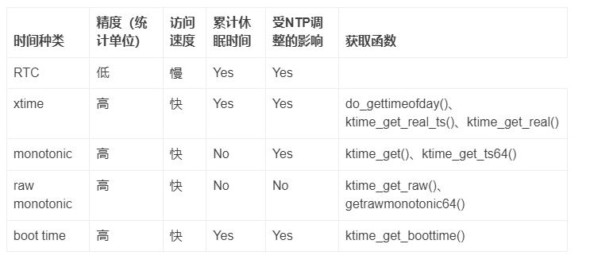

# 0x00. 导读

# 0x01. 简介

timekeeping 模块是一个提供时间服务的基础模块。Linux 内核提供各种 time line: real time clock，monotonic clock、monotonic raw clock等，timekeeping 模块就是负责跟踪、维护这些 timeline 的，并且向其他模块（timer相关模块、用户空间的时间服务等）提供服务，而 timekeeping 模块维护 timeline 的基础是基于 clocksource 模块和 tick 模块。通过 tick 模块的 tick 事件，可以周期性的更新 time line，通过 clocksource 模块可以获取 tick 之间更精准的时间信息。

# 0x02. timekepper

[Linux时间子系统之三：时间的维护者：timekeeper](https://abcdxyzk.github.io/blog/2017/07/23/kernel-clock-3/)

内核用 `timekeeper` 结构来组织与时间相关的数据
```c
struct timekeeper {  
	struct clocksource *clock;    /* Current clocksource used for timekeeping. */  
	u32 mult;    /* NTP adjusted clock multiplier */  
	int shift;  /* The shift value of the current clocksource. */  
	cycle_t cycle_interval; /* Number of clock cycles in one NTP interval. */  
	u64 xtime_interval; /* Number of clock shifted nano seconds in one NTP interval. */  
	s64 xtime_remainder;    /* shifted nano seconds left over when rounding cycle_interval */  
	u32 raw_interval;   /* Raw nano seconds accumulated per NTP interval. */  
  
	u64 xtime_nsec; /* Clock shifted nano seconds remainder not stored in xtime.tv_nsec. */  
	/* Difference between accumulated time and NTP time in ntp 
	 * shifted nano seconds. */  
	s64 ntp_error;  
	/* Shift conversion between clock shifted nano seconds and 
	 * ntp shifted nano seconds. */  
	int ntp_error_shift;  
  
	struct timespec xtime;  /* The current time */  
  
	struct timespec wall_to_monotonic;  
	struct timespec total_sleep_time;   /* time spent in suspend */  
	struct timespec raw_time;   /* The raw monotonic time for the CLOCK_MONOTONIC_RAW posix clock. */  
  
	ktime_t offs_real;  /* Offset clock monotonic -> clock realtime */  
  
	ktime_t offs_boot;  /* Offset clock monotonic -> clock boottime */  
  
	seqlock_t lock; /* Seqlock for all timekeeper values */  
};  
```

timerkeeper 提供了几种时间： xtime、monotonic time、raw monotonic time、boot time。

xtime 字段就是上面所说的墙上时间，它是一个 timespec 结构的变量，它记录了自1970年1月1日以来所经过的时间，因为是 timespec 结构，所以它的精度可以达到纳秒级，当然那要取决于系统的硬件是否支持这一精度。

monotonic time，可以把它理解为自系统启动以来所经过的时间，该时间只能单调递增，可以理解为 xtime 虽然正常情况下也是递增的，但是毕竟用户可以主动向前或向后调整墙上时间，从而修改 xtime 值。但是 monotonic 时间不可以往后退，系统启动后只能不断递增。奇怪的是，内核并没有直接定义一个这样的变量来记录 monotonic 时间，而是定义了一个变量 wall_to_monotonic ，记录了墙上时间和 monotonic 时间之间的偏移量，当需要获得 monotonic 时间时，把 xtime 和 wall_to_monotonic 相加即可，因为默认启动时 monotonic 时间为0，所以实际上 wall_to_monotonic 的值是一个负数，它和 xtime 同一时间被初始化。

clock 字段则指向了目前 timekeeper 所使用的时钟源，xtime，monotonic time 和 raw time 都是基于该时钟源进行计时操作，当有新的精度更高的时钟源被注册时，通过 timekeeping_notify 函数， change_clocksource 函数将会被调用， timekeeper.clock 字段将会被更新，指向新的 clocksource 。

xtime 一旦初始化完成后， timekeeper 就开始独立于 RTC ，利用自身关联的 clocksource 进行时间的更新操作，根据内核的配置项的不同，更新时间的操作发生的频度也不尽相同，如果没有配置 NO_HZ 选项，通常每个 tick 的定时中断周期， do_timer 会被调用一次，相反，如果配置了 NO_HZ 选项，可能会在好几个 tick 后， do_timer 才会被调用一次，当然传入的参数是本次更新离上一次更新时相隔了多少个 tick 周期，系统会保证在 clocksource 的 max_idle_ns 时间内调用 do_timer ，以防止 clocksource 的溢出。

timekeeper提供了一系列的接口用于获取各种时间信息
```c
void getboottime(struct timespec *ts);    获取系统启动时刻的实时时间
void get_monotonic_boottime(struct timespec *ts);     获取系统启动以来所经过的时间，包含休眠时间
ktime_t ktime_get_boottime(void);   获取系统启动以来所经过的c时间，包含休眠时间，返回ktime类型
ktime_t ktime_get(void);    获取系统启动以来所经过的c时间，不包含休眠时间，返回ktime类型
void ktime_get_ts(struct timespec *ts) ;   获取系统启动以来所经过的c时间，不包含休眠时间，返回timespec结构
unsigned long get_seconds(void);    返回xtime中的秒计数值
struct timespec current_kernel_time(void);    返回内核最后一次更新的xtime时间，不累计最后一次更新至今clocksource的计数值
void getnstimeofday(struct timespec *ts);    获取当前时间，返回timespec结构
void do_gettimeofday(struct timeval *tv);    获取当前时间，返回timeval结构
```

