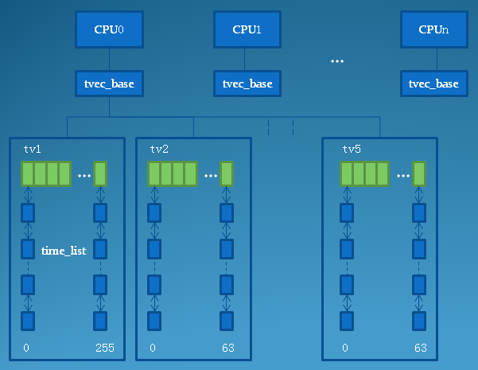

# 0x00. 导读

# 0x01. 简介

利用定时器，我们可以设定在未来的某一时刻，触发一个特定的事件。**所谓低分辨率定时器，是指这种定时器的计时单位基于 `jiffies` 值的计数**，也就是说，它的精度只有 `1/HZ` ，假如你的内核配置的 HZ 是 1000 ，那意味着系统中的低分辨率定时器的精度就是 1ms 。早期的内核版本中，内核并不支持高精度定时器，理所当然只能使用这种低分辨率定时器，我们有时候把这种基于 HZ 的定时器机制称为时间轮: time wheel 。虽然后来出现了高分辨率定时器，但它只是内核的一个可选配置项，所以直到目前最新的内核版本，这种低分辨率定时器依然被大量地使用着。

# 0x02. time wheel

系统中有可能有成百上千个定时器，难道在每个 tick 中断都遍历一下所有的定时器，检查它们是否到期？内核当然不会使用这么笨的办法，它使用了一个更聪明的办法：按定时器的到期时间对定时器进行分组。也就是 时间轮 这个名字的由来。

低分辨率定时器在实现时也充分地考虑了多核处理器的支持和优化。为了较好地利用 cache line ，也为了避免cpu之间的互锁，内核为多核处理器中的每个cpu单独分配了管理定时器的相关数据结构和资源，每个cpu独立地管理属于自己的 时间轮。

## 2.1 timer_list

了解一下。

要在内核编程中使用定时器，首先我们要定义一个 time_list 结构
```c
struct timer_list {
	/* 
	 * All fields that change during normal runtime grouped to the 
	 * same cacheline 
	*/
    // 用于把一组定时器组成一个链表
	struct list_head entry;
    // 该定时器的到期时刻，也就是期望定时器到期时刻的 jiffies 计数值。
	unsigned long expires;
    // 每个 cpu 拥有一个自己的用于管理定时器的 tvec_base 结构，
    // 该字段指向该定时器所属的 cpu 所对应 tvec_base 结构。
	struct tvec_base *base;

    // 定时器到期时，系统将会调用该回调函数，用于响应该定时器的到期事件。
	void (*function)(unsigned long);
    // 回调函数的参数
	unsigned long data;

    // 对有些对到期时间精度不太敏感的定时器，到期时刻允许适当地延迟一小段时间，
    // 该字段用于计算每次延迟的HZ数。
	int slack;
		......
};
```

```c
//初始化定时器
void init_timer(struct timer_list * timer);
//添加一个定时器
void add_timer(struct timer_list * timer);
//修改定时器的定时时间expires
int mod_timer(struct timer_list *timer, unsigned long expires);
//删除定时器
int del_timer(struct timer_list * timer);
// 在指定的cpu上添加定时器
void add_timer_on(struct timer_list *timer, int cpu);  
//  只有当timer已经处在激活状态时，才修改timer的到期时刻
int mod_timer_pending(struct timer_list *timer, unsigned long expires);  
int mod_timer_pinned(struct timer_list *timer, unsigned long expires);  
//  设定timer允许的到期时刻的最大延迟，用于对精度不敏感的定时器
void set_timer_slack(struct timer_list *time, int slack_hz);  
//  如果该timer正在被处理中，则等待timer处理完成才移除该timer
int del_timer_sync(struct timer_list *timer);  

```

例子:
```c
// 单次定时
// 加载驱动一秒钟后，打印出“timer handler, data:520”：

#include <linux/init.h>
#include <linux/kernel.h>
#include <linux/module.h>
#include <linux/sched.h>//jiffies在此头文件中定义
#include <linux/timer.h>//struct timer_list
struct timer_list timer;
static void timer_handler (unsigned long arg)
{
	printk("timer handler, data:%d\n", arg);
}
static int __init my_init(void)
{
	printk("%s enter\n", __func__);
	init_timer(&timer);
	timer.expires = get_jiffies_64() + msecs_to_jiffies(1000);//定时1秒
	timer.function = timer_handler;
	timer.data = 520;
	add_timer(&timer);
	return 0;
}
static void __exit my_exit(void)
{
	printk("%s enter\n", __func__);
	del_timer(&timer);
}
module_init(my_init);
module_exit(my_exit);
MODULE_LICENSE("GPL");
```

```c
// 循环定时
// 实现循环定时就是在定时时间到了之后，调用mod_timer函数再次修改定时时间。
// 每隔一秒钟打印“timer handler, data:520”

#include <linux/init.h>
#include <linux/kernel.h>
#include <linux/module.h>
#include <linux/sched.h>//jiffies在此头文件中定义
#include <linux/timer.h>//struct timer_list
struct timer_list timer;
static void timer_handler (unsigned long arg)
{
	printk("timer handler, data:%d\n", arg);
	mod_timer(&timer, get_jiffies_64() + msecs_to_jiffies (1000));
}
static int __init my_init(void)
{
	init_timer(&timer);
	timer.expires = get_jiffies_64() + msecs_to_jiffies (1000);//定时1秒
	timer.function = timer_handler;
	timer.data = 520;
	add_timer(&timer);
	return 0;
}
static void __exit my_exit(void)
{
	del_timer(&timer);
}
module_init(my_init);
module_exit(my_exit);
MODULE_LICENSE("GPL");
```

## 2.2 tvec_base

内核为每个cpu定义了一个 `tvec_base` 结构指针:
```c
struct tvec_base {
	spinlock_t lock;
    // 当前cpu正在处理的定时器所对应的timer_list结构
	struct timer_list *running_timer;
    // 当前cpu定时器所经历过的jiffies数
	unsigned long timer_jiffies;
    // 该cpu下一个即将到期的定时器
	unsigned long next_timer;

    // 这5个字段用于对定时器进行分组，实际上，tv1--tv5都是一个链表数组
	struct tvec_root tv1;
	struct tvec tv2;
	struct tvec tv3;
	struct tvec tv4;
	struct tvec tv5;
} ____cacheline_aligned;

```



# 0x03. 

系统初始化时，start_kernel 会调用定时器系统的初始化函数 init_timers, 里面会把 run_timer_softirq 注册为 TIMER_SOFTIRQ 的处理函数。
```c
void __init init_timers(void)
{      
	int err = timer_cpu_notify(&timers_nb, (unsigned long)CPU_UP_PREPARE, 
				(void *)(long)smp_processor_id());

	init_timer_stats();

	BUG_ON(err != NOTIFY_OK);
	register_cpu_notifier(&timers_nb);  /* 注册cpu notify，以便在hotplug时在cpu之间进行定时器的迁移 */
	open_softirq(TIMER_SOFTIRQ, run_timer_softirq);
}
```

TIMER_SOFTIRQ 的触发:

- 在 tick 设备初始化过程中，有 tick_setup_periodic => tick_set_periodic_handler ，会设置收到 clock_event_device 中断时调用的 handler 为 tick_handle_periodic 。

- 于是 tick_handle_periodic => tick_periodic/timer_tick => update_process_times => run_local_timers => raise_softirq(TIMER_SOFTIRQ)

- 因此每当收到 tick 时，会发送软中断 TIMER_SOFTIRQ ，让中断处理函数 run_timer_softirq 去处理，处理函数 run_timer_softirq 中会调用 __run_timers ，它会取出 tv1 中到期的定时器，执行定时器的回调函数。


```c
void timer_tick(void)
{
    profile_tick(CPU_PROFILING);
    xtime_update(1);
#ifndef CONFIG_SMP
    update_process_times(user_mode(get_irq_regs()));
#endif
}

void xtime_update(unsigned long ticks)
{
    write_seqlock(&jiffies_lock);
    do_timer(ticks);
    write_sequnlock(&jiffies_lock);
}

void do_timer(unsigned long ticks)
{
    /*更新jiffies*/
    jiffies_64 += ticks;
    /*更新墙上时间*/
    update_wall_time();
    /*计算全局负载*/
    calc_global_load(ticks);
}

void update_process_times(int user_tick)
{
    struct task_struct *p = current;
    int cpu = smp_processor_id();
    
    /* Note: this timer irq context must be accounted for as well. */
    account_process_tick(p, user_tick);//更新进程时间
    run_local_timers();//处理本地定时器
    rcu_check_callbacks(cpu, user_tick);
#ifdef CONFIG_IRQ_WORK
    if (in_irq())
        irq_work_run();
#endif
    scheduler_tick();
    run_posix_cpu_timers(p);
}
```

```c
void run_local_timers(void)
{
	hrtimer_run_queues();
	raise_softirq(TIMER_SOFTIRQ);
}

static void run_timer_softirq(struct softirq_action *h)
{
	struct tvec_base *base = __this_cpu_read(tvec_bases);

	hrtimer_run_pending();

	if (time_after_eq(jiffies, base->timer_jiffies))
		__run_timers(base);
}

static inline void __run_timers(struct tvec_base *base)
{
	struct timer_list *timer;

	spin_lock_irq(&base->lock);
		/* 同步jiffies，在NO_HZ情况下，base->timer_jiffies可能落后不止一个tick  */
	while (time_after_eq(jiffies, base->timer_jiffies)) {  
		struct list_head work_list;
		struct list_head *head = &work_list;
				/*  计算到期定时器链表在tv1中的索引  */
		int index = base->timer_jiffies & TVR_MASK;  

		/* 
		 * /*  tv2--tv5定时器列表迁移处理  */
		 */
		if (!index &&
			(!cascade(base, &base->tv2, INDEX(0))) &&              
				(!cascade(base, &base->tv3, INDEX(1))) &&      
					!cascade(base, &base->tv4, INDEX(2)))  
			cascade(base, &base->tv5, INDEX(3));  
				/*  该cpu定时器系统运行时间递增一个tick  */                 
		++base->timer_jiffies;  
				/*  取出到期的定时器链表  */                                       
		list_replace_init(base->tv1.vec + index, &work_list);
				/*  遍历所有的到期定时器  */          
		while (!list_empty(head)) {                                    
			void (*fn)(unsigned long);
			unsigned long data;

			timer = list_first_entry(head, struct timer_list,entry);
			fn = timer->function;
			data = timer->data;

			timer_stats_account_timer(timer);

			base->running_timer = timer;    /*  标记正在处理的定时器  */
			detach_timer(timer, 1);

			spin_unlock_irq(&base->lock);
			call_timer_fn(timer, fn, data);  /*  调用定时器的回调函数  */
			spin_lock_irq(&base->lock);
		}
	}
	base->running_timer = NULL;
	spin_unlock_irq(&base->lock);
}
```