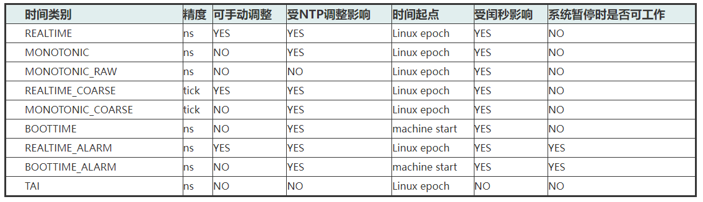

# 0x00. 导读

# 0x01. 简介

# 0x02. 术语解释

## 2.1 UTC

整个地球分为二十四时区，每个时区都有自己的本地时间，在国际无线电通信场合，为了统一起见，使用一个统一的时间，称为通用协调时。

现在通用的标准时间为 Coordinated Universal Time, UTC，由世界上最精确的原子钟提供计时，而本地时间是 UTC+TimeZone，也就是日常使用的时间。

例如 北京时间= UTC + 8

## 2.2 GMT

另外，说到 UTC 就不得不提格林威治平均时 Greenwich Mean Time, GMT，这是时区 0 的本地时间，也即是 GMT=UTC+0，所以 GMT 和 UTC 时间值是相等的。

## 2.3 CST

中国标准时间。CST = UTC + 8 = GMT + 8

## 2.4 DST

夏令时。夏令时是指夏天太阳升起的比较早的时候，将时间拨快一个小时，以提早日光的使用，中国不使用。

## 2.3 Epoch

在 *nix 系统中，还有一个词 Epoch，它指的是一个特定时间 1970-01-01 00:00:00 +0000 (UTC)。

## 2.4 wall time

我们把每天用的这个时间叫做自然时间，自然时间有时候也会被叫做墙钟时间 (wall clock time)，或者简略为墙上时间 (wall time)。

## 2.5 RTC时间  

在PC中，RTC时间又叫CMOS时间，它通常由一个专门的计时硬件来实现，软件可以读取该硬件来获得年月日、时分秒等时间信息，而在嵌入式系统中，有使用专门的RTC芯片，也有直接把RTC集成到Soc芯片中，读取Soc中的某个寄存器即可获取当前时间信息。一般来说，RTC是一种可持续计时的，也就是说，不管系统是否上电，RTC中的时间信息都不会丢失，计时会一直持续进行，硬件上通常使用一个后备电池对RTC硬件进行单独的供电。因为RTC硬件的多样性，开发者需要为每种RTC时钟硬件提供相应的驱动程序，内核和用户空间通过驱动程序访问RTC硬件来获取或设置时间信息。
```
/dev/rtcX：rtc字符设备，打开后通过ioctl进行配置。

/proc/driver/rtc：当前rtc硬件的详细信息。

/sys/class/rtc/rtcX：rtc类设备节点，可以通过目录下的sysfs对硬件进行配置。

使用 date 命令读取和设置系统时间。

date -s "2024-01-18 17:17:17"--设置当前系统时间。
使用 hwclock 命令去读和设置RTC：

hwclock -w--将当前系统时间设置到RTC硬件中。
hwclock -r--读取当前RTC硬件时间。
hwclock -s--将RTC时间设置到系统时间。

如果要设置RTC时间，先通过date设置系统时间，然后通过hwclock将系统时间设置到rtc硬件中。

date -s "2024-01-18 17:17:17"
hwclock -s
```



## 2.6 xtime  

xtime和RTC时间一样，都是人们日常所使用的墙上时间，只是RTC时间的精度通常比较低，大多数情况下只能达到毫秒级别的精度，如果是使用外部的RTC芯片，访问速度也比较慢，为此，内核维护了另外一个wall time时间：xtime，取决于用于对xtime计时的clocksource，它的精度甚至可以达到纳秒级别，因为xtime实际上是一个内存中的变量，它的访问速度非常快，内核大部分时间都是使用xtime来获得当前时间信息。xtime记录的是自1970年1月1日24时到当前时刻所经历的纳秒数。

## 2.7 monotonic time  

该时间自系统开机后就一直单调地增加，它不像xtime可以因用户的调整时间而产生跳变，不过该时间不计算系统休眠的时间，也就是说，系统休眠时，monotoic时间不会递增。

## 2.8 raw monotonic time  

该时间与monotonic时间类似，也是单调递增的时间，唯一的不同是：raw monotonic time“更纯净”，他不会受到NTP时间调整的影响，它代表着系统独立时钟硬件对时间的统计。

## 2.9 boot time  

与monotonic时间相同，不过会累加上系统休眠的时间，它代表着系统上电后的总时间。

## 2.10 broken-down time

将秒数值分解成年月日时分秒