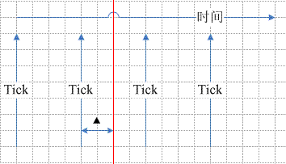
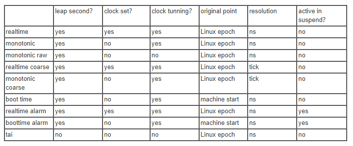
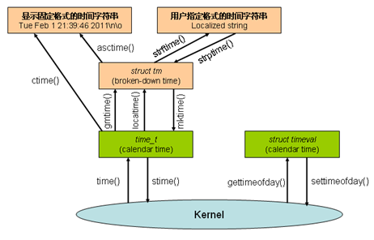

# 0x00. 导读

[Linux的时钟](http://www.wowotech.net/timer_subsystem/clock-id-in-linux.html)

# 0x01. 简介

假如你在一个没有钟表的世界，要创造一个钟表，那么需要知道几件事：
1. 时间起点，秦国开始？1949 年开始？1970 年开始？
2. 定义一个时间单位，例如 铯 133 的震荡频率定义为秒，在此基础之上，自然可以定义毫秒微秒，小时，年，世纪
3. 一种稳定递增的器件，例如 如何让秒针每秒钟动一下

确定了这三样，才算有了一个时间工具，在这之上，我们就能
1. 获得当前时间
2. 定时器

# 0x02. Linux 基础


## 2.1 如何度量时间

科学家们发现铯 133 原子在能量跃迁时候辐射的电磁波的振荡频率非常的稳定，因此被用来定义时间的基本单位：秒（或者称之为原子秒）。

## 2.2 Epoch

定义了时间单位，等于时间轴上有了刻度，虽然这条代表时间的直线我们不知道从何开始，最终去向何方，我们终归是可以把一个时间点映射到这条直线上了。如果定义了原点，那么我们可以用一个数字（到原点的距离）来表示时间。

Linux epoch 定义为 `1970-01-01 00:00:00 +0000 (UTC)` ，要是玩的花样多，你可以选择秦朝作为 epoch ，甚至选择自己的生日作为 epoch.

除了 wall time，linux 系统中也需要了解系统自启动以来过去了多少的时间，这时候，我们可以把钟表的 epoch 调整成系统的启动时间点，这时候获取系统启动时间就很容易了，直接看这块钟表的读数即可。

## 2.3 时间调整

所谓时间同步其实就是用一个精准的时间来调整本地的时间，具体的调整方式有两种，一种就是直接设定当前时间值，另外一种是采用了润物细无声的形式，对本地振荡器的输出进行矫正。第一种方法会导致时间轴上的时间会向前或者向后的跳跃，无法保证时间的连续性和单调性。第二种方法是对时间轴缓慢的调整（而不是直接设定），从而保证了连续性和单调性。

## 2.4 闰秒（leap second）

通过原子秒延展出来的时间轴就是 TAI(International Atomic Time) clock。这块表不管日出、日落，机械的按照 ce 原子定义的那个秒在推进时间。冷冰冰的 TAI clock 虽然精准，但是对人类而言是不友好的，毕竟人还是生活在这颗蓝色星球上。而那些基于地球自转，公转周期的时间虽然符合人类习惯，但是又不够精确。在这样的背景下，UTC(Coordinated Universal Time) 被提出来了，它是 TAI clock 的基因（使用原子秒），但是又会适当的调整 (leap second) ，满足人类生产和生活的需要。

TAI 和 UTC 两块表的发条是一样的，按照同样的时间滴答（tick，精准的根据原子频率定义的那个秒）来推动钟表的秒针的转动，唯一不同的是，UTC clock 有一个调节器，在适当的时间，可以把秒针向前或者向后调整一秒。

TAI clock 和 UTC clock 在1972年进行了对准（相差10秒），此后就各自独立运行了。在大部分的时间里， UTC clock 跟随 TAI clock ，除了在适当的时间点， realtime clock 会进行 leap second 的补偿。从1972年到2017年，已经有了27次leap second，因此 TAI clock 的读数已经比 realtime clock（UTC时间）快了37秒。在1972年，它们之间的offset是10秒，经过多年的运转，到了2017年， offset 累计到37秒，让我静静等待下一个 leap second 到了的时刻吧。

## 2.5 计时范围

有一类特殊的clock称作秒表，启动后开始计时，中间可以暂停，可以恢复。我们可以通过这样的秒表来记录一个人睡眠的时间，当进入睡眠状态的时候，按下start按键开始计时，一旦醒来则按下stop，暂停计时。linux中也有这样的计时工具，用来计算一个进程或者线程的执行时间。

## 2.6 时间精度

时间是连续的吗？你眼中的世界是连续的吗？看到窗外清风吹拂的树叶的时候，你感觉每一个树叶的形态都被你捕捉到了。然而，未必，你看急速前进的汽车的轮胎的时候，感觉车轮是倒转的。为什么？其实这仅仅是因为我们的眼睛大约是每秒15～20帧的速度在采样这个世界，你看到的世界是离散的。算了，扯远了，我们姑且认为时间的连续的，但是Linux中的时间记录却不是连续的，我们可以用下面的图片表示：



系统在每个tick到来的时候都会更新系统时间（到linux epoch的秒以及纳秒值记录），当然，也有其他场景进行系统时间的更新，这里就不赘述了。因此，对于linux的时间而言，它是一些离散值，是一些时间采样点的值而已。当用户请求时间服务的时候，例如获取当前时间（上图中的红线），那么最近的那个Tick对应的时间采样点值再加上一个当前时间点到上一个tick的delta值就精准的定位了当前时间。不过，有些场合下，时间精度没有那么重要，直接获取上一个tick的时间值也基本是OK的，不需要校准那个delta也能满足需求。而且粗粒度的clock会带来performance的优势。

## 2.7 睡觉的时候时间会停止运作吗？

在现实世界提出这个问题会稍显可笑，鲁迅同学有一句名言：时间永是流逝，街市依旧太平。但是对于Linux系统中的clock，这个就有现实的意义了。比如说clock的一个重要的派生功能是创建timer（也就是说timer总是基于一个特定的clock运作）。在一个5秒的timer超期之前，系统先进入了suspend或者关机状态，这时候，5秒时间到达的时候，一般的timer都不会触发，因为底层的clock可能是基于一个free running counter的，在suspend或者关机状态的时候，这个HW counter都不再运作了，你如何期盼它能唤醒系统，来执行timer expired handler？但是用户还是有这方面的实际需求的，最简单的就是关机闹铃。怎么办？这就需要一个特别的clock，能够在suspend或者关机的时候，仍然可以运作，推动timer到期触发。

# 0x03. clock id

在linux系统中定义了如下的 clock id：
```
#define CLOCK_REALTIME                  0
#define CLOCK_MONOTONIC                 1
#define CLOCK_PROCESS_CPUTIME_ID        2
#define CLOCK_THREAD_CPUTIME_ID         3
#define CLOCK_MONOTONIC_RAW             4
#define CLOCK_REALTIME_COARSE           5
#define CLOCK_MONOTONIC_COARSE          6
#define CLOCK_BOOTTIME                  7
#define CLOCK_REALTIME_ALARM            8
#define CLOCK_BOOTTIME_ALARM            9
#define CLOCK_SGI_CYCLE                 10    /* Hardware specific */
#define CLOCK_TAI                       11
```

`CLOCK_PROCESS_CPUTIME_ID` 和 `CLOCK_THREAD_CPUTIME_ID` 这两个 clock 是专门用来计算进程或者线程的执行时间的（用于性能剖析），一旦进程（线程）被切换出去，那么该进程（线程）的 clock 就会停下来。因此，这两种的 clock 都是 per-process 或者 per-thread 的，而其他的clock都是系统级别的。

tunning(校准)



CLOCK_REALTIME: 是描述真实世界的时钟，就类似挂在墙上的钟表一样，告知人类当前的时间。当然，家里的钟表你当然可以按照你的意愿向前或者向后调整。

CLOCK_MONOTONIC: 是一个禁止人为设定的真实世界的时钟，你没有办法设定它，但是可以通过 NTP 协议进行调整。

# 0x04. Linux 中的函数和结构

```c
struct tm {
    /*
     * the number of seconds after the minute, normally in the range
     * 0 to 59, but can be up to 60 to allow for leap seconds
     */
    int tm_sec;
    /* the number of minutes after the hour, in the range 0 to 59*/
    int tm_min;
    /* the number of hours past midnight, in the range 0 to 23 */
    int tm_hour;
    /* the day of the month, in the range 1 to 31 */
    int tm_mday;
    /* the number of months since January, in the range 0 to 11 */
    int tm_mon;
    /* the number of years since 1900 */ －－－－－以NTP epoch为基准点
    long tm_year;
    /* the number of days since Sunday, in the range 0 to 6 */
    int tm_wday;
    /* the number of days since January 1, in the range 0 to 365 */
    int tm_yday;
};
```

```c
/*
 * 秒： time_t
 * 微秒： timeval
 * 纳秒： timespec
*/

typedef long        time_t;

struct timeval {
    time_t        tv_sec;        /* seconds */
    suseconds_t    tv_usec;    /* microseconds 10^6 */ 
};

struct timespec {
    time_t    tv_sec;            /* seconds */
    long        tv_nsec;        /* nanoseconds */
};
```

|function  | 含义 | 返回值 | 精度 |
| -- | -- | -- | -- |
time() | time 函数获得从 1970 年 1 月 1 日 0 点到当前的秒数，存储在time_t结构之中。 | time_t | 秒 
gettimeofday() | gettimeofday 函数返回从 1970 年 1 月 1 日 0 点以来，到现在的时间。用 timeval 数据结构表示。 | struct timeval; | 微秒 
clock_gettime() | clock_gettime 函数返回从 1970 年 1 月 1 日 0 点以来，到现在的时间。用 timespec 数据结构表示。 支持不广泛。属于实时扩展。| struct timespe; | 纳秒 
ftime() | 函数返回从 1970 年 1 月 1 日 0 点以来，到现在的时间。用 timeb 数据结构表示。 已经过时, 被 time() 替代。尽量不使用。 | struct timeb; | 毫秒

## 4.1 时间格式转换



### 4.1.1 固定格式转换 

用 `ctime()` 函数转换出来的时间格式是系统固定的，调用者无法改动，因此被称为固定格式转换。 如果您对日期格式没有特殊的要求，那么用它基本上就可以了，简单，不用记忆很多的参数。

典型的 ctime() 格式如下： `Wed Dec 7 20:45:43 PST 2011`
```c
char *ctime(const time_t *clock);
```
```c
#include <time.h>

int main ()
{
    time_t time_raw_format;
    time ( &time_raw_format ); //获取当前时间
    printf (" time is [%d]\n", time_raw_format);
    //用 ctime 将时间转换为字符串输出
    printf ( "The current local time: %s", ctime(&time_raw_format));
    return 0;
}
```

### 4.1.2 自定义格式转换

为了更灵活的显示，需要把类型 time_t 转换为 tm 数据结构。tm 数据结构将时间分别保存到 代表年，月，日，时，分，秒等不同的变量中。不再是一个令人费解的 64 位整数了。 这种数据结构是各种自定义格式转换函数所需要的输入形式。

可以使用 gmtime() 和 localtime() 把 time_t 转换为 tm 数据格式， 其中 gmtime() 把时间转换为格林威治时间；localtime 则转换为当地时间。
```c
#include <time.h>
struct tm *gmtime(const time_t *timep);
struct tm *localtime(const time_t *timep);
```

使用 tm 来表示时间，您就可以调用 asctime() 和 strftime() 将时间转换为字符串了。asctime() 的输出格式固定， 和 ctime() 相同。strftime() 则类似我们最熟悉的 printf() 函数，您可以通过输入参数自定义时间的输出格式。

```c
size_t strftime(char *outstr, size_t maxsize, const char *format,
            const struct tm *timeptr);
```

```c
#include <time.h>

int main ()
{
    time_t time_raw_format;
    struct tm * time_struct;
    char buf [100];
    time ( &time_raw_format );
    time_struct = localtime ( &time_raw_format );
    strftime (buf,100,"It is now: %I:%M%p.",time_struct);
    puts (buf);
    return 0;
}
```

gettimeofday() 以及 clock_gettime()， 它们分别返回 struct timeval 或者 timespec 代表的高精度的时间值。目前，还没有直接把 struct timeval/timespec 转换为 struct tm 的函数。一般的做法是将 timeval 中的 tv_sec 转换为 tm， 使用上面所述的方法转换为字符串，最后在显示的时候追加上 tv_usec，比如下面的例子代码：
```c
struct timeval tv;
time_t nowtime; 
struct tm *nowtm; 
char tmbuf[64], buf[64]; 
gettimeofday(&tv, NULL); //获取当前时间到 tv
nowtime = tv.tv_sec; //nowtime 存储了秒级的时间值
nowtm = localtime(&nowtime); //转换为 tm 数据结构
//用 strftime 函数将 tv 转换为字符串，但 strftime 函数只能达到秒级精度
strftime(tmbuf, sizeof tmbuf, "%Y-%m-%d %H:%M:%S", nowtm);
//将毫秒值追加到 strftime 转换的字符串末尾 
snprintf(buf, sizeof buf, "%s.%06d", tmbuf, tv.tv_usec);
```