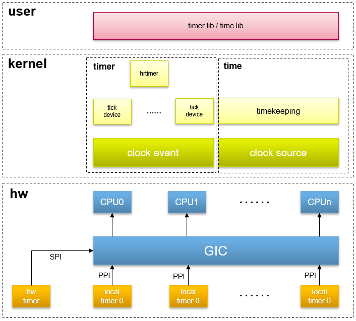
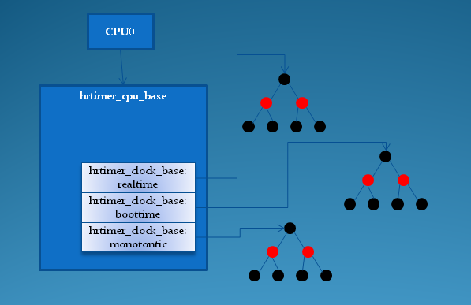

# 0x00. 导读

# 0x01. 简介

常规的低分辨率内核定时器针对 超时 的应用场景做了优化，同时低分辨率定时器的实现是和 jiffies 紧密相连的，因而无法应用于需要高精度定时的场合，为此 linux 提供了高分辨率定时器 **hrtimer(high resolution timer)** 。

hrtimer 是建立在 per-CPU 时钟事件设备上的，如果 SMP 系统中只存在一个全局的时钟事件设备，则这样的系统无法支持高分辨率定时器。高分辨率定时器需要由 CPU 的本地时钟事件设备来支持，即它是 per-CPU 的。为了支持 hrtimer，内核需要配置 `CONFIG_HIGH_RES_TIMERS=y`。

hrtimer 有两种工作模式：**低精度模式（low-resolution mode）**与**高精度模式（high-resolution mode）**。虽然 hrtimer 子系统是为高精度的 timer 准备的，但是系统可能在运行过程中动态切换到不同精度的时钟源设备，因此，hrtimer 必须能够在低精度模式与高精度模式下自由切换。由于低精度模式是建立在高精度模式之上的，因此即便系统只支持低精度模式，部分支持高精度模式的代码仍然会编译到内核当中。

高分辨率定时器基于红黑树实现。它独立于周期时钟，并且使用纳秒作为时间单位。
高分辨率定时器可以基于两种时钟实现:

- 单调时钟 CLOCK_MONOTONIC: 从0开始单调递增
- 实时时钟 CLOCK_REALTIME: 系统实际时间，可能跳跃，比如系统时间改变。

高精度模式下高分辨率定时器的时钟事件设备会在定时器到期时引发中断，该中断由 `hrtimer_interrupt` 处理。如果没有提供高分辨率时钟，则高分辨率定时器的到期操作由 `hrtimer_run_queues` 完成。

# 0x02. 详解

hrtimer 的实现需要一定的硬件基础，它的实现依赖于 timekeeper 和 clock_event_device. 

hrtimer 系统需要通过 timekeeper 获取当前的时间，计算与到期时间的差值，并根据该差值，设定该 cpu 的 tick_device( clock_event_device ) 的下一次的到期时间，时间一到，在 clock_event_device 的事件回调函数中处理到期的 hrtimer. 一旦开启了 hrtimer, 那么 tick_device 所关联的 clock_event_device 的事件回调函数会被修改为： `hrtimer_interrupt` ，并且会被设置成工作于 CLOCK_EVT_MODE_ONESHOT 单触发模式。



1. 最底层是硬件和驱动层，每个 cpu core 都有自己的 cpu local timer ，此外 SOC 内部肯定会有一个用于全局的 global counter。

2. 中间层是 linux 内核层，内核抽象出了时钟源 (clocksource) , 时钟事件设备 (clock_event_device), tick 设备 (tick_device) 用于时间管理。分为左右两部分:

	- 右边实现计时功能。linux 内核有各种 time line, 包括 real time clock, monotonic clock, monotonic raw clock 等。 clocksource 提供了一个单调增加的计时器，为 timeline 提供时钟源。 timekeeper 是内核提供时间服务的基础模块，负责选择并维护最优的 clocksource。

	- 左边实现定时功能。 clock event 管理可产生 event 或是触发中断的定时器，（一般而言，每个 CPU 形成自己的一个小系统，也就要管理自己的 clock event。） tick device 是基于 clock event 设备进行工作的， cpu 管理自己的调度、进程统计等是基于 tick 设备的。低精度 timer 和高精度 timer 都是基于 tick device 生成的定时器设备。

3. 最上层是 linux 应用层。基于 timekeeping 设备的是 **时间管理的库 time lib**，基于定时器设备的是**定时管理的库 timer lib**。

## 2.1 高精度模式与低精度模式

1. 低精度模式 

    因为系统并不是一开始就会支持高精度模式，而是在系统启动后的某个阶段，等待所有的条件都满足后，才会切换到高精度模式，当系统还没有切换到高精度模式时，所有的高精度定时器运行在低精度模式下，在每个 jiffie 的 tick 事件中断中进行到期定时器的查询和处理，显然这时候的精度和低分辨率定时器是一样的（HZ级别）。  

    低精度模式下，每个 tick 事件中断中， `hrtimer_run_queues` 函数会被调用，由它完成定时器的到期处理（调用链 tick_periodic => update_process_times => run_local_timers => hrtimer_run_queues）。 `hrtimer_run_queues` 首先判断目前高精度模式是否已经启用，如果已经切换到了高精度模式，什么也不做，直接返回。否则继续处理，它用一个 for 循环遍历各个时间基准系统，查询每个 hrtimer_clock_base 对应红黑树的左下节点，判断它的时间是否到期，如果到期，通过 `__run_hrtimer` 函数，对到期定时器进行处理，包括：调用定时器的回调函数、从红黑树中移除该定时器、根据回调函数的返回值决定是否重新启动该定时器等等。

2. 高精度模式 

    切换到高精度模式后，原来给 cpu 提供 tick 事件的 tick_device(clock_event_device) 会被高精度定时器系统接管，它的中断事件回调函数被设置为 `hrtimer_interrupt` ，红黑树中最左下的节点的定时器的到期时间被编程到该 clock_event_device 中，这样每次 clock_event_device 的中断意味着至少有一个高精度定时器到期。

逻辑说完了，我们看看代码：
```c
void hrtimer_run_queues(void)
{
    struct hrtimer_cpu_base *cpu_base = this_cpu_ptr(&hrtimer_bases);
    ktime_t now;
    // 当前处于高精度模式，直接返回
    if (__hrtimer_hres_active(cpu_base))
        return;

    /*
     * This _is_ ugly: We have to check periodically, whether we
     * can switch to highres and / or nohz mode. The clocksource
     * switch happens with xtime_lock held. Notification from
     * there only sets the check bit in the tick_oneshot code,
     * otherwise we might deadlock vs. xtime_lock.
     */
    // 如果支持高精度，则切换到高精度模式，否则尝试切换到 nohz 模式
    if (tick_check_oneshot_change(!hrtimer_is_hres_enabled())) {
        hrtimer_switch_to_hres();
        return;
    }

    raw_spin_lock(&cpu_base->lock);
    now = hrtimer_update_base(cpu_base);
    // 遍历 hrtimer_cpu_base 中的各个 base，不断取出它们最早超时的节点(hrtimer), 如果它们相对现在已经超时，调用 __run_hrtimer
    // __run_hrtimer 会将其从红黑树上移除，并调用回调函数
    __hrtimer_run_queues(cpu_base, now);
    raw_spin_unlock(&cpu_base->lock);
}
```

可以看到在进入高精度模式前，处理 hrtimer 的精度为每 tick 一次，因为 jiffies 在每次 tick 时也会加一，也就是说 hrtimer 几乎沦为了 timer. 但它会不断尝试进入高精度模式。如果可以能进入高精度模式，通过调用 `hrtimer_switch_to_hres => tick_init_highres => tick_switch_to_oneshot(hrtimer_interrupt)` 进行切换。它会将 CPU clock_event_device 的回调函数设置为 `hrtimer_interrupt` ，并将该设备切换到 oneshot mode。一旦 base 进入高精度模式，此后 hrtimer_run_queues 会直接返回。

此后在收到 clock_event_device 发来的中断后，调用 `hrtimer_interrupt` 对超时 hrtimer 进行处理：
```c
void hrtimer_interrupt(struct clock_event_device *dev)
{
    struct hrtimer_cpu_base *cpu_base = this_cpu_ptr(&hrtimer_bases);
    ktime_t expires_next, now, entry_time, delta;
    int retries = 0;

    BUG_ON(!cpu_base->hres_active);
    cpu_base->nr_events++;
    dev->next_event.tv64 = KTIME_MAX;

    raw_spin_lock(&cpu_base->lock);
    // 记录进入循环时的时间
    entry_time = now = hrtimer_update_base(cpu_base);
retry:
    cpu_base->in_hrtirq = 1;
    /*
     * We set expires_next to KTIME_MAX here with cpu_base->lock
     * held to prevent that a timer is enqueued in our queue via
     * the migration code. This does not affect enqueueing of
     * timers which run their callback and need to be requeued on
     * this CPU.
     */
    cpu_base->expires_next.tv64 = KTIME_MAX;
    // 遍历 hrtimer_cpu_base 中的各个 base，不断取出它们最早超时的节点(hrtimer), 如果它们相对现在已经超时，调用 __run_hrtimer
    // __run_hrtimer 会将其从红黑树上移除，并调用回调函数
    __hrtimer_run_queues(cpu_base, now);

    /* Reevaluate the clock bases for the next expiry */
    // 遍历 hrtimer_cpu_base 中的各个 base，得到下次最早的超时时间
    expires_next = __hrtimer_get_next_event(cpu_base);
    /*
     * Store the new expiry value so the migration code can verify
     * against it.
     */
    cpu_base->expires_next = expires_next;
    cpu_base->in_hrtirq = 0;
    raw_spin_unlock(&cpu_base->lock);

    /* Reprogramming necessary ? */
    // 将新的超时时间设置到 clock_event_device
    if (!tick_program_event(expires_next, 0)) {
        cpu_base->hang_detected = 0;
        return;
    }
    // 如果 tick_program_event 返回非 0，表示 expires_next 已经过期，可能原因如下：

    /*
     * The next timer was already expired due to:
     * - tracing
     * - long lasting callbacks
     * - being scheduled away when running in a VM
     *
     * We need to prevent that we loop forever in the hrtimer
     * interrupt routine. We give it 3 attempts to avoid
     * overreacting on some spurious event.
     *
     * Acquire base lock for updating the offsets and retrieving
     * the current time.
     */
    // 为了解决这个问题，我们提供 3 次机会，重新执行前面的循环，处理到期的 hrtimer
    raw_spin_lock(&cpu_base->lock);
    now = hrtimer_update_base(cpu_base);
    cpu_base->nr_retries++;
    if (++retries < 3)
        goto retry;
    /*
     * Give the system a chance to do something else than looping
     * here. We stored the entry time, so we know exactly how long
     * we spent here. We schedule the next event this amount of
     * time away.
     */
    cpu_base->nr_hangs++;
    cpu_base->hang_detected = 1;
    raw_spin_unlock(&cpu_base->lock);
    delta = ktime_sub(now, entry_time);
    // 如果 3 次尝试后依然失败，则计算 3 次循环的总时间，直接将下次超时的时间推后，最多 100 ms，然后重新通过 tick_program_event 设置
    if ((unsigned int)delta.tv64 > cpu_base->max_hang_time)
        cpu_base->max_hang_time = (unsigned int) delta.tv64;
    /*
     * Limit it to a sensible value as we enforce a longer
     * delay. Give the CPU at least 100ms to catch up.
     */
    if (delta.tv64 > 100 * NSEC_PER_MSEC)
        expires_next = ktime_add_ns(now, 100 * NSEC_PER_MSEC);
    else
        expires_next = ktime_add(now, delta);
    tick_program_event(expires_next, 1);
    printk_once(KERN_WARNING "hrtimer: interrupt took %llu ns\n",
            ktime_to_ns(delta));
}
```
    
## 2.2 模拟 tick 事件

我们通过 tick_switch_to_oneshot(hrtimer_interrupt) 切换到高精度模式。它会将 CPU clock_event_device 的回调函数设置为 hrtimer_interrupt 。那么原来的回调函数，也就是 tick_handle_periodic 被替换掉了。如此一来，低精度定时器 timer 将得不到处理。我们需要对这种情况进行处理，Linux 采用的方法是 tick 模拟：

通过定义一个 hrtimer，把它的超时时间设定为一个 tick ，当这个 hrtimer 到期时，在这个 hrtimer 的回调函数中，调用 tick 的回调函数，如此一来，就实现了通过高精度设备模拟低精度设备的目的。

```c
static enum hrtimer_restart tick_sched_timer(struct hrtimer *timer)
{
    struct tick_sched *ts =
        container_of(timer, struct tick_sched, sched_timer);
    struct pt_regs *regs = get_irq_regs();
    ktime_t now = ktime_get();

    // 更新 jiffies
    tick_sched_do_timer(now);

    /*
     * Do not call, when we are not in irq context and have
     * no valid regs pointer
     */
    // 处理超时 timer
    if (regs)
        tick_sched_handle(ts, regs);

    /* No need to reprogram if we are in idle or full dynticks mode */
    if (unlikely(ts->tick_stopped))
        return HRTIMER_NORESTART;

    // 推进一个 tick
    hrtimer_forward(timer, now, tick_period);

    // 重启本 hrtimer
    return HRTIMER_RESTART;
}
```

于是在该高精度定时器超时时有： tick_sched_timer => tick_sched_handle => update_process_times => run_local_timers => raise_softirq(TIMER_SOFTIRQ) 发出 TIMER_SOFTIRQ。

当然，别忘了 jiffies 也是由 tick 的处理函数来更新的，所以在这里我们也需要更新 jiffies ：

```c
static void tick_sched_do_timer(ktime_t now)
{
    int cpu = smp_processor_id();
    // 只有一个 CPU 能更新 jiffie
    // 如果支持 NO_HZ 特性，可能负责这个的 CPU 睡觉去了，则需要当前 CPU 承担该责任
#ifdef CONFIG_NO_HZ_COMMON
    /*
     * Check if the do_timer duty was dropped. We don't care about
     * concurrency: This happens only when the CPU in charge went
     * into a long sleep. If two CPUs happen to assign themselves to
     * this duty, then the jiffies update is still serialized by
     * jiffies_lock.
     */
    if (unlikely(tick_do_timer_cpu == TICK_DO_TIMER_NONE)
        && !tick_nohz_full_cpu(cpu))
        tick_do_timer_cpu = cpu;
#endif

    /* Check, if the jiffies need an update */
    // 如果是当前 CPU 负责更新 jiffie，则更新之  ---------  注意
    if (tick_do_timer_cpu == cpu)
        tick_do_update_jiffies64(now);
}
```
系统中的 jiffies 计数，时间更新等是全局操作，在 smp 系统中，只有一个 cpu 负责该工作


**由此可见， clock_event_device 的重要，低精度、高精度定时器都是靠 clock_event_device 的回调函数驱动所有逻辑。**

## 2.3 tick broadcast

# 0x03. 实现细节

系统启动的时候会调用 hrtimer_init 来完成基本的初始化工作。
```
hrtimer_init => __hrtimer_init => hrtimer_clockid_to_base                       根据 clock_id 找到 base
                               => timer->base = &cpu_base->clock_base[base]     填充到当前 CPU 的 clock_base 数组中
                               => timerqueue_init                               初始化自己的红黑树节点
```

后续可以通过 api 来操作 hrtimer, 内部会调整红黑树节点。
```c
// 添加 hrtimer
void hrtimer_init(struct hrtimer *timer, clockid_t which_clock,
			 enum hrtimer_mode mode);
/*
 * which_clock: CLOCK_REALTIME CLOCK_MONOTONIC CLOCK_BOOTTIME
 * mode: 相对时间 HRTIMER_MODE_REL, 绝对时间 HRTIMER_MODE_ABS
*/

// 激活定时器
int hrtimer_start(struct hrtimer *timer, ktime_t tim,
			 const enum hrtimer_mode mode);

// 取消定时器
int hrtimer_cancel(struct hrtimer *timer);
```

## 3.1 hrtimer

内核用一个 hrtimer 结构来表示一个高精度定时器：
```c
struct hrtimer {
	struct timerqueue_node      node;
    // 定时器的到期时间用 ktime_t 来表示
    // _softexpires 字段记录了时间
	ktime_t             _softexpires;
    // 定时器到期的回调函数
	enum hrtimer_restart        (*function)(struct hrtimer *);
	struct hrtimer_clock_base   *base;
    // 表示 hrtimer 当前的状态
	unsigned long           state;
		......
};
```

定时器一旦到期， function 字段指定的回调函数会被调用，该函数的返回值为一个枚举值，它决定了该 hrtimer 是否需要被重新激活：
```c
enum hrtimer_restart {
	HRTIMER_NORESTART,  /* Timer is not restarted */
	HRTIMER_RESTART,    /* Timer must be restarted */
};
```

`state` 状态组合:
```c
#define HRTIMER_STATE_INACTIVE  0x00  // 定时器未激活
#define HRTIMER_STATE_ENQUEUED  0x01  // 定时器已经被排入红黑树中
#define HRTIMER_STATE_CALLBACK  0x02  // 定时器的回调函数正在被调用
#define HRTIMER_STATE_MIGRATE   0x04  // 定时器正在CPU之间做迁移
```

hrtimer 的到期时间可以基于以下几种时间基准系统：
```c
enum  hrtimer_base_type {
	HRTIMER_BASE_MONOTONIC,  // 单调递增的 monotonic 时间，不包含休眠时间
	HRTIMER_BASE_REALTIME,   // 平常使用的墙上真实时间
	HRTIMER_BASE_BOOTTIME,   // 单调递增的 boottime ，包含休眠时间
	HRTIMER_MAX_CLOCK_BASES, // 用于后续数组的定义
};
```

## 3.2 管理

每个 CPU 单独管理属于自己的高分辨率定时器，为了方便管理，专门定义了一个结构体 hrtimer_cpu_base ：
```c
struct hrtimer_cpu_base {
		......
	struct hrtimer_clock_base   clock_base[HRTIMER_MAX_CLOCK_BASES];
};

struct hrtimer_clock_base {
	struct hrtimer_cpu_base *cpu_base;  // 指向所属cpu的hrtimer_cpu_base结构
		......
	struct timerqueue_head  active;     // 红黑树，包含了所有使用该时间基准系统的hrtimer
	ktime_t         resolution; // 时间基准系统的分辨率
	ktime_t         (*get_time)(void); // 获取该基准系统的时间函数
	ktime_t         softirq_time;// 当用jiffies
	ktime_t         offset;      // 
};
```

图里的一个个圆圈节点就是 hrtimer



汇总一下：
1. 每个 cpu 有一个 hrtimer_cpu_base 结构方便管理定时器，一个 hrtimer_cpu_base ，有一组 clock_base
2. hrtimer_cpu_base 结构管理着 3 种不同的时间基准系统的 hrtimer，分别是：实时时间，启动时间和单调时间；
3. 每种时间基准系统通过它的 active 字段（ timerqueue_head 结构指针），指向它们各自的红黑树；
4. 红黑树上，按到期时间进行排序，最先到期的 hrtimer 位于最左下的节点，并被记录在 active.next 字段中；
5. 三种时间基准的最先到期时间可能不同，所以，它们之中最先到期的时间被记录在 hrtimer_cpu_base 的 expires_next 字段中。