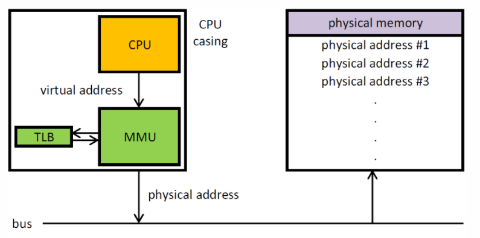
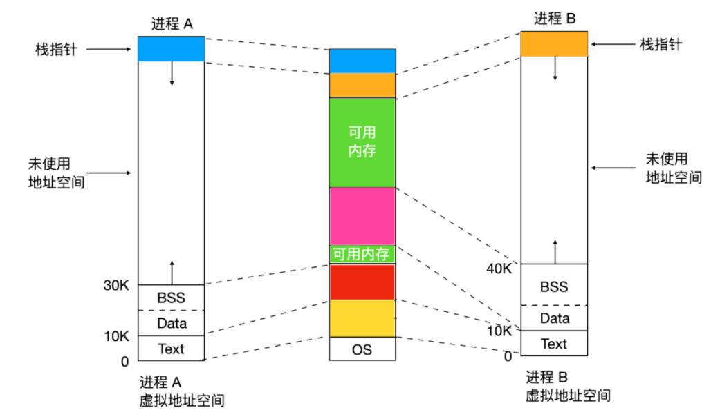
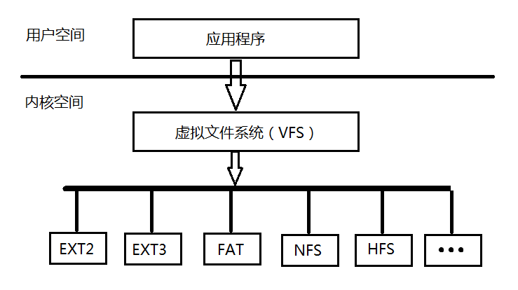

MMU作用
- 分为 分段和分页 两个部件
- MMU就是负责虚拟地址（virtual address）转化成物理地址（physical address）。

TLB 是虚拟到物理的转换缓存。




虚拟地址（ VA ）（ CPU 内核对外发出 VA ），变换后的虚拟地址（ MVA ）（ VA 被转换为 MVA 供 cache 和 MMU 使用，在此将 MVA 转换为 PA ），物理地址（ PA ）（最后使用 PA 读写实际设备）。
- CPU 看到的用到的只是 VA ， CPU 不管 VA 最终是怎样到 PA 的。
- cache、MMU 也是看不到 VA 的，它们使用的是 MVA （ VA 到 MVA 的转换是由硬件自动完成的）。
- 实际设备看不到 VA、MVA ，读写设备使用的是 PA 物理地址。


用户空间：
- 从 0x00000000 到 0xBFFFFFFF 共3GB的线性地址空间，每个进程都有一个独立的3GB用户空间，当然这是虚拟的空间。这一部分虚拟空间到物理空间的转换方法是 MMU 。

内核空间：
- 其从0xC0000000到0xFFFFFFFF共1GB大小，内核空间又可以根据映射方式的不同分为下面四块：
    - 内核逻辑地址空间   
        其从0xC0000000到high_memory(图中896MB的地方)最大为896MB
    - Vmalloc 空间   
        其地址没有严格的界限，这段空间既可以访问到我们的高端内存，也可以访问到低端内存。
    - 永久内核映射   
        其固定用来访问高端内存。
    -  固定映射   
        其在系统初始化期间永久映射I/O地址空间，或者特殊的寄存器。

低端内存
- 内核逻辑地址空间所映射的物理内存就是低端内存(实际物理内存的大小，但是小于896MB)

高端内存
- 低端内存地址之上的物理内存是高端内存（物理内存896MB之上）。

896MB来由
- Linux将内存分为内核空间和用户空间，其中内核空间中的0xC0000000~high_memory部分用来映射物理内存，但是我们还需要映射I/O空间和固定的寄存器，所以留出了high_memory~0xFFFFFFFF之间的地址来映射I/O空间和固定的寄存器，而在X86平台根据经验设定了这个high_memory为896MB。

进程占用的用户空间又可以按照访问属性（可读、可写、可执行）分为 5 个区域（分布上从下到上依次为）：
- 代码段
    - 存放指令，可读不可写
- 数据段
    - 存放程序静态分配的变量和全局变量。
- BSS 段
    - 包含了程序中未初始化的全局变量，在内存中 bss 段全部置零。
- 堆
    - 存放进程运行中被动态分配的内存段。
- 栈
    - 存放程序临时创建的局部变量



可以用 `size a.out` 查看各个区域大小。


内存分配算法有，伙伴系统和 slab ，它们不是二选一的关系， slab 内存分配器是对伙伴分配算法的补充。伙伴系统分配出去的内存还是以页框为单位，把相同大小的页框块用链表串起来，页框块就像手拉手的好伙伴。而对于内核的很多场景都是分配小片内存，远用不到一页内存大小的空间。slab分配器，「通过将内存按使用对象不同再划分成不同大小的空间」，应用于内核对象的缓存。
```
$ cat /proc/buddyinfo 
$ cat /proc/slabinfo
```


-------

Linux 虚拟文件系统（ VFS ）隐藏了各种硬件的具体细节，为所有的设备提供了统一的接口，它是对各种文件系统的一个抽象，其实使用超级块 super block 存放文件系统相关信息，使用索引节点 inode 存放文件的物理信息，使用目录项 dentry 存放文件的逻辑信息，其整体架构如下。

