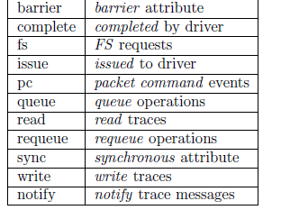
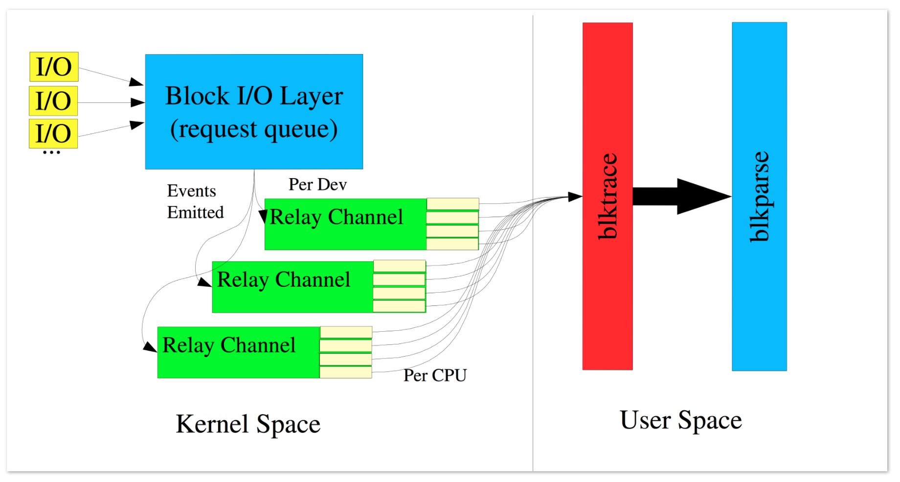
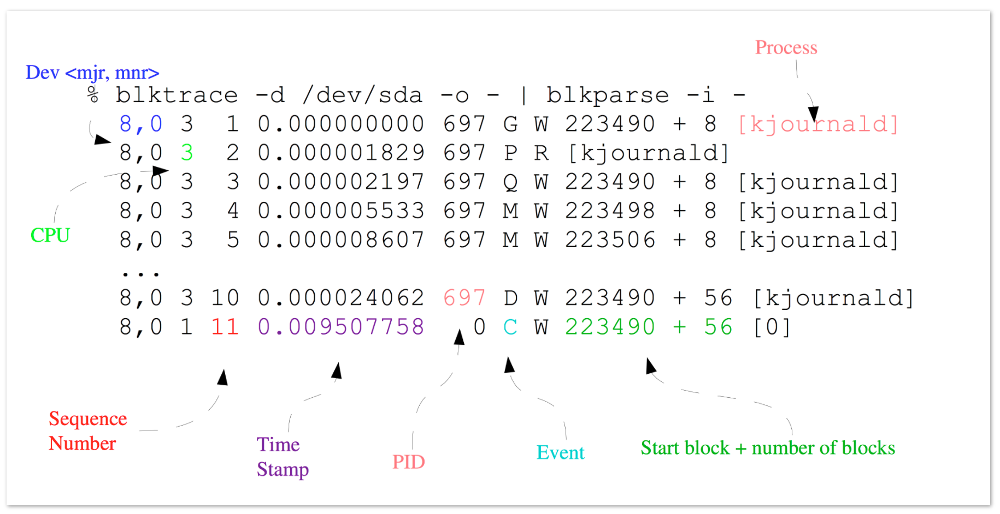
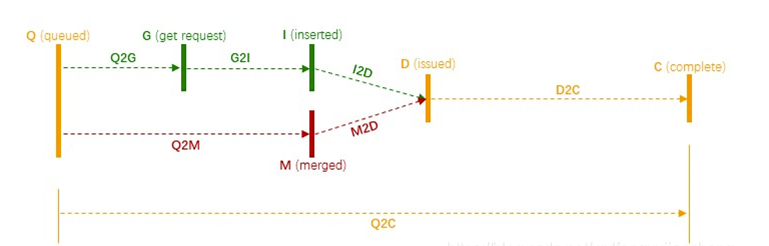
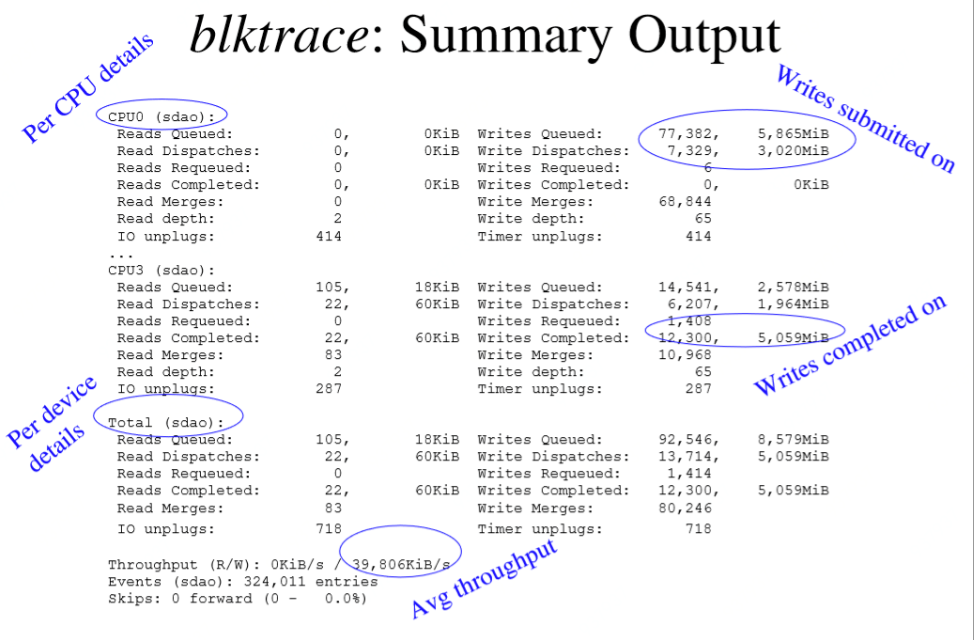

# 0x00. 导读

> blktrace stores the extracted data into files stored in the local directory. The format of the file names is (by default) device.blktrace.cpu, where device is the base device name (e.g, if we are tracing /dev/sda, the base device name would be sda); and cpu identifies a CPU for the event stream

blktrace 命令来自英文词组“block trace”的缩写，其功能是用于分析磁盘I/O负载情况。
查看Linux系统磁盘的负载情况，我们一般会使用iostat监控工具，其中很重要的参数就是await，await表示单个I/O所需的平均时间，但它同时也包含了I/O Scheduler所消耗的时间和硬件所消耗的时间，所以不能作为硬件性能的指标。

那如何才能分辨一个io从下发到返回整个时间上，是硬件层耗时多还是在io调度上耗时多呢？如何查看io在各个时间段所消耗的时间呢？那么，blktrace命令在这种场合就能派上用场，因为它能记录I/O所经历的各个步骤，从中可以分析是IO Scheduler慢还是硬件响应慢，以及各个时间段所用时间。

- blktrace 跟踪块设备的统计信息，每个CPU会有一个文件存储，
- 通过blkparse可以将这些文件整合成一个文件来显示。
- 通过btt分析后会发现监控数据

# 0x01. 简介

blktrace 是 block 层的 trace 机制，它可以跟踪 IO 请求的生成、进入队列、发到 driver 以及完成等事件。blktrace 包含3个组件：

- 一个内核模块
- 一个把内核模块跟踪到的IO信息导出到用户态的工具(blktrace命令)
- 一些分析和展示IO信息的工具(blkparse, btt命令)

广义的 blktrace 包含这3个部分，狭义的 blktrace 只是 blktrace 命令。我们介绍广义的 blktrace ：包括使用 blktrace 命令导出 IO 信息，然后使用 blkparse 和 btt 分析展示。 blktrace 命令通过 debug file system 从内核导出数据：

- blktrace 从 kernel 接收数据并通过 debug file system 的 buffer 传递到用户态； debug file system 默认是 /sys/kernel/debug ，可以使用 blktrace 命令的 -r 选项来覆盖。 buffer 的大小和数量默认分别是 512KiB 和 4 ，可以通过 -b 和 -n 来覆盖。 blktrace 运行的的时候，可以看见 debug file system 里有一个 block/{device} (默认是 /sys/kernel/debug/block/{device} ) 目录被创建出来，里面有一些 trace{cpu} 文件。

- blktrace 默认地搜集所有 trace 到的事件，可以使用 blktrace 命令的 -a 选项来指定事件。

- blktrace 把从内核接收到的数据写到当前目录，文件名为 {device}.blktrace.{cpu} ，内容是二进制数据（对于人来说是不可读的； blkparse 用于解析这些二进制数据）。例如 blktrace -d dev/sdc 会生成 sdc.blktrace.0 ,  sdc.blktrace.1 , … sdc.blktrace.N-1 个文件， N 为 cpu 个数。也可使用 -o 选项来自定义 {device} 部分，这方便和 blkparse 结合使用： blktrace 的 -o 参数对应 blkparse 的 -i 参数。

- blktrace 默认地会一直运行，直到被 ctrl-C 停掉。可以使用 -w 选项来指定运行时间，单位是秒。

blktrace 会区分两类请求:

- 文件系统请求 (fs requests) ：通常是用户态进程产生的，读写 disk 的特定位置和特定大小的数据。当然，也有可能由内核产生： flush 脏页或 sync 文件系统的元数据 (super block 或 journal block 等) 。

- SCSI 命令 (pc requests) ： blktrace 直接把 SCSI 命令发送到用户态， blkparse 可以解析它。


使用 blkparse 只是将 blktrace 数据转成可以人工阅读的格式，使用 btt 分析 blktrace 或者是 blkparse 合并的单个二进制文件

blktrace 需要 debugfs 的支持，如果系统提示 debugfs 没有 mount ，需先 mount  
执行 `mount -t debugfs none /sys/kernel/debug` 再执行 blktrace 命令

# 0x02. 命令

```
blktrace -d dev [-r debugfs_path] [-o output] [-k] [-w time] [-a action] [-A action_mask]
```

blktrace选项如下：

-r trace 文件默认挂载地址为 /sys/kernel/debug 。-r 参数能重新指定挂载地址

-a mask 缺省的为所有的事件都要trace，加入-a参数可以添加过滤器，即只观察想观察的事件

-b size 指定收集trace缓存的大小，收集debugfs files的大小，并非文件系统读写时的缓存

-n num 指定收集trace的缓存个数，同上-b 。

-o output 指定输出文件名字，假设你的名字为name 输出文件为name.blktrce.cpu。若你有两个cpu，则生成两个文件。-o的缺省名字为设备名。

-w time 指令运行秒数。-w 5 运行5秒

-k kill 杀掉正在运行的进程，-k后不需要加参数

其中-a 滤镜后跟的参数如下



例如:`blktrace /dev/block/mmcblk0p1 -o /data/trace -a WRITE   命令解析：-a 代表只监控写操作`

# 0x03. 



blktrace的输出:



- 第一个字段：8,0 这个字段是设备号 major device ID和minor device ID。
- 第二个字段：3 表示CPU
- 第三个字段：11 序列号
- 第四个字段：0.009507758 Time Stamp是时间偏移
- 第五个字段：PID 本次IO对应的进程ID
- 第六个字段：Event，这个字段非常重要，反映了IO进行到了那一步
- 第七个字段：R表示 Read， W是Write，D表示block，B表示Barrier Operation
- 第八个字段：223490+56，表示的是起始block number 和 number of blocks，即我们常说的Offset 和 Size
- 第九个字段： 进程名

其中第六个字段非常有用：每一个字母都代表了IO请求所经历的某个阶段。
```
A ： remap 对于栈式设备，进来的 I/O 将被重新映射到 I/O 栈中的具体设备。
X ： split 对于做了 Raid 或进行了 device mapper(dm) 的设备，进来的 I/O 可能需要切割，然后发送给不同的设备。
Q ： queued I/O 进入 block layer，将要被 request 代码处理（即将生成 I/O 请求）。
G ： get request I/O 请求（request）生成，为 I/O 分配一个 request 结构体。
M ： back merge 之前已经存在的 I/O request 的终止 block 号，和该 I/O 的起始 block 号一致，就会合并，也就是向后合并。
F ： front merge 之前已经存在的 I/O request 的起始 block 号，和该 I/O 的终止 block 号一致，就会合并，也就是向前合并。
I ： inserted I/O 请求被插入到 I/O scheduler 队列。
S ： sleep 没有可用的 request 结构体，也就是 I/O 满了，只能等待有 request 结构体完成释放。
P ： plug 当一个 I/O 入队一个空队列时，Linux 会锁住这个队列，不处理该 I/O，这样做是为了等待一会，看有没有新的 I/O 进来，可以合并。
U ： unplug 当队列中已经有 I/O request 时，会放开这个队列，准备向磁盘驱动发送该 I/O。这个动作的触发条件是：超时（plug 的时候，会设置超时时间）；或者是有一些 I/O 在队列中（多于 1 个 I/O）。
D ： issued I/O 将会被传送给磁盘驱动程序处理。
C ： complete I/O 处理被磁盘处理完成。
```

这些Event中常见的出现顺序如下：
```
Q – 即将生成 I/O 请求  
|
G – I/O 请求生成
|
I – I/O 请求进入 I/O Scheduler 队列
|
D – I/O 请求进入 Driver
|
C – I/O 请求执行完毕
```

由于每个Event都有出现的时间戳，根据这个时间戳就可以计算出 I/O 请求在每个阶段所消耗的时间，比如从Q事件到C事件的时间叫Q2C，那么常见阶段称呼如下：



- Q2Q — time between requests sent to the block layer
- Q2G – 生成IO请求所消耗的时间，包括remap和split的时间；
- G2I – IO请求进入IO Scheduler所消耗的时间，包括merge的时间；
- Q2M — time from a block I/O is queued to the time it gets merged with an - existing request
- I2D – IO请求在IO Scheduler中等待的时间；
- D2C – IO请求在driver和硬件上所消耗的时间；很关键
- Q2C – 整个IO请求所消耗的时间(Q2I + I2D + D2C = Q2C)，相当于iostat的await。很关键





```bash
# 生成采集文件
$ blktrace -d /dev/sda

# 合并成一个二进制文件
$ blkparse -i sda -d sda.blktrace.bin

# 利用btt协助分析统计
$ btt -i sda.blktrace.bin -l sda.d2c_latency
```

```
$ blktrace /dev/sda -a issue -a complete -w 120 -o - | blkiomon  -I 2 -h -
```