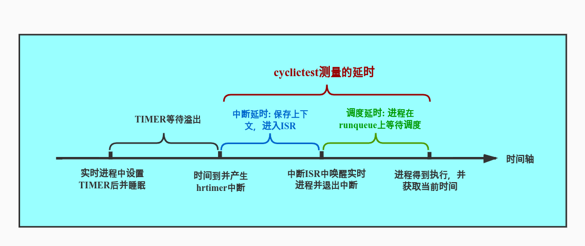

# 0x00. 导读

# 0x01. 简介

```bash
$ git clone git://git.kernel.org/pub/scm/linux/kernel/git/clrkwllms/rt-tests.git
$ cd rt-tests
# 安装依赖：libnuma-devel
$ sudo yum install numactl-devel
$ make all    
$ make install

$ sudo ./cyclictest
```

在procfs中有两个关于实时进程的控制接口可供用户设置，如下。
```
/proc/sys/kernel/sched_rt_period_us //默认是 1000 000 us
/proc/sys/kernel/sched_rt_runtime_us //默认是 950 000 us
```

表示 1s 内，实时进程最多占用 cpu 0.95s 的时间，其余 0.05s 需要留给 TASK_RUNNING 的普通进程，以免普通进程被饿死。

# 0x02.

cyclictest 所测得的延时是中断延时加调度延时，如下图。中断延时(interrupt latency)，即中断发生到进入中断处理程序ISR的延时。调度延时(scheduling latency)，即当任务被唤醒到任务真正获得CPU使用权中间的延时。



原理如下：
```
通过启动一个 master 的普通进程，然后 master 进程再启动指定数量指定优先级的实时进程，实时进程会设置一个 timer 周期性的唤醒自己（从 timer 溢出触发中断并进入 ISR 调用 wake_up_process() 唤醒实时进程，到进程真正能被运行，这中间的时间即我们需要测量的延时）。实时进程得到运行后会再次获取当前系统时间，减去睡眠时间时的时间以及睡眠的时间即可得到延时时间，并通过共享内存将该值传递给master进程进行统计，如此周而复始，最终由master进程将结果输出。

注意：当造成延时的事件发生在timer溢出之前，那么这样的延时将不会被捕捉到，所以我们需要足够久的运行cyclictest才能更大概率的抓取全面的延时数据。
```

选项
```
$ ./cyclictest  --help

cyclictest V 1.00
Usage:
cyclictest <options>

-a [CPUSET] --affinity     Run thread #N on processor #N, if possible, or if CPUSET
                           given, pin threads to that set of processors in round-
                           robin order.  E.g. -a 2 pins all threads to CPU 2,
                           but -a 3-5,0 -t 5 will run the first and fifth
                           threads on CPU (0),thread #2 on CPU 3, thread #3
                           on CPU 4, and thread #5 on CPU 5.
-A USEC  --aligned=USEC    align thread wakeups to a specific offset
-b USEC  --breaktrace=USEC 当延时大于USEC指定的值时，发送停止跟踪。USEC,单位为谬秒（us）。
-B       --preemptirqs     both preempt and irqsoff tracing (used with -b)
-c CLOCK --clock=CLOCK     选择时钟  cyclictest -c 1
                           0 = CLOCK_MONOTONIC (默认)
                           1 = CLOCK_REALTIME 
-C       --context         context switch tracing (used with -b)
-d DIST  --distance=DIST   distance of thread intervals in us, default=500
-D       --duration=TIME   指定要测试多长时间。默认单位是秒，但是也可以指定m(分),h(小时),d(天)
         --latency=PM_QOS  write PM_QOS to /dev/cpu_dma_latency
-E       --event           event tracing (used with -b)
-f       --ftrace           ftrace函数跟踪（通常与-b 配套使用，其实通常使用 -b 即可，不使用 -f ）
-F       --fifo=<path>     create a named pipe at path and write stats to it
-h       --histogram=US    在执行完后在标准输出设备上画出延迟的直方图（很多线程有相同的权限）US为最大的跟踪时间限制，这个在下面介绍实例时可以用到，结合gnuplot 可以画出我们测试的结果图。
-H       --histofall=US    same as -h except with an additional summary column
         --histfile=<path> dump the latency histogram to <path> instead of stdout
-i INTV  --interval=INTV    基本线程间隔，默认为1000（单位为us）
-I       --irqsoff         Irqsoff tracing (used with -b)
-l LOOPS --loops=LOOPS     循环的个数，默认为0（无穷个），与 -i 间隔数结合可大致算出整个测试的时间，比如 -i 1000  -l 1000000 ,总的循环时间为1000*1000000=1000000000 us =1000s ，所以大致为16分钟多。
         --laptop          Save battery when running cyclictest
                           This will give you poorer realtime results
                           but will not drain your battery so quickly
-m       --mlockall       锁定当前和将来的内存分配
-M       --refresh_on_max  delay updating the screen until a new max latency is hit.//延迟更新屏幕直到新的延时周期的到来 Userful for low bandwidth.
-n       --nanosleep       使用 clock_nanosleep
         --notrace         suppress tracing
-N       --nsecs           print results in ns instead of us (default us)  //每ns打印一次结果，而不是us(默认是us)
-o RED   --oscope=RED      oscilloscope mode, reduce verbose output by RED //示波器模式，减少冗长的输出通过RED
-O TOPT  --traceopt=TOPT   trace option //跟踪选项
-p PRIO  --priority=PRIO   最高优先级线程的优先级  使用方法： -p 90 /  --prio=90
-P       --preemptoff      Preempt off tracing (used with -b)
         --policy=NAME     policy of measurement thread, where NAME may be one
                           of: other, normal, batch, idle, fifo or rr.
         --priospread      spread priority levels starting at specified value
-q       --quiet           使用-q 参数运行时不打印信息，只在退出时打印概要内容，结合-h HISTNUM参数会在退出时打印HISTNUM 行统计信息以及一个总的概要信息。
-r       --relative        use relative timer instead of absolute
-R       --resolution      check clock resolution, calling clock_gettime() many
                           times.  List of clock_gettime() values will be
                           reported with -X
         --secaligned [USEC] align thread wakeups to the next full second
                           and apply the optional offset
-s       --system          use sys_nanosleep and sys_setitimer
-S       --smp             Standard SMP testing: options -a -t -n and same priority of all threads  //标准 SMP 测试：选项 -a -t -n ,并且所有的线程要优先级相同
        --spike=<trigger>  record all spikes > trigger
        --spike-nodes=[num of nodes]
                           These are the maximum number of spikes we can record.
                           The default is 1024 if not specified
         --smi             Enable SMI counting
-t       --threads         one thread per available processor//每个可用的处理器一个线程
-t [NUM] --threads=NUM     number of threads://线程的个数
                           without NUM, threads = max_cpus //不指定 NUM 时,线程个数为max_cups
                           without -t default = 1  //没有 -t 选项时，线程个数为1
         --tracemark       write a trace mark when -b latency is exceeded
-T TRACE --tracer=TRACER   set tracing function
    configured tracers: unavailable (debugfs not mounted)
-u       --unbuffered      force unbuffered output for live processing
-U       --numa            Standard NUMA testing (similar to SMP option)
                           thread data structures allocated from local node
-v       --verbose         output values on stdout for statistics  //把统计数据输出到标准输出
                           format: n:c:v n=tasknum c=count v=value in us  //n=任务个数 c=计数 v=数值(单位:us)
-w       --wakeup          task wakeup tracing (used with -b)  //任务唤醒跟踪(和 -b 一起使用)
-W       --wakeuprt        rt task wakeup tracing (used with -b)  //实时任务唤醒跟踪
         --dbg_cyclictest  print info useful for debugging cyclictest
```


# 0x03. 输出

```
Abbreviation	Label	    Description
T	            Thread	    Thread index and thread ID
P	            Priority	RT thread priority
I	            Interval	时间间隔(us)
C	            Count	    测量的延迟次数，或者说迭代次数
Min	            Minimum     平均延时(us)
Act	            Actual	    最近一次的延时(us)
Max	            Maximum     最大延时(us)

```

# 0x04. 常用

```bash
$ sudo cyclictest -p 90 - m -c 0 -i 200 -n -h 100 -q -l 1000000
# /dev/cpu_dma_latency set to 0us
---------------------------------------------------（下面都是结束测试/终端测试后打印的信息，这就是 -q 的功效！）
# Histogram
000000 000000
000001 111448              -- 延时为1us的在1000000次循环中占111448次（下面每行都是这个意思）
000002 060272
000003 000714
000004 000344
000005 000231
000006 013170
000007 155289
000008 601393
000009 044880
000010 005348
000011 001821
000012 001444
000013 000945
000014 000538
000015 000376
000016 000344
.....

000096 000002
000097 000002
000098 000002
000099 000002              -- 我们使用 -h 100 ，所以在结果中记录了延时为 0us ～ 99us 的次数
# Total: 000999888
# Min Latencies: 00001       -- 最小延时 1 us
# Avg Latencies: 00006       -- 平均延时 6us
# Max Latencies: 00463      -- 最大延时 463 us，那么我们指定 histogram = 100 也就是只记录了 0us～99us 的值而最大延时为 463 也就是说肯定有很多此延时超过 99 us，那么记录到哪了？答案是，没有记录具体的超过 99us 的延时值，只在下面记录了超过 99us 的延时次数（记录在 Overflows ），以及第几次超过了（记录在Thread 0）。
# Histogram Overflows: 00112     -- 超过 99 us的次数
# Histogram Overflow at cycle number:
# Thread 0: 02985 06044 06107 08644 08683 12048 18136 30164 33172 33757 36214 48208 54138 58822 61284 83843 83876 86382 92351 92352 96306 108937 108941 111443 117367 129130 129131 146426 155069 155070 159058 161563 171486 184200 186614 209260 211606 221606 223526 223527 234275 234321 236827 241705 241706 246766 266826 296886 321946 334644 336979 337006 359705 367066 384765 392126 412186 437221 442246 462306 472306 484921 487366 497366 507426 509981 512448 512488 522426 542486 567546 587606 610305 617666 635365 637704 637726 660425 672686 692846 710379 710463 717806 735443 737919 742886 760582 763088 767946 785515 785642 788149 793086 806776 808146 810703 813146 835661 835847 838172 # 00012 others  //这里记录的是第几次循环的延时超过了99us。
```