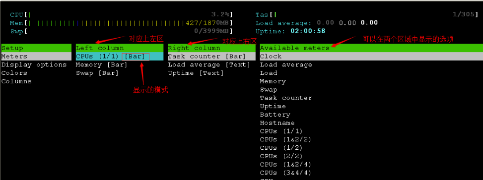
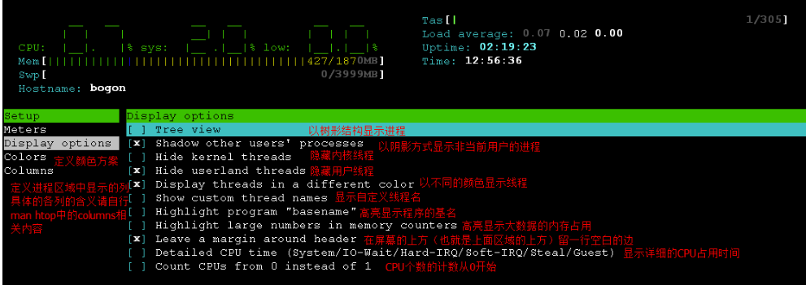

# 0x00. 导读

# 0x01. 简介

# 0x02. 
安装：
```bash
$ yum install -y htop
```

CPU 颜色:
```
蓝色: 低优先级进程占用的CPU百分比	low  
绿色: 普通用户拥有的进程CPU百分比   
红色: 系统进程占用的CPU百分比	sys  
青色: 窃取时间（Steal time）消耗的CPU百分比	vir
```

MEM 颜色：
```
蓝色: 缓冲区消耗的内存百分比	buffers
绿色: 内存区消耗的内存百分比	used
黄色/橙色: 缓存区消耗的内存百分比	cache
洋红色（Magenta）: 共享内存区消耗的内存百分比	shared
```

Swap 颜色：
```
绿色: swap区消耗的swap百分比	used
黄色/橙色: 缓存区消耗的swap百分比	cache
```


```
F1：显示帮助信息；
F2 或者 S：配置界面中的显示信息；
F3 或者 /：进程搜索；
F4 或者 \：进程过滤器；
F5 或者 t：显示进程树；
F6：排序；
F7：减小光标选取的进程的 nice 值；
F8：增加光标选取的进程的 nice 值；
F9 或者 k：杀掉指定进程；

空格键：用于标记选中的进程，用于实现对多个进程同时操作；
U：取消所有选中的进程；

s：显示光标所在进程执行的系统调用；
l：显示光标所在进程的文件列表; 

I：对排序的结果进行反转显示；

M：按照内存使用百分比排序，对应MEM%列；
P：按照CPU使用百分比排序，对应CPU%列；
T：按照进程运行的时间排序，对应TIME+列；
K：隐藏内核线程；
H：隐藏用户线程；
F：跟踪进程
```



