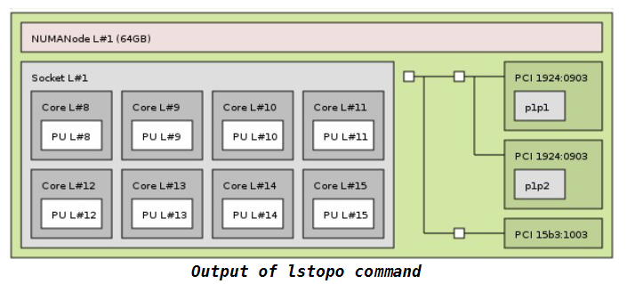

# 0x00. 导读

# 0x01. 简介

# 0x02. 

lstopo 可用于确定 PCIe 位置。 lstopo 包含在 hwloc 和 hwlocgui 软件包中。要安装这些软件包，请运行：

```bash
$ yum install hwloc hwloc-gui
```

然后运行

```bash
$ lstopo --logical --output-format png > `hostname`.png
```

