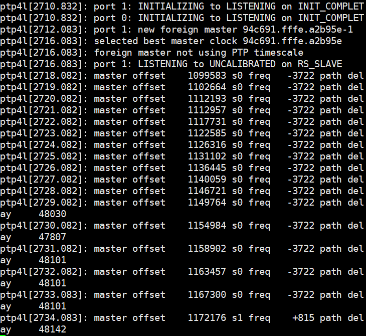

# 0x00. 导读

[Linux 使用 PTP 进行时间同步](https://getiot.tech/zh/linux-note/linux-sync-time-with-ptp/)  
[RedHat PTP](https://access.redhat.com/documentation/zh-cn/red_hat_enterprise_linux/7/html/system_administrators_guide/sec-using_ptp)  
[SUSE 使用 PTP](https://documentation.suse.com/zh-cn/sles/15-SP2/single-html/SLES-tuning/index.html#sec-util-time)

# 0x01. 简介

主时钟 (master): 时钟同步源，其他时钟将同步到该时钟

从时钟 (slave): 需要和主时钟同步的时钟

普通时钟 (Ordinary Clock) : 作为 master 或 slave 之一，如果作为 master 时候，可以是 grandmaster；而作为 slave 时，一般作为时钟分发网络的端点设备（end，最后一级）。

边界时钟 (Boundary Clock) : 有多个端口连接到网络的时钟，一个 slave 端口连接到上游设备的 PTP 端口，其他的端口作为 master 连接到下游设备的 slave 端口。下游 slave 端口同构 PTP 协议直接同步于边界时钟，而不是直接和 master 通信。

透明时钟 (Transparent Clock) : 一种网络设备，比如交换机，不需要时间同步，但是能够转发并修改某些经过的 PTP 报文，记录 ptp 报文经过本设备时所用的时间（即转发时间）增加到 PTP 报文的 correctonField （矫正域）。

# 0x02. PTP 简介

PTP(Precision Time Protocol) 是一个通过网络同步时钟的一个协议。当硬件支持时，PTP 精度能达到亚微秒，比 NTP(Network Time Protocol) 精度更高。

操作系统支持 PTP 被分开在 kernel 和 user space ，比如 Redhat 或者 CentOS ，内核支持 PTP 时钟，由网络驱动提供（硬件 PTP 依赖物理网卡提供硬件时钟），可以手动检查网卡是否支持 PTP

```bash
$ sudo ethtool -T eth0
Time stamping parameters for eth0:
Capabilities:
	hardware-transmit     (SOF_TIMESTAMPING_TX_HARDWARE)
	software-transmit     (SOF_TIMESTAMPING_TX_SOFTWARE)
	hardware-receive      (SOF_TIMESTAMPING_RX_HARDWARE)
	software-receive      (SOF_TIMESTAMPING_RX_SOFTWARE)
	software-system-clock (SOF_TIMESTAMPING_SOFTWARE)
	hardware-raw-clock    (SOF_TIMESTAMPING_RAW_HARDWARE)
PTP Hardware Clock: 0
Hardware Transmit Timestamp Modes:
	off                   (HWTSTAMP_TX_OFF)
	on                    (HWTSTAMP_TX_ON)
Hardware Receive Filter Modes:
	none                  (HWTSTAMP_FILTER_NONE)
	all                   (HWTSTAMP_FILTER_ALL)
	ptpv1-l4-sync         (HWTSTAMP_FILTER_PTP_V1_L4_SYNC)
	ptpv1-l4-delay-req    (HWTSTAMP_FILTER_PTP_V1_L4_DELAY_REQ)
	ptpv2-l4-sync         (HWTSTAMP_FILTER_PTP_V2_L4_SYNC)
	ptpv2-l4-delay-req    (HWTSTAMP_FILTER_PTP_V2_L4_DELAY_REQ)
	ptpv2-l2-sync         (HWTSTAMP_FILTER_PTP_V2_L2_SYNC)
	ptpv2-l2-delay-req    (HWTSTAMP_FILTER_PTP_V2_L2_DELAY_REQ)
	ptpv2-event           (HWTSTAMP_FILTER_PTP_V2_EVENT)
	ptpv2-sync            (HWTSTAMP_FILTER_PTP_V2_SYNC)
	ptpv2-delay-req       (HWTSTAMP_FILTER_PTP_V2_DELAY_REQ)
```

软件时间戳需要包括参数
- SOF_TIMESTAMPING_SOFTWARE
- SOF_TIMESTAMPING_TX_SOFTWARE
- SOF_TIMESTAMPING_RX_SOFTWARE
 
硬件时间戳需要包括参数
- SOF_TIMESTAMPING_RAW_HARDWARE
- SOF_TIMESTAMPING_TX_HARDWARE
- SOF_TIMESTAMPING_RX_HARDWARE


PTP 采用请求应答机制测量端到端的延时时间，时间同步的原理如下图所示：


如上图所示，存在 4 种 PTP 报文，Sync 同步报文、Follow_up 跟随报文、Delay_req 延迟请求报文，以及 Delay_resp 延迟请求响应报文。


## 2.1 linuxptp

linux 开源社区提供了一个 ptp 协议栈软件，`linuxptp`，它实现了 1588v2 协议。是一个基于用户空间的 ptp 协议栈软件；该软件是根据 IEEE 1588 Linux 标准实现的精确时间协议（PTP）。并使用 Linux 内核提供的相关应用程序编程接口（API）。

Linuxptp主要包含两个软件，一个是 ptp4l ，一个是 phc2sys 。

ptp4l 实施 PTP 边界时钟和普通时钟。如果启用硬件时戳，ptp4l 会将 PTP 硬件时钟同步到主时钟。如果使用软件时戳，它会将系统时钟同步到主时钟。仅当使用硬件时戳将系统时钟同步到网络接口卡 (NIC) 上的 PTP 硬件时钟时，才需要 phc2sys。ptp4l 默认使用硬件时戳。

> 硬件时间戳是指使用网络接口控制器（NIC）或网络交换机等硬件设备的内置时钟来进行时间戳。硬件时间戳能够在数据包传输时准确地记录时间，因为它们直接使用硬件时钟。这种方法通常能够提供更高的时间同步精度，因为硬件时间戳不受软件处理的影响，能够更准确地记录数据包的传输时间。

> 另一方面，软件时间戳是指使用计算机系统的软件时钟来进行时间戳。这种方法需要操作系统对数据包进行额外的处理，因此相对于硬件时间戳来说，同步精度可能会稍低一些。软件时间戳通常用于那些不支持硬件时间戳的网络设备上。

phc2sys 功能是建立在 ptp4l 功能之上的，只有 ptp4l 功能启动了， phc2sys 功能才能执行。


ptp4l 遵循IEEE 1588-2008 标准文档规范，实现了 BC(Boundary Clock) 、OC(Ordinary Clock) 和 TC(Transparent Clock) 等功能，也就是它可以设置时钟作为 master，slave 等；

phc2sys 是一个同步系统中两个或多个时钟的程序。一般，它用于将系统时钟与 PTP 硬件时钟（PHC）同步，硬件时钟一般由 ptp4l 进行同步；

```bash
$ git clone git://git.code.sf.net/p/linuxptp/code linuxptp
$ cd linuxptp
$ make 
$ make install
```

## 2.2 Linux 硬件时钟 

一般ptp同步都会使用硬件时钟，使用硬件时钟才能获得更高时间同步精度，有的同步精度可达100ns以内；

为什么使用软件时钟的同步精度不能达到硬件时钟呢？

1. 软件时钟只能记录ptp报文在driver中的时刻，就是说t1,t2,t3,t4，记录的是报文在网络驱动发送或者接收的时间，但是时间到达物理链路还需经过多个步骤，比如说PCIe总线传输，网卡报文调度，phy调制等，这些时间不是可控的，也就是delay1 不一定 等于delay2，但是硬件时钟记录的时间更接近物理链路开始传输的时刻，物理链路传输时间总是确定的，这个记录的时间越接近物理链路传输时间，delay1 和delay2就越近似，同步精度就越高；

2. 硬件时钟采取的时钟晶振一般更好，而且不存在linux 获取时间时的调度误差等，获取时间更精准

# 0x03. ptp4l

```bash
$ ptp4l -h
  延迟机制选项
  -A 			Auto，自动选择延迟机制。,从E2E开始，当收到对等延迟请求时切换到P2P
  -E 			E2E，选择延迟请求 - 响应（E2E）机制。 默认是用这个机制。 单个PTP通信路径上的所有时钟必须使用相同的机制。 使用E2E机制在端口上收到对等延迟请求时，将输出warning
  -P 			P2P，对等延迟机制
  网络传输选项
  -2 			IEEE 802.3
  -4 			UDP IPV4（默认）
  -6 			UDP IPV6
  时间戳选项
  -H  			使用硬件时间戳（默认）
  -S  			使用软件时间戳					
  -L  			LEGACY HW时间戳
  其他选项
  -f	[file]	从指定文件file中读取配置。 默认情况下不读取任何配置文件。
  -i	[dev]	选择PTP接口设备，例如eth0（可多次指定）必须至少使用此选项或配置文件指定一个端口。
  -p	[dev]	在Linux内核v3.5之前，无法发现与网络接口关联的PHC设备。 此选项指定在旧内核上运行时要使用的PHC设备（例如/ dev/ptp0）。要使用的时钟设备，默认为auto，忽略软件/ LEGACY HW时间戳(不推荐使用此选项)
  -s			slaveOnly mode，从时钟模式（覆盖配置文件）
  -t			透明时钟模式
  -l	[num]	将日志记录级别设置为'num'，默认是6
  -m			将消息打印到stdout
  -q			不打印消息到syslog
  -v			打印软件版本并退出
  -h			help
```

## 3.1 软件时间戳，主从模式测试  

服务端（主钟）：
```bash
$ sudo ptp4l -i enp0s31f6 -m -S
```


客户端（从钟）：
```bash
$ sudo ptp4l -i eno1 -m -S -s
```



log中的内容为：

```
master offset 值表示测得的与主时钟之间的偏差（以纳秒为单位）。

s0、s1、s2 指示器显示时钟伺服的不同状态：s0 表示已解锁，s1 表示时钟步进，s2 表示已锁定。如果伺服处于已锁定状态 (s2)，并且 pi_offset_const 选项在配置文件中设置为负值，则时钟不会步进，而只会缓慢调整（有关详细信息，请参见 man 8 ptp4l）。

freq 值表示时钟的频率调整（以十亿分率 (ppb) 为单位）。

path delay 值表示从主时钟发送的同步消息的预计延迟（以纳秒为单位）。

端口 0 是用于本地 PTP 管理的 Unix 域套接字。端口 1 是 eth0 接口。

INITIALIZING、LISTENING、UNCALIBRATED 和 SLAVE 是发生 INITIALIZE、RS_SLAVE 和 MASTER_CLOCK_SELECTED 事件时更改的端口状态示例。当端口状态从 UNCALIBRATED 更改为 SLAVE 时，表示计算机已与 PTP 主时钟成功同步。
``` 

 # 0x04. phc2sys

```
phc2sys -a [ -r ] [ -r ] [ options ]
phc2sys [ -d pps-device ] [ -s device ] [ -c device ] [ -O offset ] [ -w ] [ options ]

选项：

自动配置：

-a：开启自动配置。
-r：同步系统（实时）时钟，重复 -r 将其也视为时间源。
手动配置：

-c [dev|name]：从时钟（CLOCK_REALTIME）。
-d [dev]：主 PPS 设备。
-s [dev|name]：主时钟。
-O [offset]：从主时间偏移量，默认为 0。
-w：等待 ptp4l。
通用选项：

-E [pi|linreg]：时钟伺服，默认为 pi。
-P [kp]：比例常数，默认为 0.7。
-I [ki]：积分常数，默认为 0.3。
-S [step]：设置步阈值，默认不开启。
-F [step]：仅在开始时设置步阈值，默认为 0.00002。
-R [rate]：以 HZ 为单位的从属时钟更新率，默认为 1 HZ。
-N [num]：每次更新的主时钟读数数量，默认为 5。
-L [limit]：以 ppb 为单位的健全频率限制，默认为 200000000。
-M [num]：NTP SHM 段号，默认为 0。
-u [num]：摘要统计中的时钟更新次数，默认为 0。
-n [num]：域编号（domain number），默认为 0。
-x：通过伺服而不是内核应用闰秒。
-z [path]：UDS 的服务器地址（/var/run/ptp4l）。
-l [num]：将日志记录级别设置为 num，默认为 6。
-t [tag]：为日志消息添加标记（tag）。
-m：将消息打印到标准输出（stdout）。
-q：不要将消息打印到系统日志（syslog）。
-v：显示版本信息并退出。
-h：显示帮助信息并退出。
```

## 4.1 例子

```bash
# 将系统时钟同步到网卡上的 PTP 硬件时钟（PHC）
# 使用 -s 可按设备或网络接口指定主时钟，使用 -w 可等待直到 ptp4l 进入已同步状态：

$ sudo phc2sys -s eth0 -w

# PTP 按国际原子时（TAI）运行，而系统时钟使用的是协调世界时（UTC）。如果不指定 -w 来等待 ptp4l 同步，可以使用 -O 来指定 TAI 与 UTC 之间的偏差（以秒为单位）：

$ sudo phc2sys -s eth0 -O -35
```

实战：
同一个机器，先在 A 窗口运行
`sudo ptp4l -i enp101s0f0 -f /etc/ptp4l.conf -m` ，用来实现网卡上的时钟和远端交换机同步，不要动了，然后在 B 窗口运行 `sudo phc2sys -s enp101s0f0 -w CLOCK_REALTIME -m ` 用来将网卡上的时钟同步到系统，也就是网卡上的时钟是 master