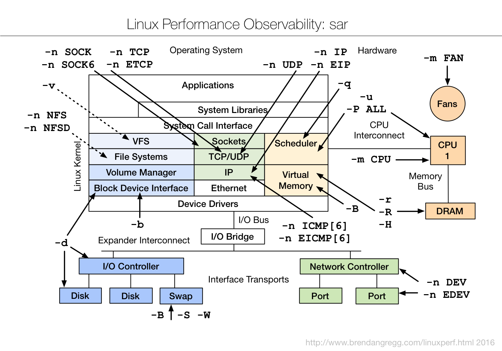

# 0x00. 导读

是 sysstat 软件包的一部分。

[系统性能工具篇(sar)](https://www.cnblogs.com/549294286/p/10319036.html)

Brendan 总结 sar 的功能:


# 0x01. 简介

sar是 System Activity Reporter （系统活动情况报告）的缩写。 sar 工具将对系统当前的状态进行取样，然后通过计算数据和比例来表达系统的当前运行状态。 

它有两种用法:   
- 追溯过去的统计数据（默认）   
- 周期性的查看当前数据

> 怀疑 CPU 存在瓶颈，可用 -u 和 -q 等来查看   
> 怀疑内存存在瓶颈，可用 -B、 -r 和 -W 等来查看   
> 怀疑 I/O 存在瓶颈，可用 -b、 -u 和 -d 等来查看


# 0x02. 用法

```bash
主选项和报告：
	-b	I/O 和传输速率信息状况
	-B	换页统计信息
	-H 大页面统计信息
	-d	块设备状况
	-I { <中断> | SUM | ALL | XALL }
		中断信息状况
	-m	电源管理信息状况
	-n { <关键词> [,...] | ALL }
		网络统计信息
		关键词可以是：
		DEV	 	网卡
		EDEV	网卡 (错误)
		SOCK	Sockets (套接字)	(v4)
		IP		IP  流	      (v4)
		EIP	 	IP 流	   (v4) (错误)
		TCP	 	TCP 流  (v4)
		ETCP	TCP 流  (v4) (错误)
		UDP	 	UDP 流  (v4)
	-q	队列长度和平均负载
	-r	内存利用率
	-R	内存统计信息
	-S	交换空间统计信息
	-u [ ALL ] CPU 利用率
	-v	Kernel table 状况
	-w	任务创建与系统转换统计信息
	-W	交换统计信息
	-y	终端设备活动情况
	-o {<文件路径>}
	   将命令结果以二进制格式存放在指定文件中
```



## 2.1 举例

### 2.1.1 网络

```bash
# sar -n <关键词> [ <时间间隔> [ <次数> ] ]
$ sar -n DEV 1 5
01:32:59 PM     IFACE   rxpck/s   txpck/s    rxkB/s    txkB/s   rxcmp/s   txcmp/s  rxmcst/s
01:33:00 PM      eth0    158.00    107.00     15.31      8.93      0.00      0.00      0.00
01:33:00 PM        lo     50.00     50.00      3.56      3.56      0.00      0.00      0.00
01:33:00 PM virbr0-nic     0.00      0.00      0.00      0.00      0.00      0.00      0.00
01:33:00 PM    virbr0      0.00      0.00      0.00      0.00      0.00      0.00      0.00

# IFACE 本地网卡接口的名称
# rxpck/s 每秒钟接受的数据包
# txpck/s 每秒钟发送的数据包
# rxKB/S 每秒钟接受的数据包大小，单位为KB
# txKB/S 每秒钟发送的数据包大小，单位为KB
# rxcmp/s 每秒钟接受的压缩数据包
# txcmp/s 每秒钟发送的压缩包
# rxmcst/s 每秒钟接收的多播数据包

$ sar -n EDEV 1  
Linux 3.10.0-1160.49.1.el7.x86_64 (localhost.localdomain)       09/13/2023      _x86_64_        (4 CPU)

11:39:35 AM     IFACE   rxerr/s   txerr/s    coll/s  rxdrop/s  txdrop/s  txcarr/s  rxfram/s  rxfifo/s  txfifo/s
11:39:36 AM      eth0      0.00      0.00      0.00      0.00      0.00      0.00      0.00      0.00      0.00
11:39:36 AM        lo      0.00      0.00      0.00      0.00      0.00      0.00      0.00      0.00      0.00
11:39:36 AM virbr0-nic      0.00      0.00      0.00      0.00      0.00      0.00      0.00      0.00      0.00
11:39:36 AM    virbr0      0.00      0.00      0.00      0.00      0.00      0.00      0.00      0.00      0.00

rxerr/s / txerr/s：每秒钟接收/发送的坏数据包
coll/s：每秒冲突数
rxdrop/s：因为缓冲充满，每秒钟丢弃的已接收数据包数
txdrop/s：因为缓冲充满，每秒钟丢弃的已发送数据包数
txcarr/s：发送数据包时，每秒载波错误数
rxfram/s：每秒接收数据包的帧对齐错误数
rxfifo/s / txfifo/s：接收/发送的数据包每秒 FIFO 过速的错误数

$ sar -n TCP 1
Linux 3.10.0-1160.49.1.el7.x86_64 (localhost.localdomain)       09/13/2023      _x86_64_        (4 CPU)

11:34:59 AM  active/s passive/s    iseg/s    oseg/s
11:35:00 AM      0.00      0.00     48.00     45.00
11:35:01 AM      0.00      0.00     33.00     32.00
11:35:02 AM      0.00      0.00     42.00     45.00

active/s：新的 TCP 主动连接（也就是 socket 中的 connect() 事件），单位是：连接数/s。
passive/s：新的 TCP 被动连接（也就是 socket 中的 listen() 事件）。
iseg/s：接收的段（传输层以段 segment 为传输单位），单位是：段/s
oseg/s：发送的段 segment 。

$ sar -n ETCP 1 2
Linux 4.2.0-27-generic (ubuntu)         07/28/2016      _x86_64_        (2 CPU)

07:59:34 PM  atmptf/s  estres/s retrans/s isegerr/s   orsts/s
07:59:35 PM      0.00      0.00      0.00      0.00      0.00
07:59:36 PM      0.00      0.00      0.00      0.00      0.00
Average:         0.00      0.00      0.00      0.00      0.00

atmptf/s ：连接从SYN-SENT或SYN-RCVD直接转为CLOSED，加上从SYN-RCVD直接转为LISTEN状态的次数  
estres/s ：连接从ESTABLISHED或CLOSE-WAIT直接转为CLOSED状态的次数
retrans/s：重传的分段数，即TCP分段包含了一个或多个之前的字节
isegerr/s：接收的错误分段数   
orsts/s  ：发送的RST分段数
```

### 2.1.2 CPU

```bash
# sar -u [ <时间间隔> [ <次数> ] ]
$ sar -u 1 5
01:35:33 PM     CPU     %user     %nice   %system   %iowait    %steal     %idle
01:35:34 PM     all      5.33      0.00     11.68      0.00      0.00     82.99
Average:        all      5.33      0.00     11.68      0.00      0.00     82.99

$ sar -P ALL 1 2
Linux 3.10.0-1160.49.1.el7.x86_64 (localhost.localdomain)       09/13/2023      _x86_64_        (4 CPU)

11:47:38 AM     CPU     %user     %nice   %system   %iowait    %steal     %idle
11:47:39 AM     all     30.56      0.00      8.59      0.00      0.00     60.86
11:47:39 AM       0     82.83      0.00      8.08      0.00      0.00      9.09
11:47:39 AM       1     26.00      0.00      5.00      0.00      0.00     69.00
11:47:39 AM       2     10.10      0.00      9.09      0.00      0.00     80.81
11:47:39 AM       3      4.00      0.00     12.00      0.00      0.00     84.00

Average:        CPU     %user     %nice   %system   %iowait    %steal     %idle
Average:        all     30.56      0.00      8.59      0.00      0.00     60.86
Average:          0     82.83      0.00      8.08      0.00      0.00      9.09
Average:          1     26.00      0.00      5.00      0.00      0.00     69.00
Average:          2     10.10      0.00      9.09      0.00      0.00     80.81
Average:          3      4.00      0.00     12.00      0.00      0.00     84.00

# %user：用户模式下消耗的CPU时间的比例
# %system：系统模式下消耗的CPU时间的比例
# %iowait：CPU等待磁盘I/O导致空闲状态消耗的时间比例
# %idle：显示 CPU 空闲时间占用 CPU 总时间的百分比

#    1. 若 %iowait 的值过高，表示硬盘存在I/O瓶颈
#    2. 若 %idle 的值高但系统响应慢时，有可能是 CPU 等待分配内存，此时应加大内存容量
#    3. 若 %idle 的值持续低于1，则系统的 CPU 处理能力相对较低，表明系统中最需要解决的资源是 CPU
```

### 2.1.3 内存

```bash
$ sar -r 1 2    
Linux 3.10.0-1160.49.1.el7.x86_64 (localhost.localdomain)       09/13/2023      _x86_64_        (4 CPU)

11:49:31 AM kbmemfree kbmemused  %memused kbbuffers  kbcached  kbcommit   %commit  kbactive   kbinact   kbdirty
11:49:32 AM    598212  15667928     96.32         0   1531832  22109252    120.29  12521480   2539408        28
11:49:33 AM    602728  15663412     96.29         0   1531832  22109596    120.29  12519468   2539408        28
Average:       600470  15665670     96.31         0   1531832  22109424    120.29  12520474   2539408        28

# kbmemfree: 可用空闲内存数量，KB
# kbmemused: 已使用内存数量，KB
# %memused: 使用率
# kbbuffers 和 kbcached: 这两个值就是 free 命令中的 buffer 和 cache, KB
# kbcommit: 保证当前系统所需要的内存,即为了确保不溢出而需要的内存( RAM+swap ), KB
# %commit: 这个值是 kbcommit 与内存总量(包括 swap )的一个百分比.
# kbactive：活跃内存数量，KB，最近使用的内存通常不会回收
# kbinact：非活跃内存数量，KB，最近很少使用，更可能被回收
# kbdirty：等待回写到磁盘的内存数量，KB
```

```bash
$ sar -R 1 2
Linux 4.2.0-27-generic (ubuntu)         07/26/2016      _x86_64_        (2 CPU)

08:01:26 PM   frmpg/s   bufpg/s   campg/s
08:01:27 PM     -1.98      0.00      0.00
08:01:28 PM      0.00      0.00      0.00
Average:        -1.00      0.00      0.00

frmpg/s：系统每秒释放内存分页数量，-表示分配的数量   
bufpg/s：系统每秒使用额外内存作为缓冲区的数量，-表示系统使用较少的分页作为缓冲区
campg/s：系统每秒似乎呀额外内存作为缓存的数量，-表示缓存中有较少的分页
```

```bash
$ sar -H 1
Linux 4.2.0-27-generic (ubuntu)         11/08/2016      _x86_64_        (2 CPU)

04:45:34 AM kbhugfree kbhugused  %hugused                                      
04:45:35 AM         0         0      0.00                                      
04:45:36 AM         0         0      0.00                                      
04:45:37 AM         0         0      0.00                                      
04:45:38 AM         0         0      0.00                                      
04:45:39 AM         0         0      0.00                                      
^C                                                                             

04:45:40 AM         0         0      0.00                                      
Average:            0         0      0.00  

kbhugfree：空闲大页面存储器
kbhugused：使用的大页面存储器
%hugused ：使用百分比
```

```bash
$ sar -B 1 3

# pgpgin/s：表示每秒从磁盘或 SWAP 置换到内存的字节数(KB)
# pgpgout/s：表示每秒从内存置换到磁盘或 SWAP 的字节数(KB)
# fault/s：每秒钟系统产生的缺页数，即主缺页与次缺页之和(major + minor)
# majflt/s：每秒钟产生的主缺页数
# pgfree/s：每秒被放入空闲队列中的页个数
# pgscank/s：每秒被 kswapd 扫描的页个数
# pgscand/s：每秒直接被扫描的页个数
# pgsteal/s：每秒钟从 cache 中被清除来满足内存需要的页个数
# %vmeff：每秒清除的页(pgsteal)占总扫描页(pgscank + pgscand)的百分比，度量分页回收效率，太低说明虚拟内存有问题
```

### 2.1.4 IO

```bash
$ sar -b 1 3

# tps：每秒物理传输总数，一个传输就是一次物理IO，发送到设备的多个逻辑IO可以合并为单个物理IO   
# rtps：每秒钟从物理设备读入的数据总量
# wtps：每秒钟向物理设备写入的数据总量
# bread/s：每秒钟从物理设备读入的数据量，单位为：块/s
# bwrtn/s：每秒钟向物理设备写入的数据量，单位为：块/s
```

```bash
$ sar -q 1 3
```
```bash
# runq-sz：运行队列的长度（等待运行的进程数）
# plist-sz：进程列表中进程（processes）和线程（threads）的数量
# ldavg-1 5 15：最后1 5 15分钟的系统平均负载（System load average）
```

```bash
$ sar -W 1 3
```
```bash
# pswpin/s：每秒系统换入的交换页面（swap page）数量
# pswpout/s：每秒系统换出的交换页面（swap page）数量
```

```bash
$ sar -w 1 2
Linux 4.2.0-27-generic (ubuntu)         07/26/2016      _x86_64_        (2 CPU)

08:27:51 PM    proc/s   cswch/s
08:27:52 PM      0.00     82.00
08:27:53 PM      1.00    128.00
Average:         0.50    105.00

proc/s ：每秒创建任务总数   
cswch/s：每秒上下文切换总数
```

```bash
$ sar -I SUM 1 2
Linux 4.2.0-27-generic (ubuntu)         07/25/2016      _x86_64_        (2 CPU)

08:23:04 PM      INTR    intr/s
08:23:05 PM       sum     74.00
08:23:06 PM       sum     59.00
Average:          sum     66.50

INTR：中断号
关键字：SUM|ALL|XALL
SUM：每秒的中断总数
ALL：前16个中断的统计数据
XALL：所有中断的统计数据
```

## 块设备状况

```bash
$ sar -d 1 3
```
```bash
# tps: 每秒从物理磁盘 I/O 的次数。多个逻辑请求会被合并为一个 I/O 磁盘请求，一次传输的大小是不确定的
# rd_sec/s: 每秒读扇区的次数
# wr_sec/s: 每秒写扇区的次数
# avgrq-sz: 平均每次设备 I/O 操作的数据大小(扇区)
# avgqu-sz: 磁盘请求队列的平均长度
# await: 从请求磁盘操作到系统完成处理，每次请求的平均消耗时间，包括请求队列等待时间，单位是毫秒(1秒=1000毫秒)
# svctm: 系统处理每次请求的平均时间,不包括在请求队列中消耗的时间.
# %util: I/O请求占CPU的百分比，比率越大，说明越饱和
#     1. avgqu-sz 的值较低时，设备的利用率较高
#     2. 当%util的值接近 1% 时，表示设备带宽已经占满
```

## 其它

```bash
# 输出统计的数据信息
$ sar -o sarfile.log -u 1 3

# 将二进制数据文件转换成数据库可读的格式。
$ sadf -d sarfile.log
$ sadf -d sarfile.log | sed 's/;/,/g' > sarfile.csv

# 从数据文件读取信息
$ sar -f sarfile.log
```