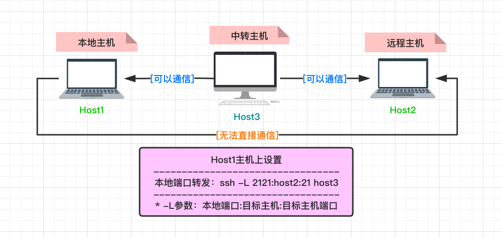
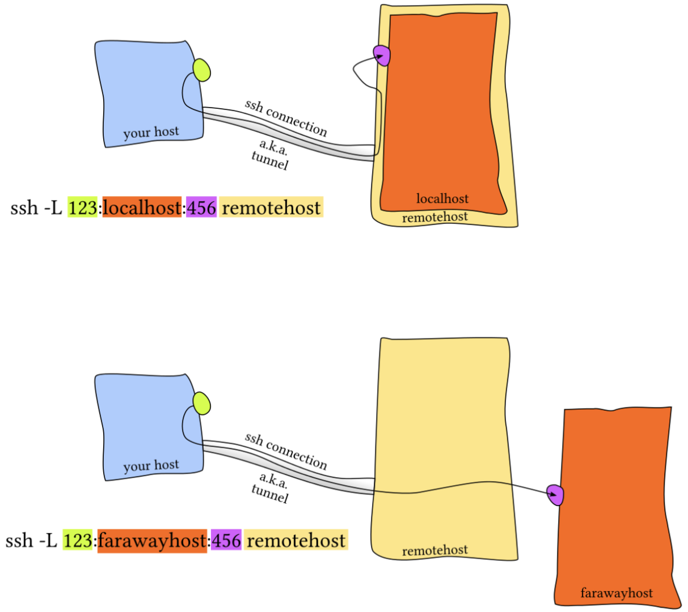
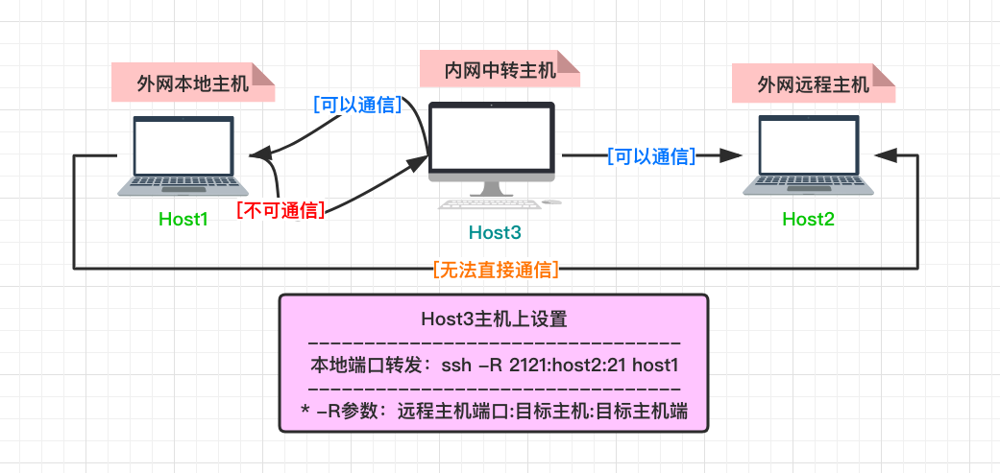
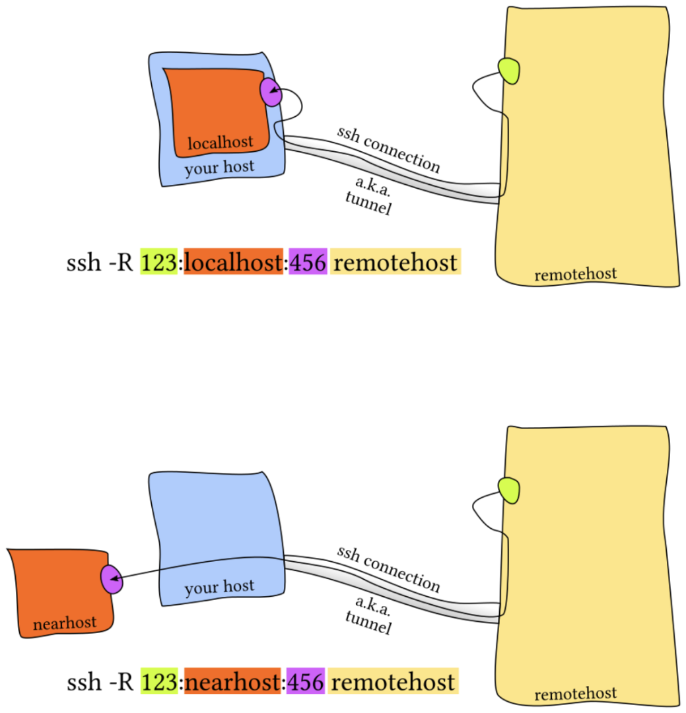

# 0x00. 导读

[ssh端口转发](https://www.lsx.cool/archives/ssh%E7%AB%AF%E5%8F%A3%E8%BD%AC%E5%8F%91)

[SSH+rsync实现服务器的自动备份](https://www.lsx.cool/archives/sshrsync-shi-xian-fu-wu-qi-de-zi-dong-bei-fen)

# 0x01. 简介

> SSH 之所以能够保证安全，原因在于它采用了公钥加密。需要指出的是，SSH 只是一种协议，存在多种实现，既有商业实现，也有开源实现。我们这里主要针对的是 OpenSSH 工具。

当使用 `ssh` 登录机器的时候，整个过程是这样的：
- （1）远程主机收到用户的登录请求，把自己的公钥发给用户。
- （2）用户使用这个公钥，将登录密码加密后，发送回来。
- （3）远程主机用自己的私钥，解密登录密码，如果密码正确，就同意用户登录。

经常用到的免密登录原理是：  
- 用户将自己的公钥储存在远程主机上。  
- 登录的时候，远程主机会向用户发送一段随机字符串，用户用自己的私钥加密后，再发回来。  
- 远程主机用事先储存的公钥进行解密，如果成功，就证明用户是可信的，直接允许登录shell，不再要求密码。

常用：
```bash
$ ssh -i /root/.ssh/ido_sch_pro ido@192.168.1.111 -p 7744

Host 主机别名（随意起名）
    HostName 主机地址（ip地址或者域名地址）
    User 用户名（如root）
    Port 端口号（如22）
    IdentityFile  私钥文件路径（如 ~/.ssh/我的私钥）
chmod 400 私钥文件路径
```

# 0x002. 免密登录

`ssh-keygen` 生成公钥。  
`ssh-copy-id user@host` 将公钥传送到远程主机 host .

`/etc/ssh/sshd_config` 这个文件，检查下面几行前面"#"注释是否取掉。
```bash
RSAAuthentication yes
PubkeyAuthentication yes
AuthorizedKeysFile .ssh/authorized_keys
```

重启远程主机的ssh服务:
```bash
# ubuntu系统
$ service ssh restart

# debian系统
$ /etc/init.d/ssh restart

# 重启ssh服务
$ systemctl restart sshd
```

登录远程主机，并执行命令：创建（如果不存在）配置文件并且将自己的公钥放进去
```
ssh user@host 'mkdir -p .ssh && cat >> .ssh/authorized_keys' < ~/.ssh/id_rsa.pub
```

**注意权限问题:**
```bash
$ chmod 700 ~/.ssh
$ chmod 600 ~/.ssh/authorized_keys
```

```
$ tree ~/.ssh
├── authorized_keys  # 存储客户端公钥
├── id_rsa           # 私钥
├── id_rsa.pub       # 公钥
└──known_hosts       # 存储服务端公钥(防止中间人攻击|变更则有区别)

```

## 2.1 配置文件

SSH 客户端的全局配置文件是 `/etc/ssh/ssh_config`，用户个人的配置文件在 `~/.ssh/config`，优先级高于全局配置文件。

ssh 服务端，sshd 的配置文件在 `/etc/ssh` 目录，主配置文件是 `sshd_config`。[sshd config 解释](https://wangdoc.com/ssh/server.html)。
```bash
# 启动
$ sudo systemctl start sshd.service

# 停止
$ sudo systemctl stop sshd.service

# 重启
$ sudo systemctl restart sshd.service
```

## 2.2 ProxyCommand

OpenSSH 支持一个名为 `ProxyCommand` 的选项，该选项可以让系统在连接时在本地运行一个命令。 故而，我们可以把 ProxyCommand + ssh -W %h:%p username@<跳板服务器> 来告诉 ssh 在连接服务器时，首先连接 username@<跳板服务器> 并用其作为代理服务器来提供服务。注意，%h:%p 参数的 -W 将 stdin 和 out 转发到远程主机 (%h) 和远程主机主机的端口 (%p).

在 OpenSSH 7.5 中引入了一个新的选项 `ProxyJump`(用 -J 标志表示, ssh -J \<user@jump-host:port\> \<user@remote-target:port\>), 它可以直接指定多个跳板机，并在每一跳使用不同的用户名/端口来进行连接。ProxyJump 比 ProxyCommand 适用范围更广。

# 0x03. 端口转发

首先，需要理解清楚一件事，`A 可以连接 B` 与 `A 和 B 可以传数据` 的区别：  
- A 和 B 可以传数据，表示 A 可以给 B 发送字节，B 也可以给 A 发
- A 可以连接 B ，表示 A 可以主动发起对 B 的连接，一旦连上了 A 和 B 就可以传数据，即使 B 不可以连接 A 。

这是我之前一直不理解远程端口转发的原因所在。

----

配置文件注意事项：

1. 默认转发到远程主机上的端口绑定的是 127.0.0.1 ，如要绑定 0.0.0.0 需要打开 sshd_config 里的 GatewayPorts 选项。

2. sshd_config 里要打开 AllowTcpForwarding 选项，否则 -R 远程端口转发会失败。

`127.0.0.1` 和 `0.0.0.0` 的区别：  
本机 IP，你可以理解为本机有三块网卡，一块网卡叫做 loopback （这是一块虚拟网卡），另外一块网卡叫做 ethernet （这是你的有线网卡），另外一块网卡叫做 wlan （这是你的无线网卡）。

你的本机 IP 是你真实网卡的 IP，具体来说有线无线各有一个，而 127.0.0.1 是那块叫做 loopback 的虚拟网卡的 IP。

0.0.0.0 代表本机的所有 IP 地址。

## 3.1 本地转发

**本地转发是在本地计算机建立的转发规则。**  

指定一个本地端口 (local-port) ，所有发向那个端口的请求，都会转发到 SSH 跳板机 (tunnel-host) ，然后 SSH 跳板机作为中介，将收到的请求发到目标服务器 (target-host) 的目标端口 (target-port) 。

假定 host1 是 **本地主机** ， host2 是远程主机。由于种种原因，这两台主机之间无法连通。但是，另外还有一台 host3 ，可以同时连通（ Host1 和 Host3 可以互相通信，Host2 和 Host3 可以互相通信）前面两台主机。因此，很自然的想法就是，通过 host3 ，将 host1 连上 host2 。



```bash
# 连接 host1 的 2121 端口，就等于连上了 host2 的 21 端口。
$ ssh -L 2121:host2:21 host3
# [bind_address:]本地端口:目标主机:目标主机端口 user@server(传说中的 跳板机)
# [bind_address:] 是执行 ssh 命令的机器的 [bind_address:]
```

注意，假设命令 `$ ssh -L 1234:localhost:21 MM` ，localhost 是 MM 的



如果经常使用本地转发，可以将设置写入 SSH 客户端的用户个人配置文件 (`~/.ssh/config`) 。
```bash
Host test.example.com
LocalForward client-IP:client-port server-IP:server-port
```

## 3.2 远程转发

**远程转发指的是在远程 SSH 服务器建立的转发规则。**

继续前面的例子，现在特殊情况出现了， host3 可以连 host1 ，但是反过来就不行，现在的目标还是希望 Host1 能访问 Host2 。



解决办法是，既然 host3 可以连 host1 ，那么就从 host3 上建立与 host1 的 SSH 连接，然后在 host1 上使用这条连接就可以了（因为 Host3 一旦连上了 Host1 那么它们两者之间就可以互发数据了，自然，发给 Host1 的数据就可以发给 Host3 ，然后 Host3 就发给 Host2 ）。

我们在 host3 执行下面的命令：
```bash
# 访问 host1 的 2121 端口，所有数据经由 host3 ，转发到 host2 的 21 端口。
$ ssh -R 2121:host2:21 host1
# [bind_address:]:远程主机端口:目标主机:目标主机端口 远程主机 。对于 远程主机:远程主机端口 的访问，等于访问 目标主机:目标主机端口
# [bind_address:] 是远程主机的 [bind_address:]
```

再来一个例子，内网某台服务器 localhost 在 80 端口开了一个服务，可以通过远程转发将这个 80 端口，映射到具有公网 IP 地址的 my.public.server 服务器的 8080 端口，使得访问 my.public.server:8080 这个地址，就可以访问到那台内网服务器的 80 端口。  

在内网localhost服务器上执行命令：
```bash
$ ssh -R 8080:localhost:80 -N my.public.server
```
建立从 localhost 到 my.public.server 的 SSH 隧道。运行以后，用户访问 my.public.server:8080 ，就会自动映射到 localhost:80 。



## 3.3 动态转发
> 可以将在本地主机 A 发起的请求，转发到远程主机 B ，由 B 去真正地发起请求。  
> 比如，请求地址为 192.168.1.100:3000 ，则通过 SSH 动态转发的请求地址也是 192.168.1.100:3000 。

```bash
$ ssh -D 8080 host
# [本地主机:]本地主机端口
```

## 3.4 SSH 其它参数

```bash
# -N: 不发送任何命令，只用来建立连接。没有这个参数，会在 SSH 服务器打开一个 Shell。
# -T 参数，表示不为这个连接分配 TTY。
# 这个两个参数可以放在一起用，代表这个SSH连接只用来传数据，不执行远程操作。
$ ssh -NT 8080 host
```

```bash
# -f: 将 SSH 连接放到后台。没有这个参数，暂时不用 SSH 连接时，终端会失去响应。
# 这样一来，你就可以在不中断 SSH 连接的情况下，在本地 shell 中执行其他操作。
$ ssh -f 8080 host
```

# 0x04. 配置

```bash
ssh -L <local host>:<local port>:<remote host>:<remote port> <user>@<hostname>

Host server
    HostName <hostname>
    User <user>
    LocalForward <local host>:<local port> <remote host>:<remote port>


ssh -R <remote host>:<remote port>:<local host>:<local port> <user>@<hostname>

Host server
    HostName <hostname>
    User <user>
    RemoteForward <remote host>:<remote port> <local host>:<local port>


ssh -D <local host>:<local port> <user>@<hostname>

Host server
    HostName <hostname>
    User <user>
    DynamicForward <local host>:<local port>
```

```bash
# 每隔一分钟，客户端就会向远程服务器发一个KeepAlive请求，这样中断就不会因为超时空闲而断开链接。
Host *
    ServerAliveInterval 60
    StrictHostKeyChecking no
    GSSAPIAuthentication no
```

# 0x05. parallel-ssh

是为小规模自动化而设计的异步并行的 SSH 库!

```bash
$ yum install pssh

# 源代码编译安装(2.3.1)
# 官方地址: https://code.google.com/archive/p/parallel-ssh/source/default/source
$ tar zxvf pssh-2.3.1.tar.gz
$ cd pssh-2.3.1
$ python setup.py install
```

```
编号	子命令	对应功能解释
 1	    pssh	通过 ssh 协议在多台主机上并行地运行命令
 2	    pscp	通过 ssh 协议把文件并行地复制到多台主机上
 3	    rsync	通过 rsync 协议把文件高效地并行复制到多台主机上
 4	    slurp	通过 ssh 协议把文件并行地从多个远程主机复制到中心主机上
 5	    pnuke	通过 ssh 协议并行地在多个远程主机上杀死进程
```