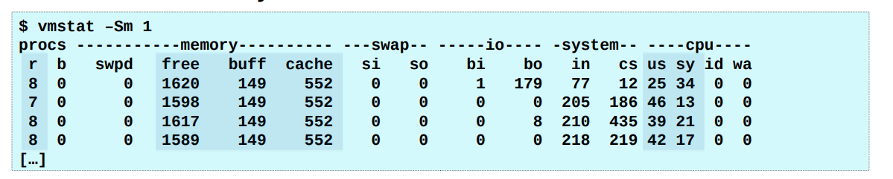

# 0x00. 导读

# 0x01. 简介

vmstat(Virtual Memory Statistics 虚拟内存统计) 命令用来显示 Linux 系统虚拟内存状态，也可以报告关于进程、内存、I/O 等系统整体运行状态。

vmstat 命令报告关于内核线程、虚拟内存、磁盘、陷阱和 CPU 活动的统计信息。由 vmstat 命令生成的报告可以用于平衡系统负载活动。系统范围内的这些统计信息（所有的处理器中）都计算出以百分比表示的平均值，或者计算其总和。

# 0x02. 命令

vmstat 的常规用法是 `vmstat interval times`，即每隔 interval 秒采样一次，共采样 times 次，如果省略times，则一直采集数据到用户手动停止。

`-Sm` 对齐输出（修改输出的单位为 m）.

```bash
$ vmstat 3 3
procs -----------memory---------- ---swap-- -----io---- -system-- ------cpu-----
 r  b   swpd   free   buff  cache   si   so    bi    bo   in   cs us sy id wa st
 5  0 437960 1548296    0 7640940    0    0     1    16    1    1 14  9 77  0  0
 2  0 437960 1548916    0 7640940    0    0     0     0 3098 1756 37 18 46  0  0
 2  0 437960 1548804    0 7640944    0    0     0     1 4340 4742 47 25 28  0  0
```

- procs
    - r: 表示运行队列(就是说多少个进程真的分配到CPU)，当这个值超过了CPU数目，就会出现CPU瓶颈了。
    - b: 显示多少进程正在不可中断的休眠（通常意味着它们在等待 IO ，例如磁盘，网络，用户输入，等等）。 

- memory
    - swapd: 显示了多少块被换出到了磁盘（页面交换），如果大于0，表示你的机器物理内存不足了。 
    - free: 显示了多少块是空闲的（未被使用） 
    - buff: 显示了多少块正在被用作缓冲区
    - cache: 显示了多少正在被用作操作系统的缓存

- swap: 显示页面交换活动
    - si: 每秒有多少块正在被换入（从磁盘），如果这个值大于0，表示物理内存不够用或者内存泄露了。
    - so: 每秒有多少块正在被换出（到磁盘），如果这个值大于0，表示物理内存不够用或者内存泄露了。

- io: 通常反映了硬盘I/O。 
    - bi: 显示了多少块从块设备读取。 
    - bo: 显示了多少块从块设备写出。 

- system: 除非上下文切换超过 100 000 次或更多，一般不用担心上下文切换。 
    - in: 每秒中断次数。 
    - cs: 每秒上下文切换次数，例如我们调用系统函数，就要进行上下文切换，线程的切换，也要进程上下文切换。 

- cpu: 显示所有的CPU时间花费在各类操作的百分比。 
    - us: 用户代码（非内核）。 
    - sy: 执行系统代码（内核）。 
    - id: 空闲。 
    - wa: 等待IO。 

brendangregg 大神建议关注的部分：  
