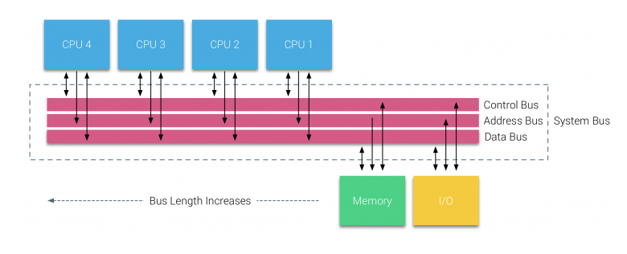
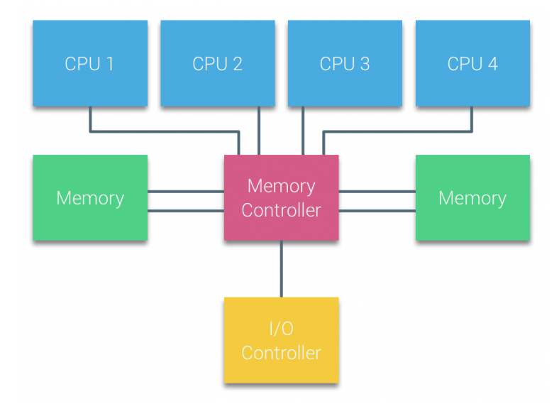
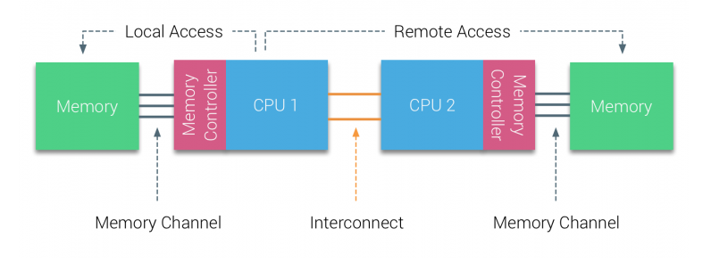
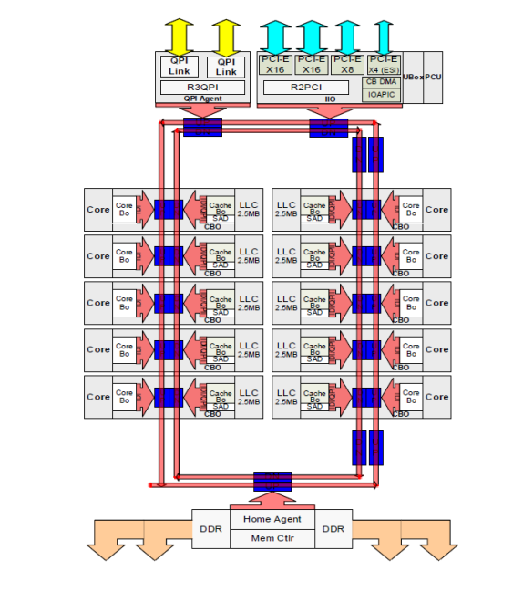

1. numa = Non-uniform memory access
2. numa 是一个共享内存架构，每个 CPU 分配了属于自己的本地内存，并且可以访问属于其它 CPU 的内存。   
    本地内存的访问具有低延迟，高带宽性能，远程内存的访问具有高延迟，低带宽性能。

3. 多处理器系统之前使用的是 交叉开关(crossbar switch) ，但这种设计的复杂性会随着处理器的增加而增加。后来改为使用 总线(bus) ，处理器通过在总线上发送请求来访问内存空间，但是这种系统也存在问题：   
    - 每个 CPU 的可用带宽会随着 CPU 数量的增加而减少
    - 添加 CPU 会使得总线长度增加，从而增加延迟   

4. CPU 性能的增长，使得处理器和内存之间的性能差距让人头痛。想到的一个办法是添加缓存，这又引入了新的麻烦。   
给每个 CPU 附加一个 cache 能够提升性能：降低平均内存访问时间，降低 memory bus 上的带宽负载。   
带来的挑战就是，使得存在多个内存块的副本，也就是缓存一致性问题。为了解决这个问题，引入缓存窥探协议（caching snoop protocols），它能够创建一个模型，使得提供正确数据的同时，不会耗尽总线上的带宽。基本原理是：写入数据的时候，产生一个无效的记录，让其它缓存数据失效甚至清除，这样其它 CPU 从自己的缓存中对于该地址后续的读取就会产生 cache miss ，然后从刚刚更新过值的 CPU 缓存中重新读取。

5. 基于总线的多核处理器，其中的处理器对于系统中的内存访问拥有相同的统一访问时间。   
    UMA(Uniform Memory Access) system = SMPs(Symmetric Multi-Processors)

6. 在 UMA 系统中，CPU 是通过 FSB(Front-Side Bus) 连接到北桥。北桥包含内存控制器，所有进出内存的通信都必须通过北桥。I/O 控制器，也连接在北桥。因此，每个 I/O 都必须经过北桥才能到达 CPU。但是，由于北桥内部的带宽以及早期的缓存窥探协议的原因，UMA 的可扩展性是有限的。

7. 为了进一步提高扩展性和性能，对 共享内存的多处理器架构(shared-memory multiprocessors architecture) 进行了三点改造：
    - 非统一性内存访问组织(Non-Uniform Memory Access organization)
    - 点对点互联拓扑
    - 可扩展的缓存一致性解决方案

8. 非统一性内存访问组织   
       
    CPU1 的内存控制器连接的内存是本地内存，CPU2 的内存控制器连接的内存对于 CPU1 而言是远程内存。远程内存访问是有额外开销的。由于内存位置的不同，该系统存在 不均匀(non-uniform) 的内存访问时间。

9. 点对点互联   
      
    QuickPath point-to-point Interconnect (QPI)

10. 可扩展的缓存一致性解决方案   
      
    上面的红色环可以参考: [Ring Bus到Mesh网络](https://zhuanlan.zhihu.com/p/32216294)