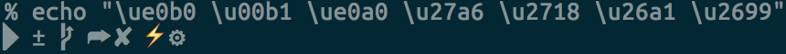

# 0x00. 导读

# 0x01. 简介

zsh 是 shell ，oh-my-zsh 是配置。

使用 chsh -s /bin/zsh 命令将 zsh 设置为系统默认 shell。

第一次运行 zsh 时会进入配置引导页面：  
输入 q 会直接退出配置引导，下一次运行 zsh 时会再次进入配置引导。  
输入 0，也会退出配置引导，但是会在当前用户目录生成一个空白的文件 .zshrc，下一次运行时就不会再进入配置引导。

## 1.1 zsh

```
$ yum install zsh
$ zsh --version
zsh 5.0.2 (x86_64-redhat-linux-gnu)
```

在 CentOS 7 下使用 agnoster 主题，部分符号在终端无法正常显示，还需安装 Powerline fonts 字体：
```bash
# clone
git clone https://github.com/powerline/fonts.git --depth=1
# install
cd fonts
./install.sh
# clean-up a bit
cd ..
rm -rf fonts

```

之后在终端输入以下命令测试Powerline font字体是否成功安装：
```
echo "\ue0b0 \u00b1 \ue0a0 \u27a6 \u2718 \u26a1 \u2699"
```
字体安装成功后符号可正常显示


## 1.2 配置

全局配置 `/etc/zshrc` 全局环境变量 `/etc/zshenv`

当前用户配置文件 `~/.zshrc`, 用户环境 `~/.zshenv`


```bash
# 设置为默认终端，不要 sudo
$ chsh -s /bin/zsh
# 或者这样
$ sudo chsh -s /bin/zsh <username>

# 修改机器名字
$ hostnamectl set-hostname CS_223
$ hostname

$ source ~/.zshrc
```

# 0x02. oh-my-zsh

oh-my-zsh 下载
```bash
$ wget --no-check-certificate  https://github.com/robbyrussell/oh-my-zsh/raw/master/tools/install.sh -O - | sh
```

还有这些安装方式，任选一个
```
curl	sh -c "$(curl -fsSL https://install.ohmyz.sh/)"
wget	sh -c "$(wget -O- https://install.ohmyz.sh/)"
fetch	sh -c "$(fetch -o - https://install.ohmyz.sh/)"
国内curl镜像	sh -c "$(curl -fsSL https://gitee.com/pocmon/ohmyzsh/raw/master/tools/install.sh)"
国内wget镜像	sh -c "$(wget -O- https://gitee.com/pocmon/ohmyzsh/raw/master/tools/install.sh)"
```

在 https://github.com/ohmyzsh/ohmyzsh/wiki/Themes 中查看内置的主题样式和对应的主题名。这些内置主题已经放在 ～/.oh-my-zsh/themes 目录下，不需要再下载。除了内置主题外，还可以选择其他开源的主题，例如 powerlevel10k 主题。

**同意使用 Oh-my-zsh 的配置模板覆盖已有的 .zshrc, 之前在 .bashrc 中用到的一些设置可以挪到 .zshrc 里面来。**

主题预览：[ohmyzsh/wiki/Themes](https://github.com/ohmyzsh/ohmyzsh/wiki/Themes)

## 2.1 插件

oh-my-zsh 的自带插件都储存在 "~/.oh-my-zsh/plugins" 目录中，如果你希望安装一个插件，可以在 "~/.zshrc" 的 plugins=(xxx, xxx, ...) 这一行里加入插件名称

如果你需要安装第三方插件和主题，需要放在 ~/.oh-my-zsh/custom/plugins 或者用 $ZSH_CUSTOM/plugins ，然后你可以在 "~/.zshrc" 的某一行（比如末尾）加入 source /path/to/plugin

比如你希望添加一个 zsh-syntax-highlighting 插件
```
source ~/.zsh-syntax-highlighting/zsh-syntax-highlighting.zsh
```

### 2.1.2 常用插件

powerlevel10k, 没有使用，懒得折腾升级 zsh 

zsh-autosuggestions：这个是自动建议插件，能够自动提示你需要的命令。  
当你输入命令时，会自动推测你可能需要输入的命令，按下右键可以快速采用建议。
```
git clone https://github.com/zsh-users/zsh-autosuggestions ${ZSH_CUSTOM:-~/.oh-my-zsh/custom}/plugins/zsh-autosuggestions
```

zsh-syntax-highlighting：这个是代码高亮插件，能够使你的命令行各个命令清晰明了。  
作用：命令错误会显示红色，直到你输入正确才会变绿色，另外路径正确会显示下划线。
```
git clone https://github.com/zsh-users/zsh-syntax-highlighting.git ${ZSH_CUSTOM:-~/.oh-my-zsh/custom}/plugins/zsh-syntax-highlighting
```

extract: 用于解压任何压缩文件，不必根据压缩文件的后缀名来记忆压缩软件。使用 x 命令即可解压文件
```
oh-my-zsh 内置了 extract 插件
```

colored-man-pages: 带颜色的 man


```
plugins=(git zsh-autosuggestions zsh-syntax-highlighting extract)
```

# 0x03. 小技巧

键入 kill <tab> 就会列出所有的进程名和对应的进程号

一旦在 shell 敲入正确命令并能执行后，shell 就会存储你所敲入命令的历史记录（存放在~/.zsh_history 文件中），多个终端会话共享历史记录

