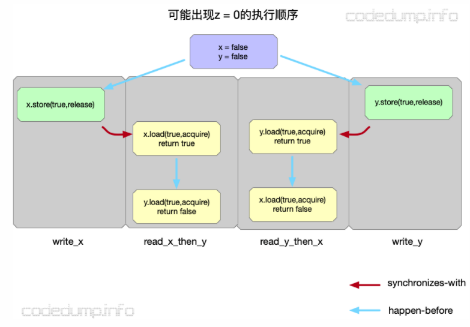

## 一、现在存在什么问题
1. 编译器会优化代码
2. CPU 会优化指令
3. CPU Cache 不一致

前面两个问题统称为 **memory recorder** ，会让程序执行的逻辑和我们看到的程序逻辑不一样。
第三个问题，让多线程变的头疼，A线程修改了x，B线程咋知道，啥时候知道？可以参考 [CPU Cache](./Cache.md)

并且，不同的编译器，不同的 CPU ，对于 memory recorder 都有各自的喜好。但是，都得保证单线程正确。


## 二、解决办法
> In computing, a memory model describes the interactions of threads through memory and their shared use of the data.

内存模型屏蔽了上诉问题，提供一系列规则，介于硬件与软件之间，对于程序员，只要按照规则编程，则程序的行为就是可控的，并且按照预想去执行。

- 内存模型三要素   
    1. 原子操作: 这类操作一旦执行就不会被打断，你无法看到它的中间状态，它要么是执行完成，要么没有执行。
    2. 指令的局部顺序性: 一系列的指令执行不能被乱序。
    3. 操作的可见性: 定义了对于共享变量的操作如何对其他线程可见。

- 原子操作间的关系   
    1. sequenced-before 单线程
    2. happens-before 多线程
    3. synchronzies-with 同步

- 注意   
    互斥锁等属于高级同步原语，C++11 引入内存模型，能从底层角度写出符合预期的多线程程序。甚至 lock-free .

- 内存模型种类   
    - SC (Sequential Consistency) 顺序一致性
        1. 每个处理器的执行顺序和代码中的顺序（program order）一样。
        2. 所有处理器都只能看到一个单一的操作执行顺序。

    - SC-DRF
        1. C++11 在用的，SC 的变种

    - TSO (Total Store Ordering) 全存储排序
        1. 只有 store-load 存在乱序（被别的 CPU 看成 load-store ），其余的 store-store，load-load 和 load-store 不会。
        2. 我们常见的PC处理器x86-64就是常见的TSO模型。
        ```c++
        int A = 0, B = 0;
        //线程1
        A = 1;
        print(B);
        //线程2
        B = 1;
        print(A);

        // 可能输出 0 0
        ```

    - PSO (Part Store Order) 部分存储定序
        1. PSO 在 TSO 的基础上继续允许 store-store 乱序。
        ```c++
        int flag, data;
        static void write_data_cpu0(int value)
        {
            data = value;
            flag = 1;
        }
        static void read_data_cpu1(void)
        {
            while (flag == 0);
            return data;
        }

        // 上面的例子中CPU1看到CPU0对内存的操作顺序可能是下面这样的:
        flag = 1;
        data = value;
        ```
    - RMO (Relaxed Memory Order) 松弛型内存模型
        1. 允许4种操作都可以乱序。

## 三、C++11
[c11-introduced-a-standardized-memory-model-what-does-it-mean?](https://stackoverflow.com/questions/6319146/c11-introduced-a-standardized-memory-model-what-does-it-mean-and-how-is-it-g)
### 如何理解六种 memory order ?
1. 对于一个整型变量 x ，执行 `x++` ，其实相当于是三条指令
    - mov（从内存到寄存器）
    - add
    - mov（从寄存器到内存）
2. 当多线程环境执行的时候，就会出问题，所以需要使用原子操作，使得三条指令变成了一个整体。某种程度上来说，它起到了锁的作用。
3. 以这个原子操作为中心，其前后的代码，并且这些代码并不一定需要是原子操作，只是普通的代码就行，假设是另一个整型变量 `y++`。那么，这个y++到底会在我们的x++之前执行，还是之后？注意这完全是单线程当中指令的执行顺序问题，与多线程风马牛不相及。但是，这个问题会导致多线程执行结果的不同。
4. 我们对x进行原子操作的地方，可以锁定线程间的关系，是一个同步点。**以这个点为基准，我们就可以得出两个线程当中其它指令执行先后顺序关系。**

    比如，A线程执行 `x++` 。B线程如果也想，那就必须等A完成之后。如果在A线程当中， `y++` 是在 `x++` 之前执行的，那么我们就可以肯定，对于B线程来说，在 `x++`（同步点）之后所有对 y 的参照，必定能看到A线程执行了 `y++` 之后的值（注意对y的访问并非原子）.

5. 但是 `y++` 到底会在哪个地方执行，由于 `memory recorder` 存在，是不确定的。所以， memory order 其实就是限制编译器以及CPU对单线程当中的指令执行顺序进行重排的程度（此外还包括对cache的控制方法）。这种限制，决定了以 **`atom操作`** 为基准点（边界），对其之前的内存访问命令，以及之后的内存访问命令，能够在多大的范围内自由重排（或者反过来，需要施加多大的保序限制）。从而形成了6种模式。它本身与多线程无关，是限制的单一线程当中指令执行顺序。但是（合理的）指令执行顺序的重排在单线程环境下不会造成逻辑错误而在多线程环境下会，所以这个问题的目的是为了解决多线程环境下出现的问题。

### 六种 memory order 解释
acquire 对应的屏障，只允许代码往下方向移动，而 release 则只允许上方向移动。
| memory order | 含义 | 种类 |
| :-----:| :----: | :----: |
| momory_order_relaxed | 对于其它读写操作没有任何同步和重排的限制，仅要求保证原子性和内存一致性 | relaxed ordering  |
| memory_order_consume | 不建议用 | release-consume ordering |
| memory_order_acquire | load 之后的读写操作无法被重排至 load 之前。即 load-load, load-store 不能被重排。 | acquire-release ordering |
| memory_order_release | store 之前的读写操作无法被重排至 store 之后。即 load-store, store-store 不能被重排。 | acquire-release ordering |
| memory_order_acq_rel | 同时包含 memory_order_acquire 和 memory_order_release 标志。 | acquire-release ordering |
| memory_order_seq_cst | 默认选择。程序指令与源码顺序一致，所有线程的所有操作存在一个全局的顺序。 | sequentially consistent ordering |

acq-rel 解释：同一个原子变量上的 acquire 和 release 操作将引入 synchronizes-with 关系。除此之外，将不再有全局的一致顺序。
```c++
#include <atomic>
#include <thread>
#include <assert.h>
std::atomic<bool> x,y;
std::atomic<int> z;
void write_x()
{
    x.store(true,std::memory_order_release);
}
void write_y()
{
    y.store(true,std::memory_order_release);
}
void read_x_then_y()
{
    while(!x.load(std::memory_order_acquire));
    if(y.load(std::memory_order_acquire))
        ++z;
}
void read_y_then_x()
{
    while(!y.load(std::memory_order_acquire));
    if(x.load(std::memory_order_acquire))
        ++z;
}
int main()
{
    x=false;
    y=false;
    z=0;
    std::thread a(write_x);
    std::thread b(write_y);
    std::thread c(read_x_then_y);
    std::thread d(read_y_then_x);
    a.join();
    b.join();
    c.join();
    d.join();
    assert(z.load()!=0);
}
```
可能出现在 read_x_then_y 中针对 y 的 load 操作在 y 的 store 操作之前完成，因为 y.store 操作与此之间没有先后顺序关系；同理也不能保证 x 一定读到 true 值，因此到程序结束是就出现了z = 0的情况。


```c++
std::atomic<bool> x,y;
std::atomic<int> z;

void write_x_then_y()
{
    x.store(true, std::memory_order_relaxed); // 1
    y.store(true, std::memory_order_release); // 2
}

void read_y_then_x()
{
    while(!y.load(std::memory_order_acquire)); // 3
    if(x.load(std::memory_order_relaxed))
        ++z;  // 4
}

int main()
{
    x=false;
    y=false;
    z=0;
    std::thread a(write_x_then_y);
    std::thread b(read_y_then_x);
    a.join();
    b.join();
    assert(z.load()!=0); // 5
}
/*
 * 2 与 3 建立了 synchronized-with 关系。
 * 同时，1 happens-before 2，3 happens-before 4 。想想，为啥 1与2 不会重排。提示 StoreStore 
 * 于是，可以推导出 1234 的执行顺序
 * 由此保证了assert不会触发。注意这里的 2 和 3 的桥梁关系。
*/
```